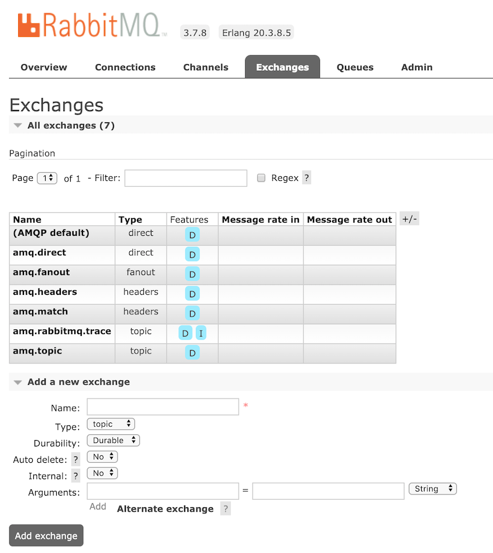
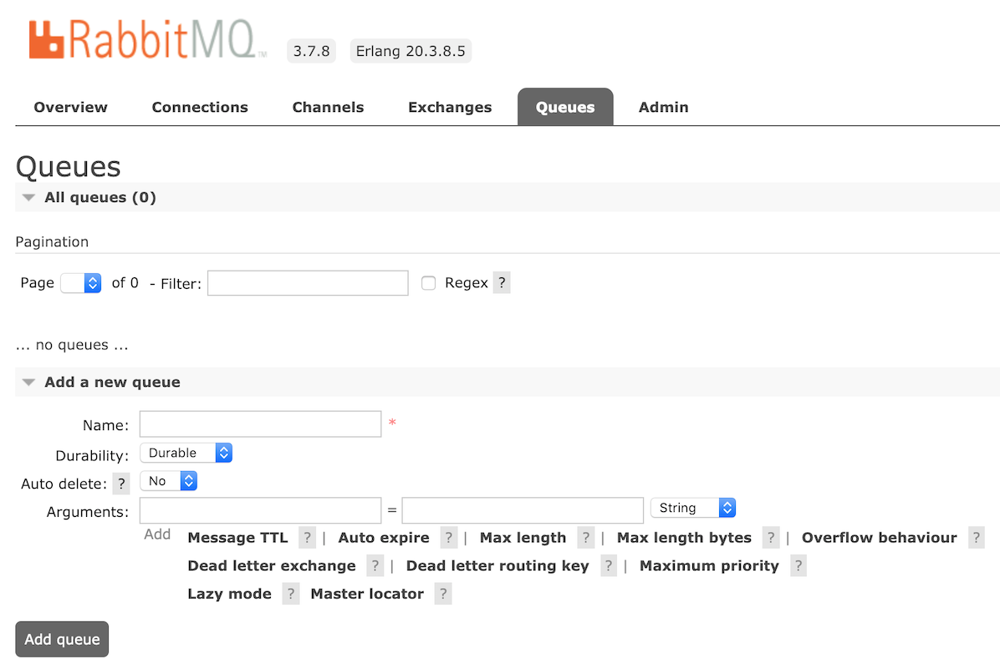

## RabbitMQ 동작 이해하기

비동기 작업 큐(예: Celery)를 사용하려면 중간 단계에 Broker 라고 부르는 메시지 큐가 항상 등장한다.

메시지 큐에는 RabbitMQ, ActiveMQ, ZeroMQ, Kafaka 등이 대표적이다. 

이 포스트는 AMQP를 구현한 RabbitMQ 내부 구성과 동작 방식을 이해하기 위한 설명이다.

 

## 🐰 RabbitMQ

[RabbitMQ](https://www.rabbitmq.com/) 는 얼랭(Erlang)으로 [AMQP](https://ko.wikipedia.org/wiki/AMQP) 를 구현한 메시지 브로커 시스템이다.

 

## AMQP

클라이언트가 메시지 미들웨어 브로커와 통신할 수 있게 해주는 **메세징 프로토콜**이다. 

                          Broker
Producers -> [Exchange -- Binding --> Queue] -> Consumers


메시지를 발행하는 **Producer 에서 Broker 의 Exchange 로 메시지를 전달**하면, **Binding 이라는 규칙에 의해  연결된  Queue 로 메시지가 복사**된다.

메시지를 받아가는 **Consumer 에서는 브로커의 Queue를 통해 메시지를 받아가서 처리한다.**

AMQP 에는 네트워크에 문제가 있거나, 메시지를 처리하지 못하는 경우를 대비해 2가지 수신 확인 모델을 갖추고 있다.

하나는 Consumer 는 메시지를 받으면 명시적으로 broker 에게 통지하고, 브로커는 이 알림을 받았을 때만 Queue 에서 메시지를 삭제한다. 다른 하나는 Broker 가 메시지를 전달하면 자동으로 삭제하는 방식이다.

 

## Exchange 와 Queue 를 연결하는 Bindings

모든 메시지는 Queue 로 직접 전달되지 않고, 반드시 **Exchange 에서 먼저 받는다.** 그리고 **Exchange Type** 과 **Binding** 규칙에 따라 적절한 **Queue 로 전달된다.** 아래와 같은 속성을 갖는다. 

- Name : Exchange 이름
- Type : 메시지 전달 방식
    1. **Direct Exchange**
    2. **Fanout Exchange**
    3. **Topic Exchange**
    4. **Headers Exchange**
- Durability : 브로커가 재시작 될 때 남아 있는지 여부(`durable`, `transient`)
- Auto-delete : 마지막 Queue 연결이 해제되면 삭제

 

### 🔗Bindings

생성된 Exchange 에는 전달 받은 메시지를 원하는 Queue 로 전달하기 위해 Bindings 이라는 규칙을 정의할 수 있다. 

간단하게 목적지 Queue 이름만으로도 Binding 을 추가할 수 있고, 일부 Exchange type 에 따라 routing key 를 지정해서 메시지를 필터링 한 후 지정한 Queue 로 보내도록 정의할 수 있다.

 

## 여러가지 Exchange Type 알아보기

### •Direct Exchange

메시지에 포함된 **routing key** 를 기반으로 Queue 에 메시지를 전달한다. 

아래 그림에서 Exchange `X`는 2개의 Queue 와 연결되어 있는 것을 볼 수 있다.

Q1은 `orange` 라는 **binding key** 로 연결되고, Q2는 `black`, `green` 2개의 binding key 로 연결된다. 

Exchange `X`로 전달된 메시지의 routing key가  `orange` 인 경우 Q1으로 전달되고,  `black`, `green`인 경우 Q2로 전달된다. 그밖에 다른 메시지는 무시된다.

*Default Exchange* 는 이름이 없는 Direct Exchange 한 형태이다. Default Exchange 는 전달될 목적지 Queue 이름과 동일한 routing key 를 부여한다.

 

### •Fanout Exchange

routing key 관계없이 연결된 모든 Queue에 동일한 메시지를 전달한다. 

 

### •Topic Exchange

routing key 전체가 일치 하거나 일부 패턴과 일치하는 모든 Queue 로 메시지가 전달된다.

여러 Consumer 에서 메시지 형태에 따라 선택적으로 수신 해야하는 경우와 같이 다양한 publish/subscribe 패턴 구현에 활용될 수 있다.

Topic Exchange 에서 사용하는 binding key 는 점(.)으로 구분된 단어를 조합해서 정의한다.

 `*` 와 `#`을 이용해 와일드 카드를 표현할 수 있으며, `*` 는 단어 하나 일치 `#` 는 0 또는 1개 이상의 단어 일치를 의미한다. 

다음과 같이 binding key 를 정의한 경우에 메시지의 routing key 가 `quick.orange.rabbit` 또는 `lazy.orange.elephant` 이면, Q1, Q2 둘 다 전달된다. `lazy.pink.rabbit` 는 binding key 2개와 일치 하더라도 1번만 전달된다.

`quick.brown.fox`, `quick.orange.male.rabbit` 는 일치하는 binding key 가 없기 때문에 무시된다.

- `*.orange.*`  ← `quick.orange.rabbit`, `lazy.orange.elephant`
- `*.*.rabbit` ← `quick.orange.rabbit`, `lazy.pink.rabbit`
- `lazy.#` ← `lazy.orange.elephant`, `lazy.pink.rabbit`

 

### •Headers Exchange

메시지 헤더를 통해 binding key 만을 사용하는 것보다 더 다양한 속성을 사용할 수 있다.

Header exchange를 사용하면 binding key는 무시되고, 헤더 값이 바인딩 시 지정된 값과 같은 경우에만 일치하는 것으로 간주한다.

 

## 메시지를 보관하는 Queue

Consumer 어플리케이션은 Queue 를 통해 메시지를 가져간다. Queue 는 반드시 미리 정의해야 사용할 수 있다. 

- Name : queue 이름. `amq.` 로 시작하는 이름은 예약되어 사용할 수 없다.
- Durability : `durable` 은 브로커가 재시작 되어도 디스크에 저장되어 남아 있고, `transient` 으로 설정하면 브로커가 재시작 되면 사라진다. 단, Queue 에 저장되는 메시지는 내구성을 갖지 않는다.
- Auto delete : 마지막 Consumer 가 구독을 끝내는 경우 자동으로 삭제된다.
- Arguments : 메시지 TTL, Max Length 같은 추가 기능을 명시한다.

 

## 하나의 연결을 공유하는 Channels

Consumer 어플리케이션에서 Broker 로 많은 연결을 맺는 것은 바람직하지 않다. 

RabbitMQ는 **Channel** 이라는 개념을 통해 하나의 TCP 연결을 공유해서 사용할 수 있는 기능을 제공한다. 

하지만 멀티 스레드, 멀티 프로세스를 사용하는 작업에서는 각각 별도의 Channel 을 열고 사용하는 것이 바람직하다.

 

## 환경 분리를 위한 Virtual Hosts

하나의 Broker 에서 운영 환경(ex. live, dev)에 따라 Users, Exchange, Queue 등을 각각 사용할 수 있는 Vhosts 컨셉을 갖고 있다. 

Vhosts 에 대한 좀 더 자세한 내용은 '[Ubuntu 에서 RabbitMQ 설치하기](https://blog.jonnung.com/rabbitmq/2019/01/30/rabbitmq-installation-on-ubuntu/)' 를 참고하자.

 

## 참고 자료

- [https://www.rabbitmq.com/tutorials/amqp-concepts.html](https://www.rabbitmq.com/tutorials/amqp-concepts.html)
- [https://www.rabbitmq.com/tutorials/tutorial-four-python.html](https://www.rabbitmq.com/tutorials/tutorial-four-python.html)
