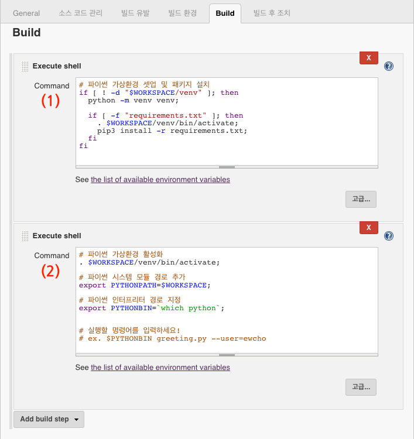

젠킨스(Jenkins)에서 파이썬 스크립트를 실행할 때 아래와 같이 명령어를 실행하는 것이 보통이다.
```bash
$ python run_script.py
```
이 때 실행되는 파이썬 환경은 해당 젠킨스 서버에 설치된 시스템(글로벌) 파이썬이 호출된다. (예: /usr/bin/python)

프로젝트마다 의존하는 파이썬 패키지가 다르고, 드문 경우지만 파이썬 버전도 다를 수 있다.  
파이썬에서는 이런 상황을 위해서 **[Virtual Environment](https://docs.python.org/ko/3.7/glossary.html#term-virtual-environment)**라는 가상 환경을 통해 패키지와 실행을 격리 시킬 수 있는 샌드박스를 제공한다.

하지만 젠킨스에서 파이썬 가상환경을 설정하고, 스크립트를 실행하는 과정은 생각보다 쉽지 않다. 그리고 우리가 원하는 모든 기능을 만족 시키는 젠킨스 플러그인도 없다.

이 포스트에서는 보통 virtualenv 또는 venv로 알려진 파이썬 가상환경을 이용해서 비교적 간단하게 젠킨스 Job 안에서 파이썬을 안전하게 실행 할 수 있는 방법을 설명한다.

<br>
## 사전 준비
사실 아직까지 파이썬2를 사용하는 레거시 시스템이 없다면, 거의 대부분은 파이썬3 환경에서 작업이 이뤄질 것이다. 하지만 Ubuntu 16.04 경우 기본 설치된 파이썬 버전이 `Python3.5` 이기 때문에 `Python3.6`이나 `Python3.7`을 사용 하려면 새로 설치해야 한다.

이 과정을 쉽게 해결하기 위해 *[pyenv](https://github.com/pyenv/pyenv)* 라는 오픈소스를 활용한다.  
그리고 젠킨스에서도 pyenv를 실행할 수 있도록 [pyenv 젠킨스 플러그인](https://wiki.jenkins-ci.org/display/JENKINS/Pyenv+Plugin)을 설치해야 한다.

<br>
## 젠킨스 작업(Freestyle project) 만들기
보통 많이 사용하는 *Freestyle project* 타입으로 새로운 작업(job)을 생성한다.


<br>
젠킨스 pyenv 플러그인을 설치 했다면 '*빌드 환경*' 탭에서 아래와 같이 '*pyenv build wrapper*' 설정이 가능하다.  
'*Preinstall pip list*' 항목에 설치하고 싶은 파이썬 패키지명을 명시할 수 있지만, 가급적 좀 더 관리가 쉽게 소스코드 프로젝트에 포함된 `requirements.txt`를 활용하는 것이 좋다.


<br>
마지막으로 파이썬 가상환경(virtualenv)와 파이썬 패키지 설치를 하기 위한 Bash 구문과 명령어를 추가한다.


<br>
**(1) 파이썬 가상환경 셋업 및 패키지 설치**
```bash
# 파이썬 가상환경 셋업 및 패키지 설치
if [ ! -d "$WORKSPACE/venv" ]; then
  python -m venv venv;
 
  if [ -f $WORKSPACE/requirements.txt ]; then
    . $WORKSPACE/venv/bin/activate;
    pip3 install -r requirements.txt;
  fi
fi
```
젠킨스 작업을 빌드할 때 실행되는 작업 경로는 `$WORKSPACE` 라는 환경변수에 저장된다.  
이 경로에 소스코드도 함께 있기 때문에 이 경로를 기준으로 파이썬 가상환경을 셋업한다.

python 3.3 빌트인 모듈로 추가된 **venv**를 사용해서 가상환경을 만든다. 
해당 프로젝트에 `requirements.txt` 파일이 있는 경우 `$ pip install` 을 실행한다.

<br>
**(2) 파이썬 가상환경 활성화 및 파이썬 모듈 경로 지정**
```bash
# 파이썬 가상환경 활성화
. $WORKSPACE/venv/bin/activate;
 
# 파이썬 시스템 모듈 경로 추가
export PYTHONPATH=$WORKSPACE;
 
# 파이썬 인터프리터 경로 지정
export PYTHONBIN=`which python`;
 
 
# 실행할 명령어를 입력하세요!
# ex. $PYTHONBIN greeting.py --user=jonnung
```

전 단계에서 설치한 가상환경(venv)를 활성화하고, 파이썬이 `$WORKSPACE` 경로에 있는 모듈들을 찾을 수 있도록 `PYTHONPATH` 환경변수를 설정한다.  
`PYTHONBIN` 환경변수는 현재 파이썬 가상환경에 설치된 파이썬 인터프리터 위치를 저장한 임시 환경변수 이다.

<br>
## :honey_pot: 꿀팁 추가
위 과정이 적용된 템플릿용 프로젝트를 미리 만들어 두고 새로운 프로젝트를 시작할 때 복사해서(Copy from) 사용하면 정신 건강에 좋다. :stuck_out_tongue_winking_eye: