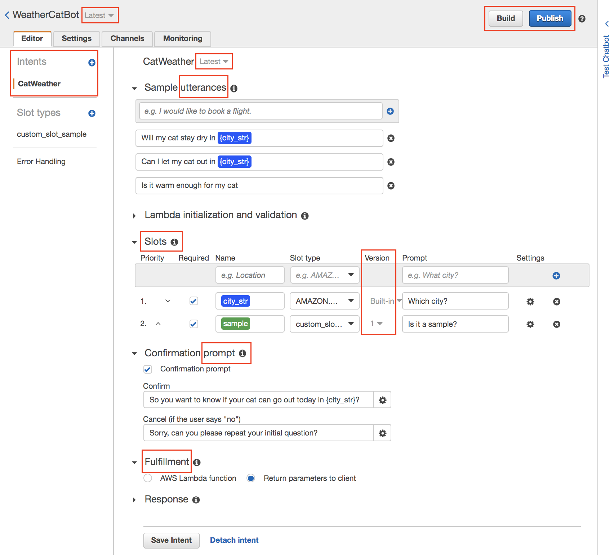

## 개인적인 학습 배경 이야기

**서버리스(Serverless)** 는 일반적인 웹서버나 WAS(Web Application Server) 또는 Database 같은 백엔드를 구성할 때 직접 물리적인 서버 구축부터 설치, 운영까지 담당하지 않고, 클라우드 환경에서 제공하는 관리형 서비스를 이용하거나 함수(Function, 기능 로직) 단위로 실행할 수 있는 서비스형 환경을 의미한다.

대표적인 예로 AWS Lambda는 FaaS(Function as a Service) 형태의 서버리스에 속하고, AWS S3 나 DynamoDB 도 서버리스라고 할 수 있다.

개인적인 생각으로 서버리스는 변화가 빠른 시대에 사용자들의 여러가지 요구사항을 빠르게 반영하고, 새로운 시도할 때 모든 것을 A부터 Z까지 만들수 없기 때문이지 않을까 생각한다. 따라서 기본적인 개념과 활용 능력은 필수로 익혀두는게 좋지 되지 않을까 생각한다.  

현재 재직중인 회사는 초기부터 프라이빗 클라우드 환경에서 온프레미스 형태로 서비스를 운영하고 있었다. 하지만 얼마전부터 작은 비율로라도 클라우드 환경에 이중화를 진행하고 있다.
그리고 최근 데이터 수집과 적재 업무를 진행 했었는데 AWS S3 → Glue → Athena를 이용해 간단한 데이터 처리 파이프라인을 구축 해보면서 클라우드 환경의 서버리스에 맛을 봤었다.

그러던 중 페이스북을 통해 "*[AWS Fundamentals: Building Serverless Applications](https://www.coursera.org/learn/aws-fundamentals-building-serverless-applications/home/info)*" 코세라 강좌를 알게 되면서 다양한 서버리스를 체험하고 학습할 수 있을 것 같아서 시작하게 되었다.

----

> 이 포스트는 위에서 소개한 코세라 강좌의 1주차에 나오는 **AWS Lex**에 대한 개념과 주요 구성 요소에 대한 설명이다.

## AWS Lex

챗봇이 사람의 질문(요청)에 응답하는 과정에는 3가지 과정이 반드시 필요하다.

1. 자동 음성 인식 (ASR: Automatic Speech Recognition)
2. 자연어 처리 (NLU: Natural-Language Understanding)
3. 텍스트를 음성으로 변환 (Text to Speech)

**Lex**는 쉽게 챗봇을 개발하기 위해 음성을 텍스트로 변환하는 자동 음성 인식(ASR)과 텍스트의 의도를 파악하는 자연어 처리(NLU)를 제공하는 관리형 서버리스이다.

아쉽게도 아직까지는 4개 리전에서만 사용 가능하고, 언어는 **영어**만 지원한다. 

## 구성 요소

- **Intent** : 봇을 통해 사용자가 얻고자 하는 정보 목적(의도)
- **Utterances** : 봇에게 전달되는 사용자의 요청. Intent 중에 하나와 매칭된다.
- **Prompt** : Utterance를 통해 얻은 정보가 부족하다면 사용자에게 다시 물어볼 수 있다.
- **Slot** : Intent를 충족 시키기 위해 반드시 필요한 정보. 모든 슬롯의 대답을 받아야 Intent를 완전히 충족 시킬 수 있다.
    - Custom Slot type → Slot Resolution
        - `Expand Values` 사용자로부터 전달받은 실제 값이 학습 데이터로 사용되고, 사용된 값으로 슬롯이 채워진다.
        - `Restrict to Slot values and Synonyms` 나열된 슬롯 값과 일치하는 사용자 데이터만 슬롯으로 사용된다. 동의어(synonyms)와 일치하는 경우에도 해당 슬롯으로 결정된다.
- **Fullfillment** : Intent가 완전히 충족 되었을 때 수행되는 비지니스 로직
- **Version** : bot, intent, slot은 각각 버전이 관리된다. 버전은 봇이 서비스될 환경(dev, beta, prod)에 따라 다르게 제공될 수 있다.
- **Build & Publish** : Intent를 저장하고 빌드해야 머신 러닝 모델이 준비된다.  Intent의 새 버전은 빌드 후 생성된다. 매번 Intent 마다 버전을 지정해서 봇을 배포할 필요없이 버전에 **Alias**를 지정해서 배포할 수 있다.(예: `prod`)
