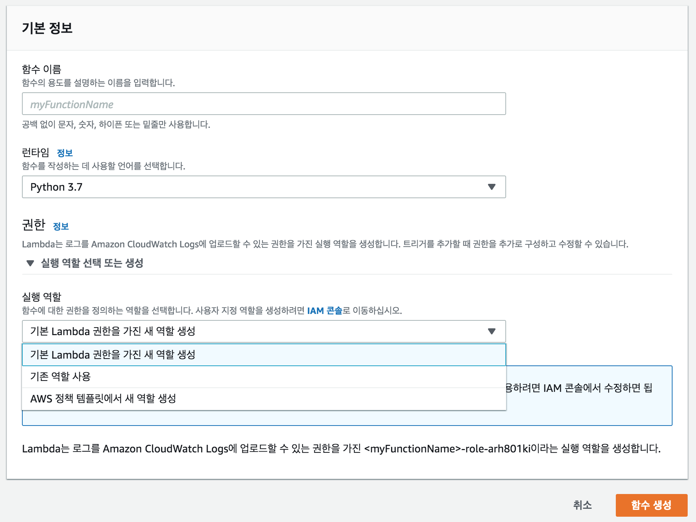
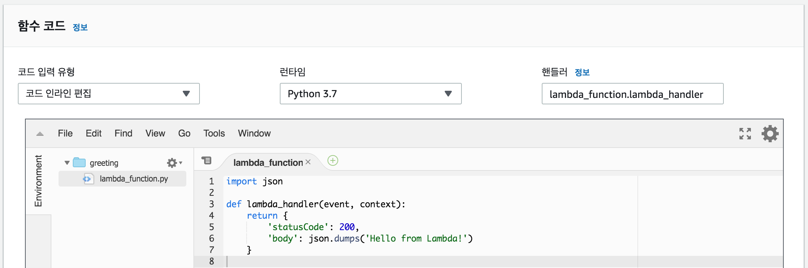
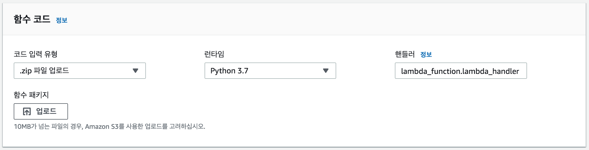

앞으로 3개의 포스트에 걸쳐서 AWS Lambda, API Gateway, Cloudwatch로 API 서비스를 구성할 때 도움이 될만한 내용을 정리할 것이다.

이 서비스들의 기본 개념과 사용법은 AWS 공식 문서나 여러 블로그에서 수없이 찾아볼 수 있기 때문에 여기서는 다루지 않는다.

대신 최근 프로덕션 환경에서 AWS Lambda를 기반으로 대규모 이벤트(행사) API를 개발하고 서비스하면서 학습하고 경험한 것 중에 좀 더 알아두면 좋을 만한 내용이다. 

<br/>
# 팁 목차
1. Lambda 함수 개발과 배포
2. API Gateway에 신규 API 추가 및 Lambda 함수로 연결하기
3. API 요청 엑세스 로그를 CloudWatch로 보내기

<br/>
# Lambda 함수 개발과 배포

### 실행 역할

**실행 역할(Execution role)**은 Lambda가 AWS 서비스와 다른 리소스들에 대한 접근 권한을 부여한다. "*기본 Lambda 권한을 가진 새 역할 생성*" 을 선택하면, CloudWatch Logs에 로그를 전송할 수 있는 기본적인 관리형 정책이 포함된 역할이 생성된다.

만약 Lambda에서 Kinesis, DynamoDB, SQS 같은 서비스로부터 이벤트를 전달 받아야 한다면, 해당 서비스에 접근할 수 있도록 적절한 정책을 추가해야 한다. ([관련 문서](https://docs.aws.amazon.com/ko_kr/lambda/latest/dg/lambda-intro-execution-role.html))

반대로 다른 AWS 서비스나 사용자 측면에서 Lambda를 호출해야 하는 경우가 있다. 이 때는 리소스(ARN) 기반 정책과 사용자(IAM) 정책으로 Lambda에 대한 엑세스 권한을 부여할 수 있다. 이 내용은 아래 API Gateway 부분에서 다시 나온다.

<br/>
### 함수 코드

**Handler** **함수**는 Lambda가 호출될 때 단 하나의 진입점이 되기 위한 단순한 함수이다. 로직이 복잡할 경우 handler 함수는 간소화하고, 핵심 로직을 별도 함수로 분리해서 더 깔끔하고 테스트하기 쉬운 형태로 구성하는 것도 좋은 방법이다.

Python의 경우 기본 handler 함수명은 `lambda_handler()`다. handler 함수명은 원하는 대로 변경할 수 있지만 "핸들러"란에 정확한 함수명을 입력해야 한다.


첫번째 `event` 파라미터와 두번째 `context` 파라미터를 전달 받으며, Lambda를 호출하는 쪽에서 데이터를 전달하면 `event` 파라미터 안에 담겨서 전달된다. 보통 이 객체는 Python `dict` 타입이다. 
두번째 `context` 파라미터에는 런타임 정보와 몇가지 메소드를 담은 객체가 전달된다.  
간단한 예로 `context.log` 속성은 표준 아웃풋 스트림 로그를 남길 수 있는 함수이다. 
```python
# greeting.py

import json

def lambda_handler(event, context):
    context.log('It works')
    
    return {
        'statusCode': 200,
        'body': json.dumps('Hello from Lambda!')
    }
```

<br/>
### Python 외부 라이브러리 설치하기

Python 내장 라이브러리와 [Boto3](https://github.com/boto/boto3)를 제외한 외부 라이브러리를 설치해서 사용한다면, 함수 코드를 포함한 모든 라이브러리 패키지를 함께 **ZIP**으로 압축해서 배포 패키지를 생성해야 한다.

여기서 주의해야 할 점은 Python의 패키지를 참조하는 기본 원리가 그대로 적용되기 때문에 외부 라이브러리 패키지를 handler 함수가 정의된 모듈에서 참조할 수 있도록 배치해야 한다.

정확한 확인을 위해 Lambda 함수를 아래와 같이 수정하고 "테스트"를 실행 해보자.

```python
# greeting.py

import sys

def lambda_handler(event, context):
    print(f'현재 경로: {__file__}')
    print('파이썬이 모듈을 찾는 경로들...')
    print(sys.path)


########## 실행 결과 ##########
# Function Logs:
# START RequestId: 739d8a63-5c60-4995-83db-9a9d67589516 Version: $LATEST
# 현재 경로: /var/task/lambda_function.py
# 파이썬이 모듈을 찾는 경로들...
# ['/var/task', '/opt/python/lib/python3.7/site-packages', '/opt/python', '/var/runtime', '/var/lang/lib/python37.zip', '/var/lang/lib/python3.7', '/var/lang/lib/python3.7/lib-dynload', '/var/lang/lib/python3.7/site-packages', '/opt/python/lib/python3.7/site-packages', '/opt/python']
# END RequestId: 739d8a63-5c60-4995-83db-9a9d67589516
# REPORT RequestId: 739d8a63-5c60-4995-83db-9a9d67589516	Duration: 8.07 ms	Billed Duration: 100 ms 	Memory Size: 128 MB	Max Memory Used: 53 MB
```

위 '실행 결과'를 보면 Lambda handler 함수 모듈은  `/var/task` 경로에 있기 때문에 Python은 기본적으로 이 위치에 있는 패키지와 모듈을 탐색한다. 그밖에 경로들은 내가 직접 접근할 수 없는 곳이다.

결국 파이썬 라이브러리를 설치하고, 배포 패키지를 구성하려면 모두 같은 위치(수준)에 존재해야 한다.
Python 라이브러리를 설치할 때 사용하는 pip 의 `--target` 인자를 이용해서 원하는 경로에 라이브러리를 설치한다.

    $ pip install requests --target ./my_packages

그리고 아래와 같이 함수 코드와 라이브러리 폴더를 함께 ZIP으로 압축한 뒤 **[AWS Console(web)](https://aws.amazon.com/ko/console/)**이나 **aws cli**를 이용해서 Lambda에 업로드 할 수 있다. 자세한 내용는 [공식 튜토리얼](https://docs.aws.amazon.com/ko_kr/lambda/latest/dg/lambda-python-how-to-create-deployment-package.html)을 참고하자.

    $ zip function.zip greeting.py
    
    $ cd ./my_packages
    $ zip -r ../function.zip .

<br/>
**(1) AWS Console(web)에서 직접 업로드하기**


<br/>
**(2) AWS CLI를 이용해서 업로드하기**
```bash
$ aws lambda update-function-code --function-name greeting --zip-file fileb://function.zip
```

<br/>
### 배포하기
**배포**는 위에서 AWS Console 에디터에서 직접 수정하거나 ZIP파일 업로드, aws cli를 이용해 업로드하는 방법을 살펴보았다. 

이제 막 AWS Lambda를 배웠고, 간단하게 사용 해보는 정도로는 이 정도라도 충분하다. 하지만 함수 코드가 계속 늘어나고 배포가 잦아지면 이마저도 매우 번거롭고, 시간 낭비가 될 수 있다.

하지만 이 문제를 해결하기 위해 서버리스 환경에서 다양한 편의 기능을 제공하는 **프레임워크**가 존재한다. 이 프레임워크를 이용해 함수 코드를 관리하고, AWS Lambda 함수를 설정 파일로 관리할 수 있으며, 편리한 자동 배포와 모니터링이 가능하다.

현재 시점에서는 [Serverless](https://github.com/serverless/serverless)가 가장 인기가 많은 것 같고, 그 다음은 [Zappa](https://github.com/Miserlou/Zappa), [Chalise](https://github.com/aws/chalice) 등이 있다. 
가볍게 둘러본 결과 역시 Serverless가 Hot할만 하다는 생각이 들었다. 아마 앞으로 클라우드 서버리스 기술을 많이 사용할 것 같기 때문에 미리 프레임워크에 대한 학습과 경험을 늘려 보는 것이 좋을 것 같다.
