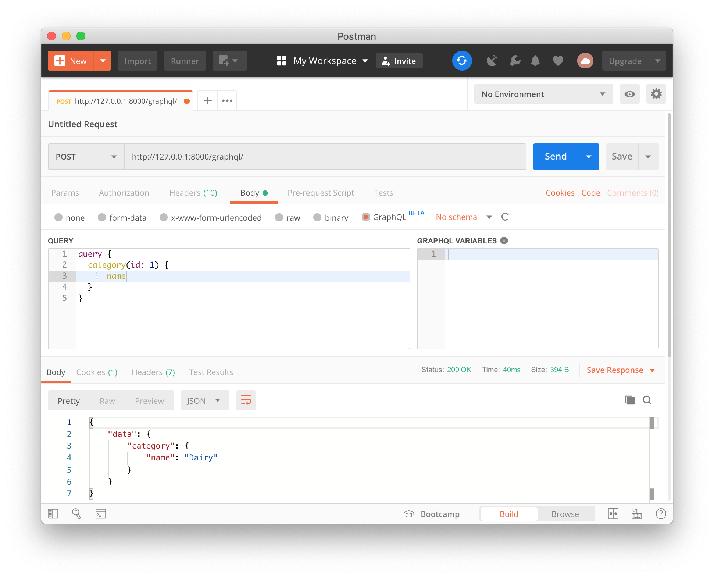
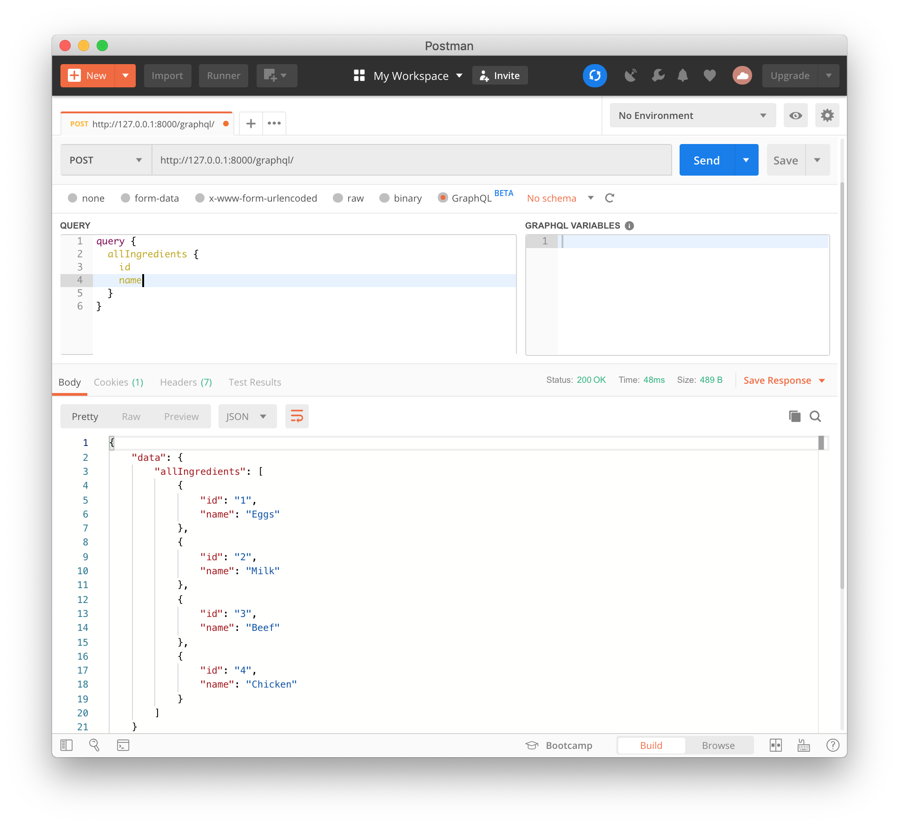

내가 가장 좋아하고, 가장 많이 사용하는 프로그래밍 언어인 Python으로 GraphQL 서버를 구현하면서 GraphQL에 대해 자세히 공부해 보자.

[awesome-graphql](https://github.com/chentsulin/awesome-graphql#lib-py) Python 라이브러리 목록에서 클라이언트 구현을 제외하고, GraphQL 스키마와 타입을 구현하기 위한 라이브러리를 먼저 살펴봤다.

1. **[Graphene](https://github.com/graphql-python/graphene)**
    - Pythonic한 방식으로 가장 쉽게 GraphQL의 스키마와 타입을 구현하기 위한 라이브러리
    - SDL(Schema Difinition Language)을 Python class와 attribute 코드로 정의한다.

2. **[Ariadne](https://github.com/mirumee/ariadne)**
    - 스키마 우선 접근 방식(?)으로 API를 구현할 수 있게 해주는 라이브러리
    - SDL로 스키마를 정의할 수 있고, 비동기 실행이 가능한 resolver 함수와 사용자 정의 Scalar/Enum 타입 정의 가능, 파일 업로드 지원과 `.graphql` 파일에 정의한 스키마를 로딩할 수 있다.
3. **[Tartiflette](https://github.com/tartiflette/tartiflette)**
    - Python3.6 이상 asyncio를 기반으로 GraphQL을 구현할 수 있는 라이브러리
    - [Dailymotion](https://www.dailymotion.com)에서 Graphene(위)을 사용하면서 봉착한 한계를 해결 하고자 만들었다.
    - Python 사고 방식을 중시하는 개발자를 위한  더 경험을 제공하고, SDL로 스키마를 정의한다.

<br/>
# Graphene?
파이썬으로 GraphQL API를 구현하기 위해 다양한 도구를 제공하는 라이브러리.

[Apollo](https://www.apollographql.com/docs/apollo-server/) 서버와 Ariadne 같은 경우 **스키마 우선 접근**에 속한다고 할 수 있는데, 반해 Graphene은 코드 우선 접근 방식을 사용하고 있다. 즉, SDL(Schema Definition Language)를 사용하는 대신 파이썬 코드로 데이터를 표현한다는 의미이다.

Graphene은 유명 프레임워크와 ORM과 쉽게 통합할 수 있고, 스키마 정의와 Relay-Compliant API를 구축하기 위한 도구와 패턴들을 제공한다.

▶︎ *파이썬 환경에 PIP를 이용한 graphene 라이브러리 설치*
```bash
$ pip install "graphene>=2.0"
```

<br/>
# Graphene 기초

다음과 같은 쿼리를 GraphQL 서비스로 전송한다고 가정해 보자.

```graphql
{
    hello(name: "jonnung")
}
```

이 쿼리는 GraphQL 서비스가 갖는 단일 Endpoint(예:`/graphql/`)로 전달되며, root type인 Query 스키마에 의해 검증될 것이다. Query 스키마를 SDL(Schema Definition Language)로 표현하면 아래와 같다.
```sdl
type Query {
  hello(name: String = "anonymous"): String
  goodbye: String
}
```

GraphQL 서비스가 이 쿼리를 처리한 후 반환된 결과값에는 우리가 요청한 필드 값만 포함될 것이라는 것을 예상할 수 있다.

```json
# HTTP 응답 결과
{
  "data": {
    "hello": "Hello jonnung!"
  }
}
```

<br/>
**Graphene**은 위와 같은 SDL을 Python 코드로 구현할 수 있게 해준다.

GraphQL 명세에 의하면 모든 스키마는 <u>객체 타입(object type)</u>으로 구성되고, 이 <u>객체는 필드(field)를 포함</u>한다.  
필드의 타입은 string, integer 등과 같은 <u>스칼라 타입</u>이거나 <u>열거형(enum) 타입</u>이 될 수 있다. 그리고 필드는 <u>인자(argument)</u>를 받을 수 있으며, 인자에 대한 타입과 기본 값을 지정할 수 있다.
```python
# example.py
from graphene import ObjectType, String, Schema


class Query(ObjectType):
    hello = String(name=String(default_value='anonymous'))
    goodbye = String()


schema = Schema(query=Query)
```

요청한 쿼리에 데이터를 가져오기 위해 스키마의 각 필드마다 **Resolver** 함수를 구현해야 한다.  
Resolver 함수는 `resolve_<필드명>` 같은 이름을 가진 Query 클래스의 메서드로 정의한다.
```python
# example.py
from graphene import ObjectType, String, Schema


class Query(ObjectType):
    hello = String(name=String(default_value='anonymous'))
    goodbye = String()

    def resolve_hello(self, info, name):
        return f'Hello {name}!'

    def resolve_goodbye(self, info):
        return 'Bye~'


schema = Schema(query=Query)
```
<br/>
이제 위 스키마에 쿼리를 전달 해보자.
```python
# query.py
from example import schema

result = schema.execute('{ hello }')
print(result.data['hello'])
# Hello anonymous!

result_with_arg = schema.execute('{ hello(name: "jonnung") }')
print(result_with_arg.data['hello'])
# Hello jonnung!

result_goodbye = schema.execute('{ goodbye }')
print(result_goodbye.data['goodbye'])
# Bye~
```

<br/>
# Django와 Graphene 연동하기

> ⚠️  이 내용은 [Graphene-Django의 공식 튜토리얼](https://docs.graphene-python.org/projects/django/en/latest/tutorial-plain/)을 기반으로 정리된 내용이다. 하지만 핵심적인 부분만 다루기 위해 약간 변경한 부분이 존재한다.

### Django 프로젝트 준비
> ❗️ 편의상 Django에 대한 기본적인 개념과 구조를 이해하고 있다는 것을 전제로 하고 있다. (이건 공식 튜토리얼도 마찬가지...)

먼저 새로운 Django 프로젝트를 생성하고, 간단한 **모델 클래스**를 정의한다.  
```bash
# Django 설치
$ pip install Django

# Graphene Django 설치
$ pip install graphene-django

# 새로운 Django 프로젝트
$ django-admin startproject cookbook

# 새로운 Django 앱 추가
$ cd cookbook;
$ django-admin startapp ingredients
```

이 모델 클래스는 요리책(cookbook)에 대한 재료(ingredients)와 분류(category)에 대한 모델을 정의하고 있다.
```python
# 모델 클래스 정의하기
# ingredients/models.py
from django.db import models


class Category(models.Model):
    name = models.CharField(max_length=100)

    def __str__(self):
        return self.name


class Ingredient(models.Model):
    name = models.CharField(max_length=100)
    notes = models.TextField()
    category = models.ForeignKey(
        Category, related_name='ingredients', on_delete=models.CASCADE)

    def __str__(self):
        return self.name
```

<br/>
### GraphQL 최상위 스키마(root type) 정의

위에서 설명 했지만 스키마의 root type은 모든 쿼리의 진입점(Endpoint)이 된다. 
이 root type은 **Query**와 **Mutation** 중 중 하나가 될 수 있다.

여기서 살펴볼 스키마는 Query 타입을 가진 query 필드이며, Query 타입은 하위 필드를 갖는 객체 타입(object type)이다.
```sdl
schema {
    query: Query
}
```
```sdl
type Query {
	all_categories: [CategoryType]
	all_ingredients: [IngredientType]
}
```

이제 이 SDL에서 Django와 Graphene을 이용해 구현해 보자.

먼저 Django 프로젝트-레벨(cookbook)에 `schema.py` 모듈을 추가하고 `graphene.ObjectType` 상속한 `Query` 클래스를 정의한다. 이 `Query` 클래스가 GraphQL의 root type이 된다.  
그리고 `Query` 클래스는 Django 앱-레벨(igredients)에 있는 schema.py 모듈에 정의된 `Query` 클래스(`ingredients.schema.Query`)를 다중 상속하는 Mixin 클래스가 된다.
```python
# cookbook/schema.py
import graphene

from cookbook.ingredients.schema import Query as IngredientsQuery


class Query(IngredientsQuery, graphene.ObjectType):
    pass


schema = graphene.Schema(query=Query)
```
```python
# ingredients/schema.py
import graphene
from graphene_django.types import DjangoObjectType

from ingredients.models import Category, Ingredient


class CategoryType(DjangoObjectType):
    class Meta:
        model = Category


class IngredientType(DjangoObjectType):
    class Meta:
        model = Ingredient


class Query(object):
    category = graphene.Field(CategoryType,
                              id=graphene.Int(),
                              name=graphene.String())
    all_categories = graphene.List(CategoryType)


    ingredient = graphene.Field(IngredientType,
                                id=graphene.Int(),
                                name=graphene.String())
    all_ingredients = graphene.List(IngredientType)

    def resolve_all_categories(self, info, **kwargs):
        return Category.objects.all()

    def resolve_all_ingredients(self, info, **kwargs):
        return Ingredient.objects.all()

    def resolve_category(self, info, **kwargs):
        id = kwargs.get('id')
        name = kwargs.get('name')

        if id is not None:
            return Category.objects.get(pk=id)

        if name is not None:
            return Category.objects.get(name=name)

        return None

    def resolve_ingredient(self, info, **kwargs):
        id = kwargs.get('id')
        name = kwargs.get('name')

        if id is not None:
            return Ingredient.objects.get(pk=id)

        if name is not None:
            return Ingredient.objects.get(name=name)

        return None
```
이렇듯 실제 애플리케이션들에 정의된 스키마(schema.py)를 최상위 root type 스키마가 포함하게 되는 것이다.  
Graphene은 이것을 <u>Python 클래스를 기반으로 구현하기 위해 다중 상속을 이용한 것</u>이고, 하위 스키마(부모 클래스)가 늘어날수록 관리측면에서 여러모로 불편함과 비용이 발생할 것 같다는 생각이 든다. 

<br/>
### GraphQL 서버 실행하기

GraphQL은 단일 진입점(endpoint)를 갖기 때문에 보통 `/graphql/` 이라는 하나의 URL Path로만 쿼리를 받는다.
그래서 `/graphql/` 경로를 Django가 받도록 설정해야 하므로 `cookbook/urls.py` 모듈에 `urlpatterns` 변수를 수정한다.  

아래 코드에서는 원문 튜토리얼과 다르게 [**graphiql**](https://github.com/graphql/graphiql) 사용하지 않게 설정 해봤고 대신 CURL이나 Postman을 이용해 HTTP 요청을 보낼 수 있도록 CSRF 토큰을 검증하지 않게 설정했다.  
(`GraphQLView` 클래스에 `dispatch` 함수가 `ensure_csrf_cookie` 데코레이터를 통해 CSRF 토큰을 강제하고 있기 때문에 이를 우회하기 위한 방법이다.)

```python
# cookbook/urls.py
from django.contrib import admin
from django.urls import path
from django.views.decorators.csrf import csrf_exempt

from graphene_django.views import GraphQLView

urlpatterns = [
    path('admin/', admin.site.urls),
    path(r'graphql/', csrf_exempt(GraphQLView.as_view()))
]
```

다음으로 `GraphQLView` Django View 클래스로 전달받은 쿼리를 검증하기 위해 GraphQL 스키마를 지정 해줘야 한다. 

가장 간단한 방법은 `urls.py` 모듈에서 Django View 클래스에 호출한 `.as_view(schema=schema)`에 `schema` 키워드 인자를 전달하면 된다.  
아니면 (공식 튜토리얼대로) `settings.py` 모듈에 `GRAPHENE` 변수를 선언하고, dict 타입으로 "SCHEMA"를 명시할 수 있다.
```python
# cookbook/settngs.py
GRAPHENE = {
    'SCHEMA': 'cookbook.schema.schema'
}
```
<br/>
이제 Django 서버를 실행한다.
```bash
$ python manage.py runserver
```

<br/>
### HTTP로 `/graphql/` 호출하기

위에서 언급한 대로 CURL, HTTPie 또는 Postman을 통해 `/graphq/` 을 호출할 수 있다.

▶︎ *Postman을 이용해서 GraphQL 호출하기 ([v7.2 부터 GraphQL 지원](https://blog.getpostman.com/2019/06/18/postman-v7-2-supports-graphql/)* 👍*)* 



# 마무리
Python으로 GraphQL 서버를 구축해야 한다면 그나마 **Graphene**이 가장 보편적인 선택일 수 있을 것 같다.  

그 이유는 너무나 유명한 Django, Flask 같은 웹 프레임워크와 통합이 잘 제공되고, ORM을 사용한다면 정의한 GraphQL 스키마와 거의 1:1 매칭이 가능하다는 편의성을 들 수 있을 것 같다.  

하지만 SDL을 Python 클래스로 구현해야 하는 것은 중복 비용일 것 같다는 것과 최상위 스키마(Query)에서 다중 상속하는 방식은 그다지 깔끔 해보이지는 않는다고 생각한다. 

어쨌든 나는 계속 Python으로 GraphQL에 대한 탐구와 시도를 이어갈 예정이기 때문에 실제 서비스로 적용하는 것을 목표로 하고 있다. 끝


