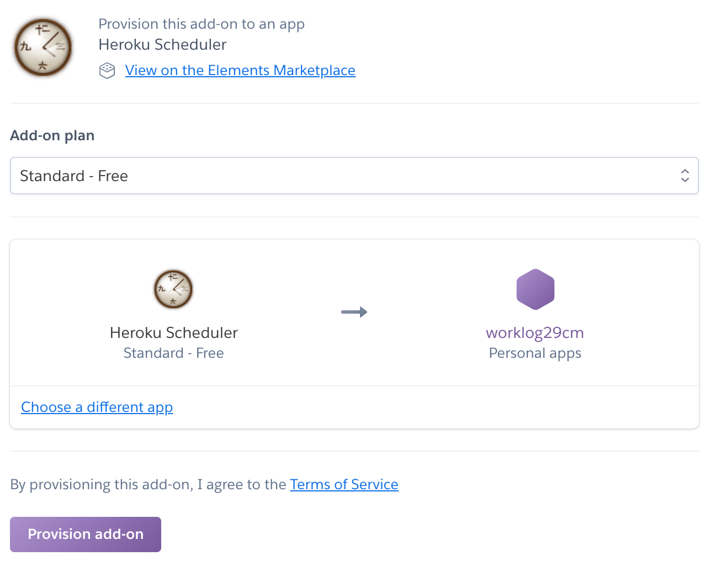
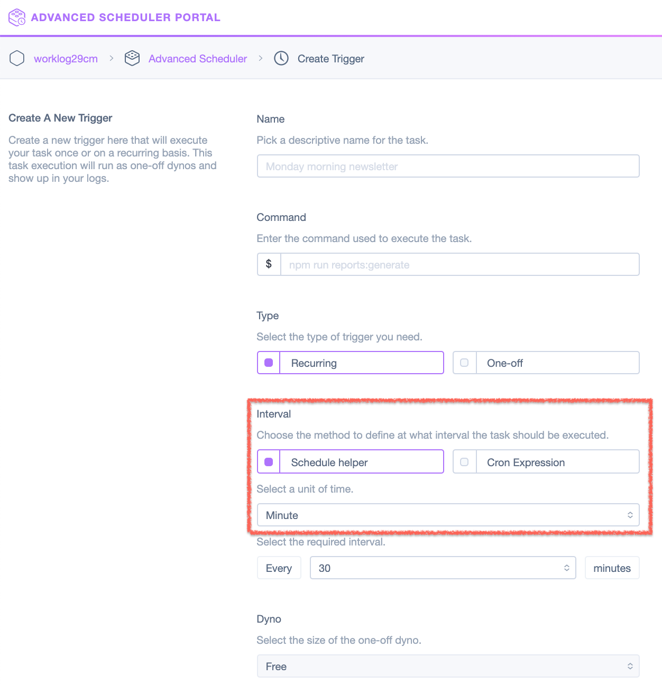

보통 어떤 작업을 일정한 시간 간격으로 실행하기 위해서 Cron을 사용한다. Cron은 crontab 파일에 셸 명령어와 반복 시간을 표현하는 방식(ex. */1 * * * *)으로 실행된다.

최근에 간단한 Django기반의 토이 프로젝트를 서비스하기 위해 무료 서버를 생각하다가 오랜만에 Heroku를 이용하게 되었다. 출퇴근 로그를 기록하는 웹 앱이고, 퇴근 시간 전에 슬랙으로 미리 알림을 주기 위해서 스케줄러가 필요했다. 

Heroku는 Python, Node.js, Java 등으로 작성된 어플리케이션을 배포하고, 실행 시켜주는 Paas 서비스인데 어플리케이션에서 사용하는 부가 서비스를 Add-on 형태로 붙일 수 있다. 
간단한 예로 DB를 사용하기 위해 Add-on 섹션에서 [Heroku Postgresql](https://elements.heroku.com/addons/heroku-postgresql)을 검색해서 추가할 수 있다.

Add-on 마켓플레이스에서 "Scheduler"를 검색하면, 관련된 결과가 몇가지 나오지만 기본적으로 Heroku 공식 가이드에서 "[Heroku Scheduler](https://elements.heroku.com/addons/scheduler)"를 기준으로 작성되어 있기 때문에 간단한 스케줄링은 이 Add-on을 사용하는 것이 나을 것 같다. 

그런데 이 스케줄러는 최소 10분 간격 밖에 지원하지 않기 때문에 1분 단위로 어떤 작업을 반복해야 할 때는 사용할 수 없다. 

그럴 때는 "[Advanced Scheduler](https://elements.heroku.com/addons/advanced-scheduler)"를 추천한다. 이 Add-on은 시간을 지정하는 Input에서 최소 5분 단위까지 지원하면서, 선택적으로 Crontab 표현식을 사용할 수 있기 때문에 1분 단위로 스케줄을 설정하는 것이 가능하다. 

~~아직은 BETA 서비스라서 Early bird 혜택으로 무료라서 부담없이 사용할 수 있지만, 등록한 모든 작업의 실행 횟수가 **1달에 7,500번을 초과할 수 없다.**~~

> 2020년 01월 10일 아래 내용이 업데이트 됨

갑자기 'Advanced Scheduler'를 업그레이드 해야 한다는 메일이 온 걸 확인해보니 Early bird가 끝난 것 같다.  
리소스 관리 페이지에서 확인 해보니 4가지 업그레이드 플랜이 나와 있었다.  

|| |[Hobby]| |[Primeum 0]| |[Primeum 1]| |[Primeum 2]|
|---|---|---|---|---|---|---|---|---|
|Task 개수| |3| |15| |30| |60|
|매달 실행 횟수| |1,000| |50,000| |100,000| |200,000|
|실행 내역 보관| |3일| |7일| |14일| |30일|
|가격| |무료| |$15/월| |$30/월| |$60/월|

나는 매일 "6시간 * 60(1분마다) * 20일 = 7,200회" 동안 Task를 실행하고 있었기 때문에 더이상 이 Add-On을 사용할 수 없을 것 같다. ㅠㅠ 

