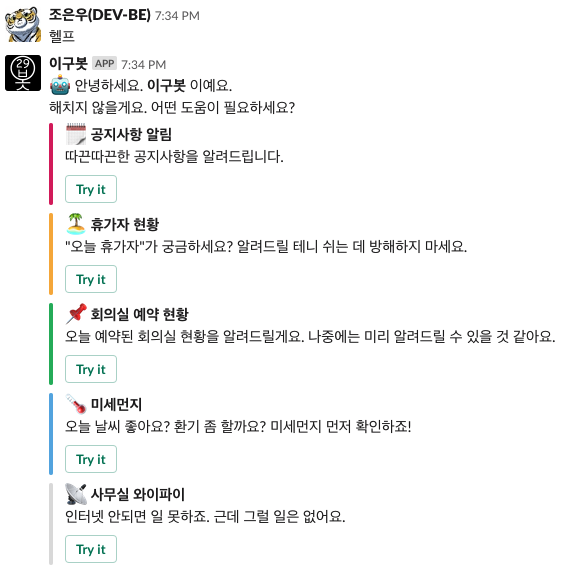
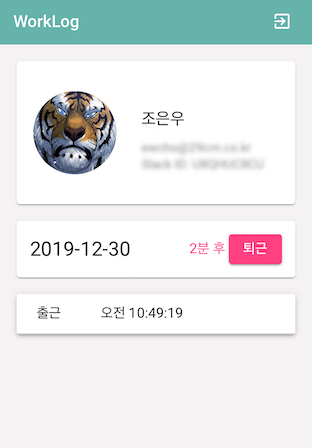
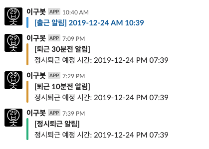
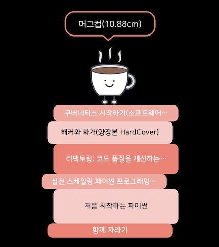

올해 정말 많은 일이 있었다. 열심히 노력해서 얻은 결실도 있었고, 그것에 대한 보상인지 내 가정에 큰 행운이 찾아오기도 했다. 당연히 좋은 일만 있던 것은 아니었지만 그때마다 가족과 친구들이 많은 힘이 되어줬다.

자 그럼 본격적으로 2019년 회고를 시작한다.

 
## 👨‍💻일
#### 기술 발표 문화 - 29CM Developer Conference (29DCF)
개발팀이 경험한 것과 배운 것들을 정기적으로 공유하는 자리를 만들려고 노력했다.  
사실 개인적인 목표는 나중에 더 큰 무대에서 발표를 잘하려면 발표 경험이 많아야 한다는 나름의 소신이 있기 때문이다.  
매달 1번씩은 하려고 했는데 올해 총 4번의 발표를 했다.  

- 분산 비동기 작업 처리를 위한 Celery 첫걸음 (발표 자료준비중)
- 다시 태어난 이구봇 - 취미로 챗봇 만드는 개발자 (발표 자료 준비중)
- Graphql을 이용한 출퇴근 기록 웹 서비스 개발 후기와 토이 프로젝트를 위한 무료로 서버 구성하는 방법 (발표 자료 준비중)
- [가장 보통의 파이썬 개발 환경](https://speakerdeck.com/jonnung/gajang-botongyi-paisseon-gaebal-hwangyeong)

 
#### Celery 도입과 RabbitMQ 클러스터 구축
회사에서 운영하는 서비스에 비동기 작업을 처리할 수 있는 기반이 없던 터라 Django를 기반으로 하는 Celery를 적용했다.  
한 달 정도 조사하고 실습하면서 개념과 기본 활용을 익히고, 서비스를 이용하는 데 직접 영향을 주지 않는 부분부터 점진적으로 비동기 작업을 적용했다.  

최근에 특정 Celery Worker 메모리 사용량이 비정상적으로 증가하는 현상이 발견되어 동료 개발자와 함께 원인을 찾고, 적절한 대응책을 마련했던 일이 있었다.  
아직도 정확한 원인과 근본적인 해결책은 알 수 없지만 Kubernetes 환경에서 비정상적인 메모리 사용량을 감지해서 컨테이너를 재시작할 수 있도록 LivenessProbe를 Shell script로 만들어서 적용했다.  

 
#### 사무실 이사
2년간 정들었던 합정 사무실을 떠나 선릉으로 이사를 오게 되었다. 출퇴근 시간은 획기적으로 단축되어 좋지만 더는 합정의 힙한 감성 속에서 일할 수 없게 된 게 아쉬웠다.  
일상적인 익숙함에 소중하게 생각하지 못했던 것이 많은 아쉬움으로 남았다. 더 많이 돌아다니고 맛집도 더 많이 다녀봤어야 했는데...  

새로 이사 온 선릉 사무실은 생각보다 쾌적했다. 모든 직원이 한 층에서 함께 일하는 것도 나쁘지 않았고, 오히려 자주 마주치고 교류하면서 더 친해질 수 있었다.  
하지만 몇 달 전에 개발팀은 다른 층으로 이사해서 독립적으로 일하고 있다. 결정적인 이유는 개발팀 인원이 갑자기 늘어나면서 자리가 없었기 때문인데 결과적으로 보면 따로 있는 게 덜 방해 받고, 좀 더 집중하기 좋은 것 같다.

 
#### 백엔드 개발팀
2018년 11월부터 백엔드 CELL에 리더를 맡게 되었다. 리더가 처음이라 잘 할 수 있을까 걱정도 많이 했고, 고민도 많이 했다.  
하지만 주변 동료들은 너무 열심히 도와주고 격려해 줘서 항상 힘을 낼 수 있었고, 그래서 지금처럼 멋진 백엔드 팀이 될 수 있었다.  

최근에 멤버가 더 늘어서 사실 작은 부분까지 세심하게 챙겨줄 수 없는 건 맞지만, 사실 내가 생각하는 리더의 역할은 믿어주고, 밀어주는 거로 생각한다.  
2019년에는 제대로 팀을 구성하기 위한 준비 단계였다면 2020년에는 제대로 달려볼 수 있는 한 해가 될 것 같다.  

 
#### 크고 작은 변화들
항상 일손이 부족했던 개발팀에 짧은 시간에 많은 개발자가 입사했다. 그동안 퇴사하는 뒷모습만 많이 보다가 새로운 사람들이 많이 들어오니까 조금 신기했지만, 결과적으로 좋긴 좋다.  
하지만 새로운 멤버들에게 제대로 된 프로세스로 정보를 제공하고, 적응할 수 있도록 도와주지 못한 것 같아 많이 미안했다. 그동안 바쁘다는 핑계로 일감만 처리하면서 신경 쓰지 못했던 부분이기도 했다.  

2020년에는 누구나 쉽고 빠르고, 당연하게 개발할 수 있는 환경을 만들기 위해 많은 것들을 만들고 준비해야겠다.  

 
#### 아쉬운 점
지금은 거의 그렇지 않거나 앞으로 더 좋아질 것 같다고 생각하기 때문에 얘기하자면, 그 전부터 느꼈던 이 회사의 분위기에 대한 내 생각을 한 줄로 요약하면 "제대로 안 돌아간다" 였다.  
서비스가 제대로 안 돌아가는 게 아니라 서비스를 만드는 관련 부서들끼리 서로 잘 안 맞는다. 그렇다 보니 개인 간의 신뢰도 높지 않다. 서로 존중하고 배려하면서 일하고 있다는 생각이 들지 않았다. 그리고 이 부분은 제대로 노력하지 않으면 아무리 시간이 지나도 나아지지 않는다.  

새로운 멤버가 늘어나면서 기존에 갖고 있던 안 좋은 분위기들이 점점 사라지거나 잊히는 느낌을 받는다. 다들 일을 더 잘해보려고 서로 노력하고 있는 모습이라고 생각한다.  
나도 지금보다 더 우리 팀과 회사를 위해서 작은 것부터 큰 것까지 세심하게 신경 쓰고, 행동해야겠다.  

 

----
## 🚂 토이 프로젝트
#### 슬랙 앱 / 이구봇
파이썬 창시자인 귀도 반 로썸이 크리스마스주에 심심해서 파이썬을 개발하기 시작했다는 일화처럼 나도 명절에는 작은 거라도 만들어보고 싶다는 계획을 세웠다.  
우리 회사는 2018년 중순부터 슬랙을 쓰게 되었는데 그때부터 슬랙봇으로 만들고 싶었던 기능이 몇 가지 있었다. 공지사항 알림, 휴가자 현황, 회의실 예약 현황, 미세먼지, 와이파이 비번 등등...  

하지만 내가 최종적으로 만들고 싶었던 기능은 DevOps를 위한 슬랙 봇이었다. JIRA 이슈 알림, 코드리뷰 알림, 자동 배포와 서비스 모니터링과 각종 알림 등등...  
그래서 설날 때부터 Django를 기반으로 슬랙의 Event API와 Interactive API를 활용한 Pluggable 슬랙 봇 서버를 개발했다.  
아래 스샷처럼 필요한 기능은 플러그인 형태로 개발해서 쉽게 붙일 수 있다.  

회사에 공개하고, 어느 정도 운영을 해보면서 이 정도 완성도면 소스코드를 공개해도 괜찮을 것 같았다.  
그래서 시간 될 때마다 테스트 코드 추가하고, 웹 프레임워크를 Django에서 Flask로 전환하면서 리팩토링하고, Docstring을 추가했다.  
거의 마무리를 앞두고 다른 거에 신경을 쓰다가 아직 공개를 못 하고 있다. 이 회고를 마치면 이것부터 해야겠다.  

 
#### 출퇴근 기록 / WorkLog
추석 연휴에 또 뭔가 만들어 보고 싶었다.  
그동안 출퇴근 기록이 출입문 지문인식으로 변경되면서 본인이 몇 시에 출근했는지 잊어버리는 일이 많아졌다. 업무 시간 중에 가장 많이 사용하는 메신저를 활용해서 출퇴근을 기록할 수 있도록 하면 좋겠다는 아이디어가 떠올랐다.  

당시에 GraphQL을 공부하던 중이라 UI와 서버를 모두 GraphQL을 활용해서 구현해 보고 싶었다.  
대신 24시간 안에 개발해보기!  
당연히 연속 24시간은 힘드니까 매일 퇴근 후 조금씩 개발했고, 결국 실제로 설계/개발에 투자한 시간은 다 합쳤을 때 24시간 안에 프로젝트를 완수할 수 있었다.  말이 쉽지 쓸데없는 시간 낭비를 줄이고, 삽질하지 않으려면 최적의 선택과 집중이 필요했다.  

Angular8, Apollo Client, Django, Graphene을 기반으로 웹 UI와 GraphQL 서버를 개발했고, 웹 서버는 Netlify에 올리고, API 서버는 Heroku에 배포했다.

 

 

----
## 🧠 스터디 그룹
#### React Native
매년 스마트폰 앱 개발을 목표로 삼는다. 하지만 제대로 시작해본 적이 없었다.  
나와 같은 뜻을 가지고 85D 멤버들과 React Native로 앱을 만들어 보자는 목표로 매주 주말 스터디를 진행했다.  
첫날부터 Xcode 설치하는데 하루를 다 소비했고, 그 다음에도 매주 큰 진척이 없다가 결국 각자 다른 공부하는 모임으로 변경되면서...(사라짐ㅋㅋ)

 
#### GraphQL 스터디
그동안 관심만 두고 미루고 있었던 GraphQL을 공부해 보고자 동료 개발자들을 꼬셔서 사내 스터디 그룹을 만들었다.  
기본 개념부터 시작해서 각 구현 환경에서 프로그래밍 언어마다 어떻게 구현할 수 있는지 알아보는 것에 중점을 두었다. 목표가 명확했기 때문에 4주 코스로 진행했고, 나는 1번의 발표와 2개의 블로그 포스팅을 할 수 있을 정도로 의미 있는 학습 경험이었다.  

[처음 만나는 GraphQL](https://jonnung.dev/graphql/2019/07/23/graphql-getting-started/)
[Python으로 GraphQL 서버 구현 (Graphene 튜토리얼 따라하기)](https://jonnung.dev/graphql/2019/08/05/python-graphql-graphene-tutorial/)

 
#### 알고리즘 문제 해결 스터디
간혹 회사 동료들에게 알고리즘 공부를 하고 싶다는 얘기를 듣곤 했다.  
과거 3년 전쯤에 페이스북 그룹을 통해서 알고리즘 스터디를 오랜 기간 진행했던 경험이 있어서 이때 경험을 살려 스터디 그룹을 만들었다.  

주요 흐름은 "구종만님의 알고리즘 문제 해결 전략"이라는 도서를 갖고 진행하고, 매주 알고리즘 문제를 풀어서 공개 저장소에 PR을 보내야 한다.  
그리고 퇴근 후 모여서 각자 구현한 방식을 설명하는 방식으로 진행하고 있다.  
현재 5주 차가 넘어가고 있는데 낙오자 없이 순항 중이다. 

[GitHub - 29rithm/algospot: 29CM 개발자들의 알고리즘 스터디](https://github.com/29rithm/algospot)

 
#### 스프린트 서울 (스터디 모임은 아니지만)
수년간 파이콘 행사를 다니면서 스프린트에 참여 해보고 싶었지만 용기가 잘 나지 않았다. 그러다 [스프린트 서울](https://www.sprintseoul.org/)을 알게 되어 신청하게 되었다.  

첫 스프린트 모임에서 Pandas 스프린트에 참여했다. 그나마 Pandas 몇 번 사용해 본 경험이 있어서 기여하고 싶은 마음이 들었기 때문이다.  
하지만 초심자가 해볼 만한 이슈를 찾는 것도 꽤 힘들었다.   
결국 첫 PR을 제출하지 못했지만, 스프린트를 통해 어떻게 이슈를 탐색해서 해결하고 커뮤니케이션하는지 전체적인 흐름은 완전히 느껴볼 수 있는 즐거운 시간이었다.  

사실 그 후로 스프린트를 참석하지 못했다. 거의 매번 신청은 했는데 그때마다 다른 일정이 겹쳐서 갈 수 없었다.  2020년에는 더 많이 참석해야지~

 

----
## 📚 독서
한 달에 1권씩 기술 서적을 읽으려고 삼았던 목표는 7.4권 정도로 마무리되었다.  
아래 그림은 내가 올해 읽은 책들의 두께를 쌓아올렸을 때 높이다.  
[북적북적](https://apps.apple.com/kr/app/%EB%B6%81%EC%A0%81%EB%B6%81%EC%A0%81-%EB%8F%85%EC%84%9C-%EA%B8%B0%EB%A1%9D-%EC%95%B1/id1472538417) 이라는 어플을 우연히 알게 되었는데 내가 읽은 책의 장수를 기준으로 탑을 쌓아준다. 겨우 머그컵 정도의 높이밖에 안 되다니...

 
#### 처음 시작하는 파이썬
2년 전쯤 샀다가 올해 제대로 읽어봤다. 파이썬을 한 지 5년이 넘다 보니 제목만 보고 초심자용 같았는데 전혀 그렇지 않았다.  
오히려 지금 수준에서 한 번 더 제대로 숙지하면 좋은 내용이 너무 많았다.  
요즘은 누가 파이썬을 배우기 위해 책 추천을 해달라고하면 무조건 이 책을 권한다.

#### 데이터 중심 애플리케이션 설계
가장 많은 관심과 애착을 가진 책이다. 이 책을 끝까지 보는 것에 큰 의미를 두고 있었다.  
책 내용이 그렇게 호락호락하지 않다 보니 진도를 나가기도 어렵고, 이해하기도 쉽지 않았다. 그러다 보니 집중력을 잃을 때가 많았고 결국 읽기를 중단했다. 

#### 함께 자라기
출시되자마자 회사 동료들과 비슷한 시기에 읽으면서 의견도 주고받고, 각자 실천도 하면서 정말 함께 자라고 함께 잘 할 수 있도록 해준 고마운 책이다.

#### 마이크로서비스 패턴
아직 출간되지 않은 책이다. 페이스북에서 우연히 신청한 베타 리더에 선정돼서 60% 분량의 원고를 택배로 받아서 보름 정도 열심히 읽고 리뷰를 작성했다.  
마이크로서비스 구축을 위해 반드시 알고 숙달하면 좋을 만한 내용이 많았고, 번역 퀄리티가 너무 뛰어나서 술술 읽혔다.  
책을 집필해 본 적은 없지만, 베타 리더로써 책에 내 이름이 실린다고 하니 너무 뿌듯하다. (2020년 1월 예약 판매 예정)

 

----
## 🌴 여행
#### 제주도
인생 첫 제주도였다. 그동안 살면서 왜 이렇게 아름다운 곳을 오지 않았는가 싶었고, 지금이라도 와서 너무 좋다고 생각했다.  
아내와 함께 매 순간 너무나 즐겁고 행복했던 여행이었다.

#### 뉴욕
19년 전에 헤어진 친구의 결혼식을 가기 위해 뉴욕행 비행기에 올랐다.  
9년 전에 혼자일 때 한번 다녀오긴 했지만, 결혼 후에도 갈 수 있도록 허락해 준 아내에게 진심으로 감사하고 있다.

