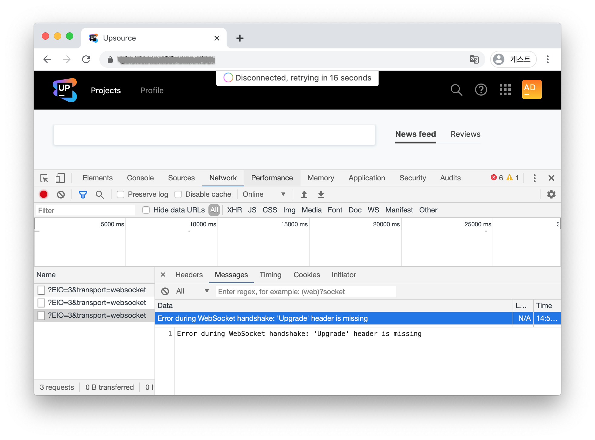
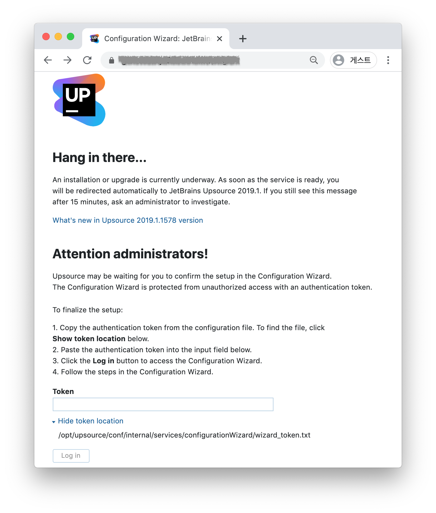
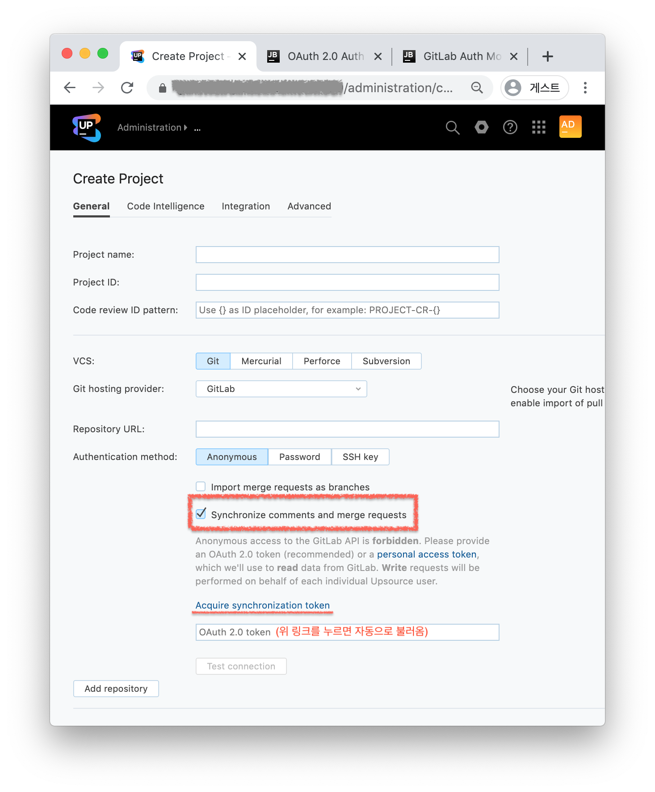

## Upsource 소개
[**Upsource**](https://www.jetbrains.com/ko-kr/upsource/)는 **Jetbrains**에서 만든 코드 리뷰 도구이다. Upsource는 웹 브라우저를 통해 코드 변경사항과 커밋 메시지, 커밋한 사람, Diff 보기, 코드 리뷰 생성과 의견을 주고받을 수 있는 기능을 제공한다.  

Github이나 Gitlab 등이 제공하는 저장소 히스토리 그래프와 커밋 내용, 브랜치도 모두 볼 수 있다. 하지만 Git 저장소를 직접 호스팅하는 기능은 갖고 있지 않다. Upsource의 근본적인 컨셉은 **코드 리뷰 협업**에 있기 때문이다.  

이미 모든 회사에서 Github, Gitlab, Bitbucket 같은 Git 호스팅 서비스를 사용하고 있고, 이미 이 시장을 선점하고 있는 3대장(서로간 격차는 무시하고)과 굳이 비벼볼 필요는 없지 않을까 생각한다. 그래서 오히려  더 나은 **코드 리뷰** 경험을 위한 도구라는 측면을 강조하는 것이 **Upsource**의 필요성을 부각하는 데 도움이 될 것 같다.  

> <뒷 이야기>  
> 얼마 전 회사 동료가 처음 Upsource를 보여주고 팀에 소개하고 싶다고 했을 때 살짝 보고 바로 고개를 절레절레 저었다.  
> 이미 Gitlab EE를 쓰고 있고, 앞으로 Github으로 옮길지도 모르는데 이 시점에서 새로운 Git 호스팅 서비스가 무슨 필요가 있겠냐는 의견이었다.   
> 하지만 자세히 듣고 살펴보니 추구하는 방향성이 전혀 다른 도구라는 것을 알게 되었다. 급격히 몰려오는 미안함에Upsource를 사내 개발서버에 설치해서 써볼 수 있도록 도와줬다.  
> 이 포스트의 내용은 그 과정에서 경험한 내용을 담았다.  

<br/>
## Docker로 Upsource 서버 시작
먼저 Upsource가 권장하는 시스템 사양 중 메모리(RAM)는 8GB 이상이다. 예상보다 최소 요구사항이 높은편인 것 같았다. 하지만 개발팀에서 다 같이 사용하기 위해 이 정도 투자는 할 수 있지 않을까?  

그리고 Upsource는 10명 이하까지는 무료 라이선스를 제공한다. 따라서 팀 규모가 10명 이상이라면 프로젝트나 담당 영역(예: Frontend, Backend, App 등)에 맞게 분리된 여러 Upsource서버를 구성하는 방법도 있다.  

설치는 간단하다. [ZIP](https://www.jetbrains.com/help/upsource/zip-installation.html)으로 압축된 아카이브를 내려받아 포함된 Bash 스크립트로 실행하거나, Docker 이미지로 프로세스를 실행할 수 있다. 
여기서는 실행 환경과 관계없이 안정적인 실행을 보장하는 [Docker](https://www.jetbrains.com/help/upsource/docker-installation.html) 이미지를 사용해서 Upsource 서버를 실행한다.

먼저 Docker Hub에 가서 [Upsource 공식 이미지](https://hub.docker.com/r/jetbrains/upsource/)를 확인한다. 특이한 점은 `latest` 태그를 제공하지 않고 있어서 [정확한 최신 태그](https://hub.docker.com/r/jetbrains/upsource/tags)로 내려받아야 한다. 

```bash
$ docker pull jetbrains/upsource:2019.1.1578
```

Docker 컨테이너를 실행하기 전 Upsource 프로세스가 실행되면서 생성하는 데이터(data), 설정 파일(conf), 로그(logs), 백업(backups) 폴더를 호스트 OS와 마운트하기 위해 생성해 둬야 한다.  


```bash
cd /home/apps/upsouce;
mkdir -p -m 750 data conf logs backups
chown -R 13001:13001 data conf logs backups
```


Upsource 서버는 기본적으로 `:8080` 포트로 요청을 받는다. 현재 호스트 OS에 동일한 포트가 사용되고 있지 않다면 `-p 8080:8080`처럼 같게 하고, 아니면 `-p 5000:8080` 형태로 포트 포워딩 설정을 변경해야 한다. 

`docker run` 명령어 다음에 `-it` 옵션 대신 `-d`를 사용해서 데몬 형태로 실행했다.
```bash
docker run -d --name upsource-server-temp \
-v /home/apps/upsource/data:/opt/upsource/data \
-v /home/apps/upsource/conf:/opt/upsource/conf \
-v /home/apps/upsource/logs:/opt/upsource/logs \
-v /home/apps/upsource/backups:/opt/upsource/backups \
-p 8080:8080 \
jetbrains/upsource:2019.1.1578
```

<br/>
## Reverse Proxy를 통한 Upsource 연결 설정
인프라 구성에 따라 다르겠지만 이 경우에는 인터넷을 통해 Upsource 서버로 바로 들어가지 못하고, 특정 Reverse Proxy를 통과해야 하는 상황에 대한 설명이다.

> Reverse Proxy란? 단순한 예를 들자면 분산된 WAS를 인터넷을 통해 클라이언트에게 직접 노출하지 않고, 특정 서버가 대신 받아 요청된 Host나 포트에 따라 적절히 라우팅해 주고, 버퍼 역할을 해주는 Proxy 서버를 말한다.   

아래 설정은 Reverse Proxy로 많이 사용하는 Nginx 설정이다. Nginx에서 직접 TLS 인증서를 통해 HTTPS 요청을 받을 수 있도록 `443`포트를 열고 있다.  
만약 HTTPS를 제공할 수 없다면 `80`을 사용해야 한다. 근데 요즘 세상에 HTTPS를 제공하지 않는다면...☠️  
아무튼 HTTPS로 서비스하기 위한 다른 방법은 Upsource 서버에서 직접 TLS 인증서를 사용해 HTTPS 요청을 받을 수도 있다.  

```
server {
    listen 443 ssl;
    server_name upsource.jonnung.dev;
    access_log  /var/log/nginx/access.log main;

    include /home/apps/nginx/conf/ssl.conf;

    location / {
        proxy_pass  http://{upsource-server-host}:8080;
        proxy_set_header Host $host;
        proxy_set_header X-Real-IP $remote_addr;
        proxy_set_header X-Forwarded-Host $http_host;
        proxy_set_header X-Forwarded-For $proxy_add_x_forwarded_for;
        proxy_set_header Upgrade $http_upgrade;
        proxy_set_header Connection "upgrade";
    }

    include /home/apps/nginx/conf/error.conf;
}
```

위 설정에서 가장 중요한 부분은 Reverse Proxy가 Upsource 서버로 전달하는 HTTP Header 중 `Upgrade`와 `Connection` 설정이다.  
Upsource Frontend는 Upsource 서버와 Websocket을 이용해 실시간으로 통신한다. 그렇기 때문에 HTTP 연결을 Websocket 프로토콜로 업그레이드시켜주기 위한 HTTP Header 전달이 필수다.


> `Upgrade` 로 프로토콜을 업그레이드 하는 매커니즘은 [Protocol upgrade mechanism - HTTP | MDN](https://developer.mozilla.org/ko/docs/Web/HTTP/Protocol_upgrade_mechanism)에서 확인할 수 있고, 클라이언트에서 어떻게 Websocket 연결로 업그레이드 하는지는 [이 블로그](https://engineering.huiseoul.com/%EC%9E%90%EB%B0%94%EC%8A%A4%ED%81%AC%EB%A6%BD%ED%8A%B8%EB%8A%94-%EC%96%B4%EB%96%BB%EA%B2%8C-%EC%9E%91%EB%8F%99%ED%95%98%EB%8A%94%EA%B0%80-%EC%9B%B9%EC%86%8C%EC%BC%93-%EB%B0%8F-http-2-sse-1ccde9f9dc51)를 참고할 수 있다.  

아래 화면은 Upsource 서버를 실행하고 최초 접속했을 때 보이는 화면이다.  
관리자를 위한 최초 인증을 하기 위해 Upsource 서버 설정에 포함된 토큰을 입력해야 한다.  
```bash
# 도커 컨테이너 안에 있는 Upsource 토큰 가져오기
$ docker exec -it upsource-server cat /opt/upsource/conf/internal/services/configurationWizard/wizard_token.txt
```


이 다음 자세한 설정 과정은 [공식 문서](https://www.jetbrains.com/help/upsource/getting-started.html)와 [이동욱님 블로그](https://jojoldu.tistory.com/256)로 참고하는 것을 추천한다.

<br/>
## Gitlab으로 로그인 & Merge Request 동기화
Upsource 프로젝트를 만들때 VCS를 등록 과정에서 Github 이나 Gitlab에 있는 Git 저장소를 동기화할 수 있다.
하지만 `Synchronize comments and merge requests` 기능을 사용하려면 Upsource와 함께 실행되고 있는 Hub 라는 서비스의 **Auth module**을 등록해야 한다. 

Gitlab과 연동을 하려면 [Gitlab 어드민에 Application 설정에 Upsource을 추가](https://www.jetbrains.com/help/hub/2019.1/gitlab-auth-module.html)해야 한다. 
이 과정을 마친 후 "Acquire synchronization token"을 누르면 자동으로 토큰을 받아와서 지속해서 사용할 수 있다.

<br/>
## 마치며
Jetbrains 답게 높은 완성도와 깔끔하고 직관적인 UI 덕분에 코드 리뷰와 커뮤니케이션할 때 많은 도움이 될 것 같다. RAM을 다소 많이 쓰는 것 같지만 그만큼 빠른 속도가 장점이다.  
Jetbrains IDE를 쓴다면 [Upsource plugin](https://www.jetbrains.com/help/upsource/installing-plugin.html)을 함께 쓸 수 있다고 한다.  
