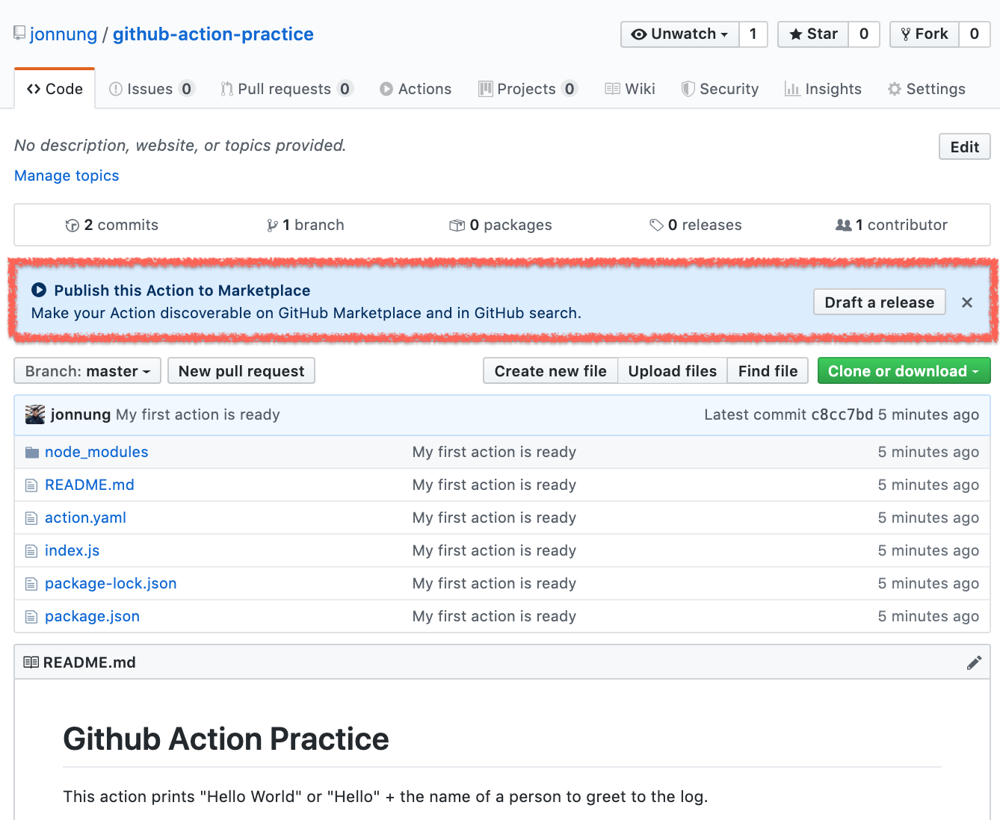

## Github Action이란?
**Github Action**은 Github 저장소를 기반으로 소프트웨어 개발 **Workflow**를 자동화 할 수 있는 도구이다. 간단하게 말하자면 Github에서 직접 제공하는 CI/CD 도구라고 할 수 있다.  

Workflow는 Github 저장소에서 발생하는 build, test, package, release, deploy 등 다양한 이벤트를 기반으로 직접 원하는 Workflow를 만들 수 있다.  

Workflow는 **Runners**라고 불리는 Github에서 호스팅 하는 Linux, macOS, Windows 환경에서 실행된다. 그리고 이 Runners를 사용자가 직접 호스팅하는 환경에서 직접 구동시킬 수도 있다.(self-hosted runner)  

Github 마켓 플레이스에는 여러 사람이 공유한 Workflow는 찾을 수 있으며, 자신이 직접 만들어서 공유할 수도 있다.  


### ⏳ 얼마나 사용 할 수 있을까?
Workflow는 저장소마다 최대 20개까지 등록할 수 있다. 그리고 Workflow 안에 존재하는 `Job`이라는 단계마다 최대 6시간 동안 실행될 수 있고, 초과하게 되면 자동으로 중지된다.  

그리고 Github 계정 플랜에 따라 전체 Git 저장소를 통틀어 동시 실행할 수 있는 `Job` 개수가 정해져 있다.   
Job 안에서 Github API를 호출한다면 1시간 동안 최대 1,000번까지만 가능하다.


### 💵 사용료 얼마나?
공개 저장소는 무료이며, 비공개 저장소는 해당 계정에 부여된 무료 사용량 이후에 과금된다.  
Github 무료 계정의 전체 비공개 저장소를 기준으로 한달에 <u>500MB 스토리지와 실행 시간 2,000분(minute)</u>까지 제공된다.


<br/>
## Workflow 시작하기
가장 빠르게 Workflow를 만드는 방법은 Github이 해당 저장소를 분석해서 적절히 제공하는 템플릿을 이용하는 방법과 Gitbub 마켓플레이스에 공유된 Workflow를 가져오는 방법이 있다.  


하지만 기본적인 방법은 저장소에  `.github/workflows`  폴더를 만들어서 `.yml` 형식 파일 만든 뒤 Workflow를 정의하는 것이다.  

<br/>
### Workflow 주요 구성
- 어떤 이벤트가 발생했을 때 실행될 수 있다.
- 최소 1개 이상의 **Job**을 정의해야 한다.
- Job 안에는 여러 **Step**을 정의할 수 있다.
- Step 안에는 단순한 커맨드 실행이나 **Action**을 가져와 사용할 수 있다.
- Action은 Github 마켓플레이스에 공유된 Action을 이용하거나 현재 저장소에서 직접 만들어서 사용할 수 있다.


먼저 간단한 예제를 살펴보면서 구성을 익혀보자.  

```yaml
name: Greet Everyone
# 이 Workflow는 저장소에 Push가 되면 실행 되도록 한다
on: [push]

jobs:
  # Job ID: 문자와 -(대시), _(언더바)로 구성된 Job 고유 식별자
  build:
    # Job 이름
    name: Greeting
    # 이 Job은 리눅스에서 실행된다
    runs-on: ubuntu-latest
    steps:
      # 이 Step은 Github이 제공하는 `hello-world-javascript-action` Action을 사용한다
      - name: Hello world
        uses: actions/hello-world-javascript-action@v1
        with:
          who-to-greet: 'Mona the Octocat'
        id: hello
      # 이 Step은 이전 Step에서 나온 출력을 사용한다
      - name: Echo the greeting's time
        run: echo 'The time was ${{ steps.hello.outputs.time }}.'
```

<br/>
### 어떤 이벤트가 발생했을 때 Workflow를 실행하기
- Github에 Push나 Pull Request 같은 이벤트가 발생 했을때 실행
- Crontab처럼 반복 스케줄 사용 (예: `*/5 * * * *`)
- 외부에서 이벤트를 발생 시키고 싶을 때는 `repository_dispatch` REST API를 통해 커스텀 이벤트를 전달 (참고: [External Events - GitHub Help](https://help.github.com/en/actions/automating-your-workflow-with-github-actions/events-that-trigger-workflows#external-events-repository_dispatch)
- 브랜치를 지정하거나 필수 실행 인자를 전달해서 수동으로 실행하기 (`workspace_dispatch`)


> ⚠️ **반복 스케줄**은 UTC 타임존 시간을 사용하고, 기본 브랜치나 마지막 커밋을 기준으로 동작한다. 최소 간격은 5분까지만 가능하다. (참고: [Scheduled Events -  Github Help](https://help.github.com/en/actions/automating-your-workflow-with-github-actions/events-that-trigger-workflows#scheduled-events-schedule))  

<br/>
### Git 브랜치나 Git 태그로 이벤트 지정하기
위에서 설명한 이벤트 중 Push나 Pull Request 이벤트에는 **Git 브랜치**, **Git 태그**, **파일 경로**를 활용해서 좀 더 상세하게 이벤트를 정의할 수 있다.   

예를 들자면 `master` 브랜치 또는`v1` 태그가 Push 되었을 때 `test` 폴더안에 어떤 파일이 변경된 경우에 Workflow가 실행되게 할 수 있다.  

```yaml
on:
  push:
    branches:
      - master
    tags:
      - v1
    paths:
      - 'test/*'
```

<br/>
### Workflow를 실행할 Runner 지정하기
Workflow는 Github이 직접 호스팅하는 환경이나 사용자가 직접 호스팅하는 환경에서 실행할 수 있다.  
그리고 그 환경에서 직접 어떤 명령어를 실행시키거나 도커 컨테이너를 활용하는 방법도 있다.  

실행 환경은 `runs-on` 항목으로 지정하고, Github이 호스팅하는 머신 환경은 `Ubuntu`, `Windows`, `MacOS`가 있다. (참고: [Virtual environments for GitHub-hosted runners - GitHub Help](https://help.github.com/en/actions/automating-your-workflow-with-github-actions/virtual-environments-for-github-hosted-runners))


<br/>
## Action을 작성하고, 가져다 쓰기
### Action이란?
위에서 Action을 직접 만들거나 Github 마켓 플레이스에서 공유된 것들을 가져와 사용할 수 있다고 했다.   
즉, **Action**은 사용자가 어떤 동작을 직접 프로그래밍해서 Workflow 상에서 활용할 수 있는 방법이다.  

예를 들어 NPM 패키지를 빌드해서 배포하거나 Go 바이너리를 Github 저장소 release에 올리는 동작을 적절한 도구나 여러 API를 조합해서 만든 것을 Action으로써 활용하는 것이다.  
그리고 이렇게 만든 Action을 공유하면 마치 코딩할 때 라이브러리를 가져다 쓰는 것처럼 쓸 수 있다. 

<br/>
### Action 만들기
Action은 도커 컨테이너와 Javascript로 만들 수 있다.   

도커 컨테이너로 Action을 만드는 경우 일관된 동작을 보장할 수 있는 장점이 있지만, Github이 호스팅하는 리눅스 환경에서만 실행할 수 있다.  

Javasript로 Action을 만들면 좀 더 간단하며, 도커 컨테이너보다 더 빨리 실행된다.  

이렇게 만든 Action에 필요한 Input, Output 설정이나 메인 실행 파일 같은 메타 정보를 정의하기 위해 `action.yaml` 또는 `action.yml`을 반드시 작성해야 한다.  

<br/>
간단한 Action을 하나 만들어 보자.  
먼저 Action 코드를 올려둘 Github 저장소를 하나 만든다. (예: `github-action-practice`)  

<br/>
**① `action.yml` 만들기**  

Acton 메타 정보의 종류와 의미는 [Metadata syntax for GitHub Actions - GitHub Help](https://help.github.com/en/actions/automating-your-workflow-with-github-actions/metadata-syntax-for-github-actions)에서 참고하자.  

```yaml
name: 'Hello World'
description: 'Greet someone and record the time'
branding:
  color: 'yellow'
  icon: 'code'
inputs:
  who-to-greet:
    description: 'Who to greet'
    required: true
    default: 'World'
outputs:
  time:
    description: 'The time we greeted you'
runs:
  using: 'node12'
  main: 'index.js'
```

<br/>
**② 메인 실행 파일 작성하기**  

`action.yml` 마지막에 정의한 `index.js` 이름으로 메인 실행 파일을 만든다.  
Javascript로 Action 로직을 만드는 경우 도움이 될만한 Node.js 패키지가 있다.   
[@actions/core](https://github.com/actions/toolkit/tree/master/packages/core),  [@actions/github](https://github.com/actions/toolkit/tree/master/packages/github) 이 두 패키지는 Input, Output을 쉽게 처리하고, Github Action 컨텍스트에 접근할 수 있는 인터페이스 등을 제공한다.  

```javascript
const core = require('@actions/core');
const github = require('@actions/github');

try {
  const nameToGreet = core.getInput('who-to-greet');
  console.log(`Hello ${nameToGreet}!`);

  const time = (new Date()).toTimeString();
  core.setOutput("time", time);

  const payload = JSON.stringify(github.context.payload, undefined, 2)
  console.log(`The event payload: ${payload}`);
} catch (error) {
  core.setFailed(error.message);
}
```

<br/>
**③ 저장소 Push하고, Workflow에서 사용하기**  

Action 저장소가 다른 저장소의 Workflow에서 사용되려면 반드시 Public 저장소로 설정되어 있어야 한다.  
아래 내용은 위에서 살펴본 Workflow 예제에 `Hello world` Step 부분을 수정했다.  

```yaml
# 윗부분 생략
jobs:
  greeting_job:
    name: Greeting
    runs-on: ubuntu-latest
    steps:
      - name: Hello world
        uses: jonnung/github-action-practice@master
        with:
          who-to-greet: 'Jonnung'
        id: hello
      - name: Echo the greeting's time
        run: echo 'The time was ${{ steps.hello.outputs.time }}.'
```

<br/>
### Action 공유하기
Github 마켓플레이스에 Action을 공유할 때는 Action만을 위한 독립된 저장소를 구성하는 것이 좋다.  

[GitHub Marketplace · Actions to improve your workflow · GitHub](https://github.com/marketplace?type=actions)  

<br/>

만약 Action을 공유할 목적이 아니라 특정 프로젝트에 종속된 구성을 한다면 `action.yaml` 파일을 어디에 두던 상관이 없다.  
하지만 `.github/actions/action1`, `.github/actions/action2` 같은 구성을 하는 것이 관리하는 측면에서 유용하다.  

Action을 독립된 Git 저장소로 구성한다면, 반드시 Public 저장소 타입으로 만들어야 한다.  
하지만 이 저장소가 바로 Github 마켓 플레이스에 올라가는 건 아니다. 하지만 Github이 자동으로 `action.yml`을 감지해서 마켓 플레이스에 올릴 수 있다는 배너를 노출해준다.  



<br/>
## 마치며
CI/CD 파이프라인을 구성할 때 주로 Jenkinsfile이나 Gitlab CI를 이용하고 있었다. 사내 Git 호스팅 서버로 Gitlab EE를 사용하고 있기도 하고 Jenkins를 신뢰하고 있는 편이긴 하다.  

Jenkinsfile을 도입한 결정적인 이유는 아무래도 역사와 전통이 깊은 Jenkins를 사용하는게 다양한 사례들을 활용하고, 문제가 발생했을 때 더 쉽게 정보를 얻을 수 있을 것이라고 판단했었다.  

최근 Github Action이 정식 출시되었을 때 크게 관심을 갖지 않았지만, 조만간 Gitlab EE 라이센스가 끝나기 때문에 Github Team으로 이사 가는 것을 추진하고 있다. (당연히 동료 개발자들은 환호했음)  

하지만 Gitlab EE에서 제공하는 Docker Registry 서버 기능을 사용하고 있기 때문에 이 부분을 해결하고, 중요하진 않지만 Git Remote 도메인 부분도 기존 것을 활용할 수 있을지 좀 더 조사를 해봐야 한다.  

아무튼 Github Action을 살펴본 결론은 굉장히 쉽고 간단하다는 것이다.  
CI/CD에 대한 개념이 익숙한 상태에서 Workflow를 구성하는 핵심적인 요소들만 이해하면 쉽게 익혀서 사용할 수 있다고 생각한다.
