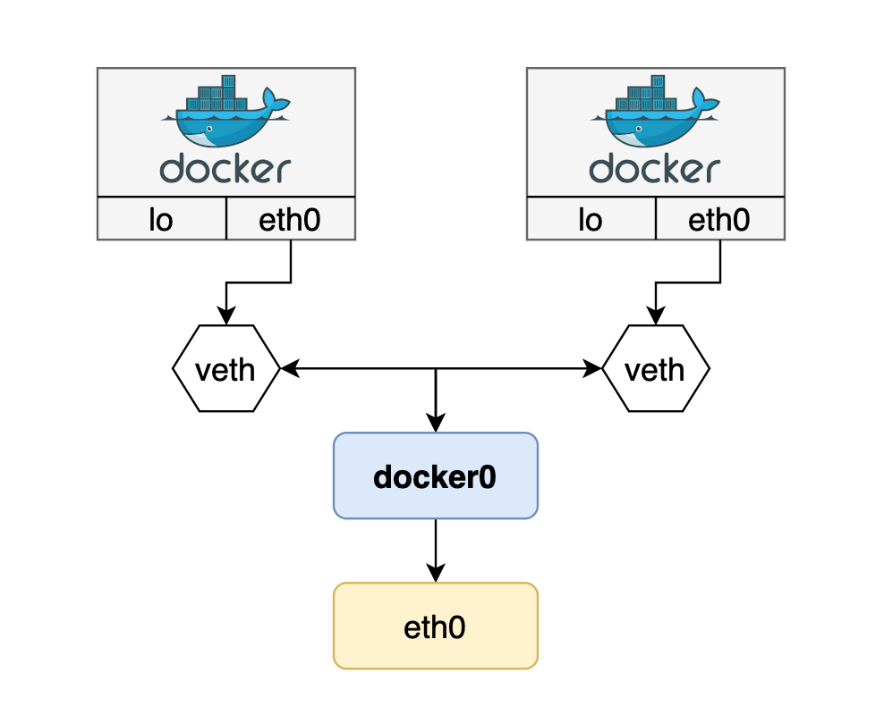

## 도커를 설치하게 되면 생기는 일
Docker를 설치한 후 Host의 네트워크 인터페이스를 살펴보면 `docker0`라는 가상 인터페이스가 생긴다.  
`docker0`는 일반적인 가상 인터페이스가 아니며 도커가 자체적으로 제공하는 네트워크 드라이버 중 브리지(Bridge)에 해당한다.  

도커에서 사용할 수 있는 네트워크 종류는 브리지(bridge), 호스트(host), 논(none) 등이 있다.

```
$ docker network ls

NETWORK ID          NAME                DRIVER              SCOPE
7abfb3c2d5f6        bridge              bridge              local
3b30280e1fb1        host                host                local
d2d3b122215d        none                null                local
```

```
$ ifconfig docker0
docker0   Link encap:Ethernet  HWaddr 02:42:90:f4:b3:c5
          inet addr:172.17.0.1  Bcast:172.17.255.255  Mask:255.255.0.0
          UP BROADCAST MULTICAST  MTU:1500  Metric:1
          RX packets:0 errors:0 dropped:0 overruns:0 frame:0
          TX packets:0 errors:0 dropped:0 overruns:0 carrier:0
          collisions:0 txqueuelen:0
          RX bytes:0 (0.0 B)  TX bytes:0 (0.0 B)


$ ip addr
# 중략
3: docker0: <NO-CARRIER,BROADCAST,MULTICAST,UP> mtu 1500 qdisc noqueue state DOWN group default
    link/ether 02:42:90:f4:b3:c5 brd ff:ff:ff:ff:ff:ff
    inet 172.17.0.1/16 brd 172.17.255.255 scope global docker0
       valid_lft forever preferred_lft forever
```

`docker0` 브리지는 컨테이너가 통신하기 위해 사용된다. 도커 컨테이너를 생성하면 자동으로 이 브리지를 활용하도록 설정되어 있다.  
`docker0` 인터페이스는 `172.17.0.0/16` 서브넷을 갖기 때문에 컨테이너가 생성되면 이 대역 안에서 IP를 할당받게 된다. (예: `172.17.0.2`, `172.17.0.3`)  

`$ docker network inspect bridge` 명령어를 이용하면 브리지 네트워크의 자세한 정보를 알 수 있다.  
```json
[
    {
        "Name": "bridge",
        // 중간 생략
        "Driver": "bridge",
        "IPAM": {
            "Driver": "default",
            "Options": null,
            "Config": [
                {
                    "Subnet": "172.17.0.0/16"
                }
            ]
        },
        // 중간 생략
        "ConfigOnly": false,
        "Containers": {
            "14b9779c990fe7557d60f2605ff4224e5f85f26bd99807c71f78df45133314be": {
                "Name": "busybox1",
                "EndpointID": "3ea17b0de094890abb1cccdb15b9144035d64bdc07777b97ddf9427b27563f51",
                "MacAddress": "02:42:ac:11:00:02",
                "IPv4Address": "172.17.0.2/16",
                "IPv6Address": ""
            }
        }
        // 이하 생략
    }
]
```

## 도커 컨테이너를 생성하게 되면 생기는 일
컨테이너는 Linux Namespace 기술을 이용해 각자 격리된 네트워크 공간을 할당받게 된다.  
그리고 위에서 언급한 대로 `172.17.0.0/16` 대역의 IP를 순차적으로 할당 받는다. 이 IP는 컨테이너가 재시작할 때마다 변경될 수 있다.  

컨테이너는 외부와 통신하기 위해 2개의 네트워크 인터페이스를 함께 생성한다.  
하나는 컨테이너 내부 Namespace에 할당되는`eth0` 이름의 인터페이스이고, 나머지 하나는 호스트 네트워크 브리지  `docker0`에 바인딩 되는 `vethXXXXXXX`이름 형식의 **veth 인터페이스**다. ("veth"는 "virtual eth"라는 의미)  
컨테이너의 `eth0`인터페이스와 호스트의 `veth` 인터페이스는 서로 연결되어 있다.  

결국 `docker0` 브리지는 `veth` 가상 인터페이스와 호스트의 `eth0` 인터페이스를 이어주는 중간 다리 역할을 한다. 그리고 컨테이너 안에 `eth0`인터페이스는 `veth` 가상 인터페이스를 통해 외부와 통신할 수 있게 되는 것이다.


직접 확인해보기 위해 간단한 도커 컨테이너 2개를 실행시켜본다.  
`busybox`이미지를 이용해서 5분간 Sleep 상태를 유지 하도록 했다.  
```
$ docker run -d --rm --name busybox1 busybox sleep 300
$ docker run -d --rm --name busybox2 busybox sleep 300
```

먼저 컨테이너 내부 네트워크 인터페이스를 확인해보자.(Ubuntu 18.04 기준)  
`eth0` 인터페이스에 각각 `172.17.0.2`, `172.17.0.3` IP가 할당 되었다.  

```
$ docker exec -it busybox1 ip addr

1: lo: <LOOPBACK,UP,LOWER_UP> mtu 65536 qdisc noqueue qlen 1
    link/loopback 00:00:00:00:00:00 brd 00:00:00:00:00:00
    inet 127.0.0.1/8 scope host lo
       valid_lft forever preferred_lft forever
18: eth0@if19: <BROADCAST,MULTICAST,UP,LOWER_UP,M-DOWN> mtu 1500 qdisc noqueue
    link/ether 02:42:ac:11:00:02 brd ff:ff:ff:ff:ff:ff
    inet 172.17.0.2/16 brd 172.17.255.255 scope global eth0
       valid_lft forever preferred_lft forever
```

```
$ docker exec -it busybox2 ip addr

1: lo: <LOOPBACK,UP,LOWER_UP> mtu 65536 qdisc noqueue qlen 1
    link/loopback 00:00:00:00:00:00 brd 00:00:00:00:00:00
    inet 127.0.0.1/8 scope host lo
       valid_lft forever preferred_lft forever
20: eth0@if21: <BROADCAST,MULTICAST,UP,LOWER_UP,M-DOWN> mtu 1500 qdisc noqueue
    link/ether 02:42:ac:11:00:03 brd ff:ff:ff:ff:ff:ff
    inet 172.17.0.3/16 brd 172.17.255.255 scope global eth0
       valid_lft forever preferred_lft forever
```

이제 호스트의 네트워크 인터페이스를 보면 `veth4eb48a6`, `veth40d220d` 가상 인터페이스가 새로 생성된 것을 볼 수 있다.  

```
$ ip link

# 일부 생략
3: docker0: <BROADCAST,MULTICAST,UP,LOWER_UP> mtu 1500 qdisc noqueue state UP mode DEFAULT group default
    link/ether 02:42:90:f4:b3:c5 brd ff:ff:ff:ff:ff:ff
19: veth4eb48a6@if18: <BROADCAST,MULTICAST,UP,LOWER_UP> mtu 1500 qdisc noqueue master docker0 state UP mode DEFAULT group default
    link/ether d6:6e:fe:c7:57:36 brd ff:ff:ff:ff:ff:ff link-netnsid 0
21: veth40d220d@if20: <BROADCAST,MULTICAST,UP,LOWER_UP> mtu 1500 qdisc noqueue master docker0 state UP mode DEFAULT group default
    link/ether 16:e1:c4:6c:eb:e8 brd ff:ff:ff:ff:ff:ff link-netnsid 1
```

`brctl` 명령어를 통해 브리지 네트워크 상태를 확인해보면 `veth4eb48a6`, `veth40d220d` 인터페이스가 `docker0` 브리지에 연결된 것을 확인할 수 있다.  

```
$ brctl show

bridge name	bridge id		STP enabled	interfaces
docker0		8000.024290f4b3c5	no		veth4eb48a6
											veth40d220d
```

두 컨테이너(`busybox1`, `busybox2`)는 브리지를 통해 같은 네트워크상에 있기 때문에 한쪽 컨테이너에서 다른 컨테이너와 통신할 수 있게 된다.

```
$ docker exec -it busybox2 ping 172.17.0.2

PING 172.17.0.2 (172.17.0.2): 56 data bytes
64 bytes from 172.17.0.2: seq=0 ttl=64 time=0.109 ms
64 bytes from 172.17.0.2: seq=1 ttl=64 time=0.064 ms
64 bytes from 172.17.0.2: seq=2 ttl=64 time=0.058 ms
64 bytes from 172.17.0.2: seq=3 ttl=64 time=0.072 ms

```

마지막으로 컨터이너의 게이트웨이를 확인 해보면 `172.17.0.1`된 것을 볼 수 있는데 결국 컨테이너 내부의 모든 패킷이 호스트의 `docker0`을 통해 외부로 나가게 되는 것을 확인할 수 있다.  

```
$ docker exec -it busybox1 route

Kernel IP routing table
Destination     Gateway         Genmask         Flags Metric Ref    Use Iface
default         172.17.0.1      0.0.0.0         UG    0      0        0 eth0
172.17.0.0      *               255.255.0.0     U     0      0        0 eth0
```

## 참고
- [Docker Network 구조(1) - docker0와 container network 구조](https://bluese05.tistory.com/15)
- [시작하세요! 도커/쿠버네티스 - YES24](http://www.yes24.com/Product/Goods/84927385)
