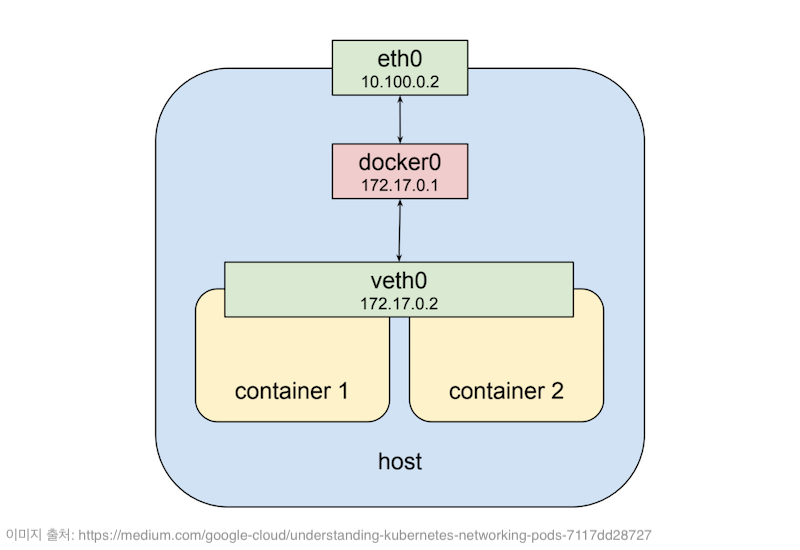
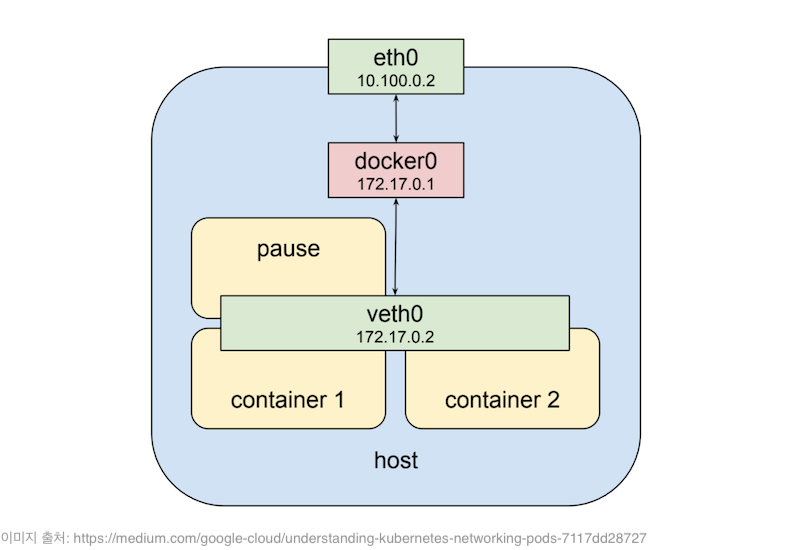
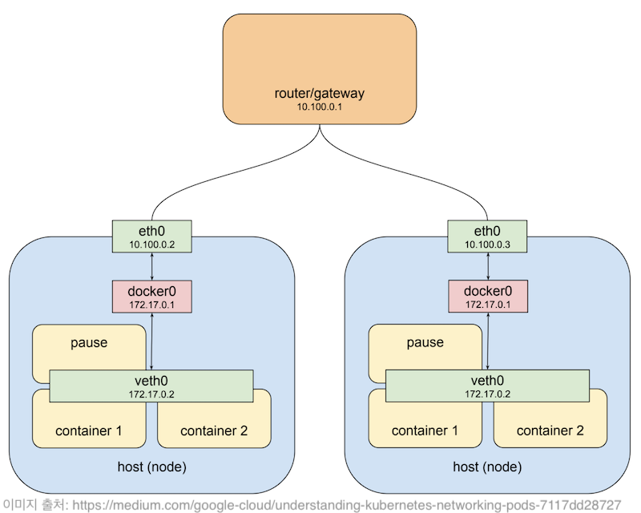
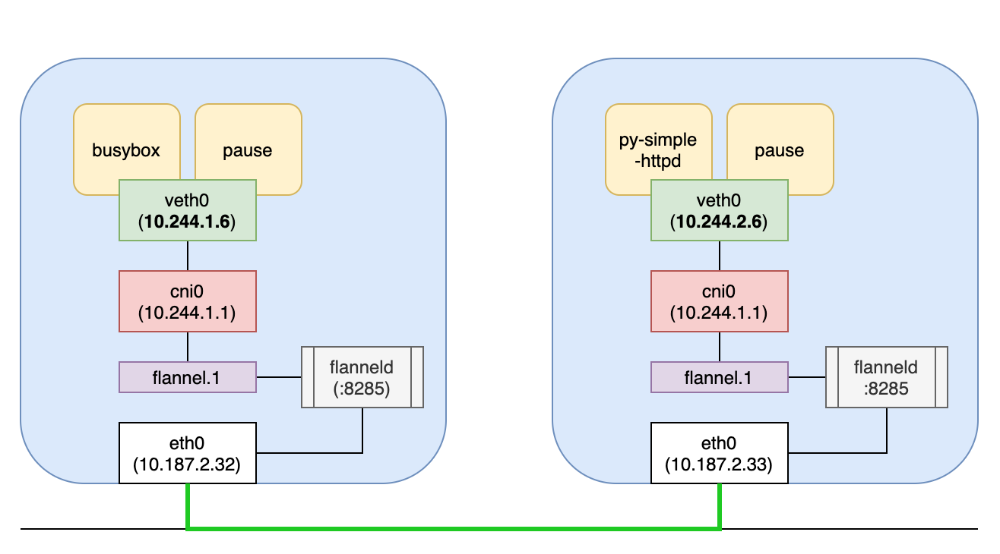

## Pod 안에 도커 컨테이너 간의 네트워킹
Pod 안에 있는 모든 컨테이너들은 localhost로 서로 통신할 수 있다.   
그 원리는 도커 컨테이너가 시작될 때 만들어지는 `veth0`라는 가상 네트워크 인터페이스가 있는데 쿠버네티스가 PPod를 생성할 때 내부에 있는 컨테이너기리 `veth0` 가상 인터페이스를 서로 공유하기 해서 서로 같은 네트워크 상에 존재할 수 있도록 하기 때문이다.   

따라서 아래 그림에서 보이는 Container-1과 Container-2는 하나의 Pod 안에서 `veth0` 가상 인터페이스를 공유하고 있고 동일한 IP 주소로 갖는다. 하지만 당연히 두 컨테이너는 서로 다른 포트를 사용해야 서로 통신 할 수 있게 된다.   

이렇게 Pod 안에 컨테이너들은 격리된 상태에서 독립적인 일을 수행할 수 있으면서 서로 네트워크 통신이 가능하다는 장점을 갖게 되었다.  


그렇다면 쿠버네티스는 어떻게 가상 네트워크 인터페이스를 공유할까?  
그 답은 쿠버네티스가 Pod 마다 함께 포함 시키는 `pause`라는 특별한 컨테이너 때문이다.   
`pause` 컨테이너는 다른 컨테이너들의 통신과 외부 통신을 위한 가상 네트워크 인터페이스만 제공하며, 쿠버네티스가 SIGTERM 신호를 보내기 전까지 아무것도 하지 않고 sleep 상태로 대기한다. 


</br>
## 쿠버네티스 클러스터 내 Pods 간의 네트워킹
쿠버네티스 클러스터는 Master 노드와 Worker 노드로 구성된다. 클러스터에 소속된 실제 노드(서버)들은 보통 같은 사설(private) 네트워크에 속하기 때문에 서로 통신할 수 있다.  
하지만 Pod에 할당된 IP는 이 사설 네트워크 대역에 포함되지 않는다.  
Pod 안에 컨테이너들은 `pause`컨테이너가 만든 가상 인터페이스를 통해 호스트의 `docker0` 브리지 네트워크로 연결될 것이다.     
그리고 해당 노드로 요청이 도착하면 가장 먼저 호스트의 `eth0`을 거친 후 `docker0` 브리지를 통해 `veth0`으로 전송된다. 그 다음에 `veth0`에 연결된 컨테이너의 `eth0`로 전달된다.     


그런데 만약 위 그림에 있는 왼쪽 Worker 노드의 Pod에서 오른쪽 Worker 노드의 Pod로 요청을 보내려면 어떻게 해야할까?  
라우터가 오른쪽 노드(`10.100.0.3`)에 `172.17.0.2`IP를 갖는 Pod가 있다는 사실을 알고 있다면 적절하게 패킷을 보낼 수 있을 것이다.   
하지만 문제는 또 다른 노드에 있는 Pod도 `172.17.0.2` IP를 가질 수 수 있다는 것이다. 그 이유는 Worker 노드마다 `veth0` 가상 인터페이스에 의한 Pod IP 주소가 같을 수 있기 때문이다.    

</br>
### 오버레이 네트워크
이 문제를 해결하기 위해서 "**오버레이 네트워크(overlay network)**"라는 방식을 통해 Pod가 서로 통신할 수 있는 구성을 만들 수 있다.   
"오버레이 네트워크"란 실제 노드 간의 네트워크 위에 별도 Flat한 네트워크를 구성하는 것을 의미한다.  

쿠버네티스는 자체적으로 네트워크 구성 해주지 않기 때문에 클러스터를 구성할 때 CNI(Container Network Interface) 규약을 구현한 [CNI 플러그인](https://kubernetes.io/docs/concepts/cluster-administration/addons/#networking-and-network-policy)을 함께 설치해야 한다.  
만약 `kubeadm`으로 쿠버네티스 클러스터를 구성하려고 하면 Master 노드를 초기화한 후 CNI 네트워크 플러그인이 설치되지 않으면, CoreDNS Pod가 시작되지 않고 PENDING되어 있는 것을 볼 수 있다.   

CNI 플러그인 중 오버레이 네트워크를 제공하는 대표적인 플러그인은 **[Flannel](https://github.com/coreos/flannel)**이 있으며, **[Calico](https://www.projectcalico.org/)**는 오버레이 네트워크는 물론이며, Pod 간의 통신과 다른 외부 네트워크 통신을 허용하는 네트워크 정책 관리 기능을 제공하기도 한다.

</br>
### Flannel로 오버레이 네트워크 이해하기
오버레이 네트워크를 이해하기 위해 쿠버네티스 클러스터에 Flannel을 네트워크 플러그인으로 설치했다고 가정한다.     
(이 클러스터는 Master 노드(k8s-test001) 1대와 Worker 노드(k8s-test002, k8s-test003) 2대로 구성되어 있다.)  

<br/>

먼저 샘플 Pod 2개를 생성할 것이다.  

첫번째 샘플 Pod는 `busybox`를 베이스 이미지로 해서 단순히 Sleep 상태를 유지하는 컨테이너를 실행할 것이고, 두번째 샘플 Pod는 Python의 `SimpleHTTPRequestHandler`로 구현한 간단한 HTTP 서버 컨테이너다.  

각 Pod는 오버레이 네트워크 상에서 IP를 할당 받고, 그 IP를 통해 서로 통신할 수 있게 된다.  
따라서 `busybox`컨테이너가 실행되고 있는 Pod에서 Python `HTTP`서버가 있는 Pod로 GET 요청을 보내는 방식으로 테스트를 진행할 것이다.  

아래 Pod 매니페스트(manifest)를 각각 `busybox_pod.yaml`와 `py_simple_httpd_pod.yaml`로 저장하고, `kubectl apply` 명령어를 사용해서 Pod를 생성한다.   
 
```yaml
# busybox_pod.yaml
apiVersion: v1
kind: Pod
metadata:
  name: busybox
  labels:
    env: test
spec:
  containers:
  - name: busybox
    image: busybox
    imagePullPolicy: IfNotPresent
    command: ["sleep", "3600"]
  nodeSelector:
    nickname: tiger
```

```yaml
# py_simple_httpd_pod.yaml
apiVersion: v1
kind: Pod
metadata:
  name: py-simple-httpd
  labels:
    env: test
spec:
  containers:
  - name: py-simple-httpd
    image: jonnung/python-simplehttpserver-it-works:latest
    imagePullPolicy: IfNotPresent
    ports:
    - containerPort: 8585
      name: http
      protocol: TCP
  nodeSelector:
    nickname: dragon
```

```shell
# 쿠버네티스 마스터 노드에서 Pod 생성하기

kubectl apply -f busybox_pod.yaml
kubectl apply -f py_simple_httpd_pod.yaml
```

생성된 Pod 전체 목록을 확인 해보면 `busybox`Pod는 `10.244.1.6`, Python 서버 Pod는 `10.244.2.6`IP를 할당 받았다.  

IP 대역이 `10.244.0.0/16`인 이유는 쿠버네티스 클러스터를 초기화 할 때 `--pod-network-cidr=10.244.0.0/16` 옵션을 지정했기 때문이다. (Flannel 설치 가이드 권장 사항 중 하나)  

```
root@k8s-master ▸ kubectl get pod -o wide
NAME            READY   STATUS    RESTARTS   AGE     IP           NODE
busybox         1/1     Running   0          4m48s   10.244.1.6   k8s-test002
py-simple-httpd 1/1     Running   0          3m16s   10.244.2.6   k8s-test003
```

<br/>

잠시 **Flannel**을 살펴보자.   
쿠버네티스 클러스터의 모든 노드에서 `flanneld`라는 프로세스가 `kube-system` 네임스페이스로 실행되고 있다.   

```
root@k8s-master ▸ kubectl get po -n kube-system -o wide -l tier=node

NAME                          READY   STATUS    IP            NODE       
kube-flannel-ds-amd64-xnm95   1/1     Running   10.187.2.31   k8s-test001
kube-flannel-ds-amd64-fm4pd   1/1     Running   10.187.2.32   k8s-test002
kube-flannel-ds-amd64-q5wh9   1/1     Running   10.187.2.33   k8s-test003
```

`flanneld`는 커널 라우팅 테이블에 몇가지 규칙을 추가한다.`k8s-test002`Worker 노드에 접속해 라우팅 규칙을 직접 확인해보자.
```
root@k8s-test002 ▸ ip route

default via 10.187.2.1 dev eth0
10.187.2.0/24 dev eth0  proto kernel  scope link  src 10.187.2.32
10.244.0.0/24 via 10.244.0.0 dev flannel.1 onlink
10.244.1.0/24 dev cni0  proto kernel  scope link  src 10.244.1.1
10.244.2.0/24 via 10.244.2.0 dev flannel.1 onlink
172.17.0.0/16 dev docker0  proto kernel  scope link  src 172.17.0.1 linkdown
```
중간에 있는 `cni0`브리지는 도커 네트워크에서 기본 제공하는 `docker0`와 동일한 역할을 한다. 따라서 Pod 안에 모든 컨테이너는 `10.244.1.0/24` 대역의 IP를 할당 받을 것이고, 무조건 `cni0`브리지를 통해서 통신할 수 있다.  

`brctl` 명령어를 통해 브리지 네트워크를 확인 해보면, 2개의 `veth0` 가상 네트워크 인터페이스가 `cni0` 브리지에 바인딩된 것을 확인할 수 있다.  
```
root@k8s-test002 ▸ brctl show

bridge name	bridge id		STP enabled	interfaces
cni0		8000.825f78b5bd20	no		veth246a4f62
							vethcf3c37c8
```

이제 진짜 busybox(`10.244.1.6`) Pod에서 Python 서버 Pod(`10.244.2.6`)로 요청을 보내보자!  

```
root@k8s-test002 ▸ docker exec \ 
    -it {{busybox 컨테이너 ID}} \
    wget http://10.244.2.6:8585
```

</br>
</br>

이 패킷은 가장 먼저 `cni0` 브리지를 통해 나갈 것이고, 목적지 IP가 `10.244.2.6`이기 때문에 라우팅 규칙에 따라 `flannel.1`로 전달된다.  
`flannel.1`는 `flanneld`에 의해 만들어진 TUN 디바이스? 인터페이스다. (이 부분은 아직 잘 모르는 내용이지만 느낌만 알고 넘어간다.)  
그 다음에는 커널이 다시 이 패킷을 `flannel.1`을 만든 프로세스인 `flanneld`로 전달한다.   

Flannel은 **etcd**에 서브넷과 호스트를 맵핑한 데이터를 저장하고 있기 때문에 etcd에서 목적지 IP를 검색한 뒤 실제 서버 IP를 알아낼 수 있다.  
Flannel은 이 원본 IP 패킷을 UDP 패킷으로 감싼 후 목적지 노드로 전송한다. 이 통신을 위해 `flanneld`가 실행되고 있는 모든 노드마다 `:8285`포트를 개방해야 한다.  

목적지 노드에 도착한 UDP 패킷을 `flanneld`가 열어서 원본 IP 패킷을 가져온 후 `flannel.1`를 통해 다시 커널로 전달되고, 원본 IP는 다시 라우팅 규칙에 따라 `cni0`브리지로 전달되어 해당 IP를 갖는 컨테이너로 도달할 수 있게 된다.


</br>
## 참고
- [Understanding kubernetes networking: pods - Google Cloud - Community - Medium](https://medium.com/google-cloud/understanding-kubernetes-networking-pods-7117dd28727)
- [Cluster Networking - Kubernetes](https://kubernetes.io/docs/concepts/cluster-administration/networking/)
- [쿠버네티스 네트워킹 : 포드 네트워킹(kubernetes pod networking) :: 아리수](https://arisu1000.tistory.com/27850)
