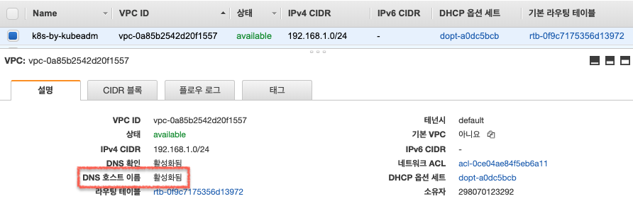
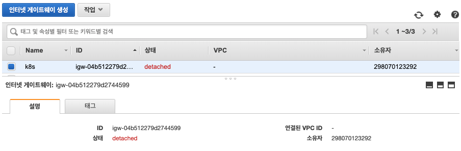
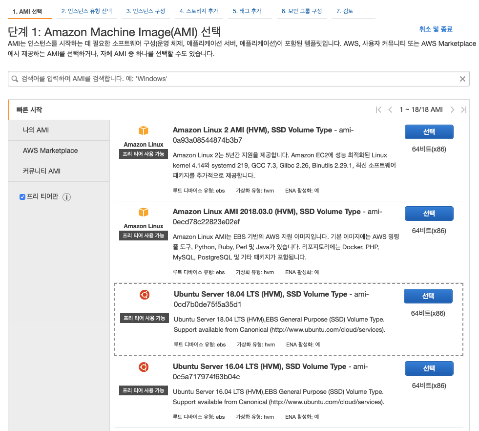
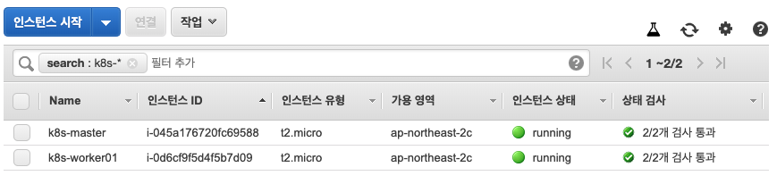

> 이 튜토리얼은 AWS EC2에 쿠버네티스 클러스터(Kubernetes Cluster)를 만들어 보는 것이다.  
> 여기서 다루는 AWS 리소스는 [AWS CLI](https://docs.aws.amazon.com/cli/latest/userguide/install-cliv2-mac.html)를 사용해서 진행된다.  

<br/>

## AWS 네트워크
### VPC 만들기
AWS EC2를 만들기 전에 먼저 VPC를 생성한다.   
**VPC**는 논리적인 독립 네트워크를 구성할 수 있게 해주는 AWS 리소스다.  
AWS 계정을 만들면 기본 VPC(`default`)가 하나 생성되며 이 VPC를 사용해도 상관없다. 하지만 실전에 근접한 실습을 위해 새로운 VPC를 만들어보자.  

현재 어떤 VPC가 존재하는지 확인해보자.   
```shell
aws ec2 describe-vpcs
```

VPC 이름과 IPv4 CIDR 블록은 필수다. CIDR 블록 범위는 사설망 대역에서 선택하자.   
아래 명령어는 AWS CLI(`aws`)로 VPC를 생성한 결과에 포함된 `VpcId`값을 쿼리한 후 바로 Bash 변수로 담는 표현이다. 다른 명령어을 실행할 때 참조할 값들을 미리 변수에 담아두면 편리하다.  

```shell
export VPC_ID=$(aws ec2 create-vpc \
  --cidr-block 10.1.1.0/24 \
  --output text \
  --query 'Vpc.VpcId')
```

```shell
echo ${VPC_ID}

vpc-06444363ec8022659
```

생성한 VPC에 `Name`태그를 달아준다.
```shell
aws ec2 create-tags \
  --resource ${VPC_ID} \
  --tags Key=Name,Value=k8s-by-kubeadm
```

해당 VPC에서 시작된 EC2 인스턴스가 Public IP주소에 해당하는 Public DNS 호스트 이름을 받도록 설정한다.  
```
aws ec2 modify-vpc-attribute \
  --vpc-id ${VPC_ID} \
  --enable-dns-hostnames '{"Value": true}'
```


<br/>

### 서브넷 만들기
VPC만으로는 할 수 있는게 없고 **서브넷(Subnet)**을 만들어야 한다. 즉 CIDR 블록을 가지는 단위로 VPC를 잘게 쪼개서 사용하는 것이다.   
서브넷은 실제로 리소스가 생성되는 물리적인 공간인 가용존과 연결된다.    
```shell
export SUBNET_ID=$(aws ec2 create-subnet \
  --vpc-id ${VPC_ID} \
  --availability-zone ap-northeast-2c \
  --cidr-block 10.1.1.0/26 \
  --output text --query 'Subnet.SubnetId')
```
```shell
echo ${SUBNET_ID}

subnet-0783a9ada58444a04
```

생성한 서브넷에 `Name`태그를 달아준다.   
```shell
aws ec2 create-tags \
  --resources ${SUBNET_ID} \
  --tags Key=Name,Value=k8s
```

<br/>

### 인터넷 접근을 위한 인터넷 게이트웨이와 라우팅 테이블 규칙 설정
VPC는 기본적으로 격리된 네트워크라서 인터넷에 연결되지 않는다. 인터넷에 연결하기 위해 "**인터넷 게이트웨이**"를 사용하면 되는데 인터넷 게이트웨이는 서브넷에 연결된 **라우팅 테이블**의 규칙으로서 추가된다.   

인터넷 게이트웨이를 생성한다.   
```shell
export INTERNET_GATEWAY_ID=$(aws ec2 create-internet-gateway \
  --output text \
  --query 'InternetGateway.InternetGatewayId')
```
```shell
echo ${INTERNET_GATEWAY_ID}

igw-04b512279d2744599
```

인터넷 게이트웨이에도 `Name`태그를 달아준다.   
```shell
aws ec2 create-tags \
  --resources ${INTERNET_GATEWAY_ID} \
  --tags Key=Name,Value=k8s
```



이제 VPC에 인터넷 게이트웨이를 연결한다.   
```shell
aws ec2 attach-internet-gateway \
  --internet-gateway-id ${INTERNET_GATEWAY_ID} \
  --vpc-id ${VPC_ID}
```

<br/>

라우팅 테이블은 VPC를 만들 때 이미 만들어져 있었다. 라우팅 테이블에 `Name`태그를 붙여주고 `ROUTE_TABLE_ID`값을 가져온다.   
```shell
export ROUTE_TABLE_ID=$(aws ec2 describe-route-tables \
  --filters Name=vpc-id,Values=${VPC_ID} \
  --output text \
  --query 'RouteTables[0].RouteTableId')
```
```shell
echo ${ROUTE_TABLE_ID}

rtb-0397ea3b1e150b765
```
```shell
aws ec2 create-tags --resources ${ROUTE_TABLE_ID} --tags Key=Name,Value=k8s
```

위에서 설명한 것처럼 라우팅 테이블을 서브넷에 연결해야 한다. 
```shell
aws ec2 associate-route-table \
  --route-table-id ${ROUTE_TABLE_ID} \
  --subnet-id ${SUBNET_ID}
```

그리고 인터넷 게이트웨이를 이 라우팅 테이블의 규칙으로 추가한다.   
```shell
aws ec2 create-route \
  --route-table-id ${ROUTE_TABLE_ID} \
  --destination-cidr-block 0.0.0.0/0 \
  --gateway-id ${INTERNET_GATEWAY_ID}
```

<br/>

### 보안 그룹 설정
보안 그룹은 EC2 인스턴스 앞단에서 트래픽을 제어할 수 있는 가상 방화벽이다.   
보안 그룹도 VPC를 만들 때 자동으로 생성되었다. 따라서 `${VPC_ID}`를 이용해 보안 그룹 정보를 확인할 수 있다.   

```shell
export SECURITY_GROUP_ID=$(aws ec2 describe-security-groups \
  --filters Name=vpc-id,Values=${VPC_ID} \
  --output text \
  --query 'SecurityGroups[0].GroupId')
```
```shell
echo ${SECURITY_GROUP_ID}

sg-056d6cefb7e1f44a0
```

보안 그룹에도 `Name`태그를 달아준다.   
```shell
aws ec2 create-tags \
  --resources ${SECURITY_GROUP_ID} \
  --tags Key=Name,Value=k8s
```

SSH 접속용 `22` 포트와 `kubectl`에서 쿠버네티스 API와 통신하기 위한 `6443` 포트를 허용하는 보안 규칙을 추가한다.   
```shell
# SSH
aws ec2 authorize-security-group-ingress \
  --group-id ${SECURITY_GROUP_ID} \
  --protocol tcp \
  --port 22 \
  --cidr 0.0.0.0/0;

# HTTPS
aws ec2 authorize-security-group-ingress \
  --group-id ${SECURITY_GROUP_ID} \
  --protocol tcp \
  --port 6443 \
  --cidr 0.0.0.0/0
```
----
<br/>

## EC2 인스턴스
[AMI](https://docs.aws.amazon.com/ko_kr/AWSEC2/latest/UserGuide/AMIs.html)는 Ubuntu 18.04 LTS를 선택한다.  


위와 같은 AMI를 선택하는 화면에서 참고한 AMI ID를 `${IMAGE_ID}` 변수에 넣어둔다.   
```shell
export IMAGE_ID="ami-0cd7b0de75f5a35d1"
```

그리고 EC2 인스턴스에 SSH 접속을 위한 키페어를 만든다.  
```shell
aws ec2 create-key-pair \
  --key-name k8s \
  --output text \
  --query 'KeyMaterial' > k8s.id_rsa

chmod 600 k8s.id_rsa
```

<br/>

### 쿠버네티스 마스터 노드용 EC2 생성
```shell
export MASTER_INSTANCE_ID=$(aws ec2 run-instances \
    --associate-public-ip-address \
    --image-id ${IMAGE_ID} \
    --count 1 \
    --key-name k8s \
    --security-group-ids ${SECURITY_GROUP_ID} \
    --instance-type t2.micro \
    --private-ip-address 10.1.1.10 \
    --user-data "name=master" \
    --subnet-id ${SUBNET_ID} \
    --output text --query 'Instances[].InstanceId')
```

```shell
aws ec2 create-tags \
  --resources ${MASTER_INSTANCE_ID} \
  --tags "Key=Name,Value=k8s-master"
```

<br/>

### 쿠버네티스 워커 노드용 EC2 생성
```shell
export WORKER_INSTANCE_ID=$(aws ec2 run-instances \
    --associate-public-ip-address \
    --image-id ${IMAGE_ID} \
    --count 1 \
    --key-name k8s \
    --security-group-ids ${SECURITY_GROUP_ID} \
    --instance-type t2.micro \
    --private-ip-address 10.1.1.20 \
    --user-data "name=worker" \
    --subnet-id ${SUBNET_ID} \
    --output text --query 'Instances[].InstanceId')
```
```shell
aws ec2 create-tags \
  --resources ${WORKER_INSTANCE_ID} \
  --tags "Key=Name,Value=k8s-worker01"
```

<br/>

