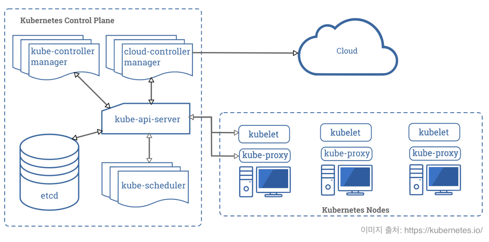
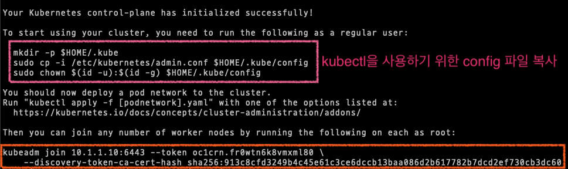
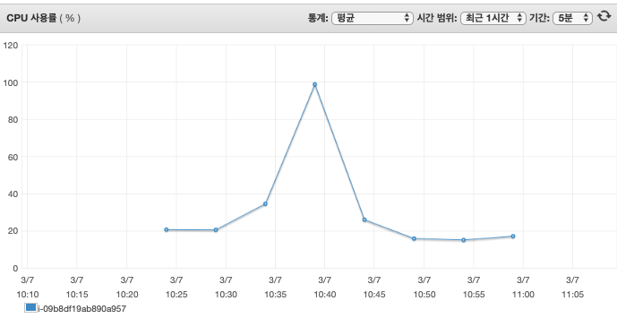

> 이 튜토리얼은 "[(1) AWS 인프라 구축](https://jonnung.dev/kubernetes/2020/03/01/create-kubernetes-cluster-using-kubeadm-on-aws-ec2/)"에서 만든 AWS EC2 인스턴스에 쿠버네티스 클러스터를 직접 구성 해보는 과정을 담았다.   
> 쿠버네티스 1.17 버전과 네트워크 플러그인은 Calico를 사용한다.  

## 쿠버네티스 클러스터 아키텍처 요약
쿠버네티스 클러스터는 **컨트롤 플레인(Control plane)** 부분을 담당하는 마스터 노드와 애플리케이션 파드(POD)가 실행되는 워커 노드로 구성된다. 


<br/>

#### 컨트롤 플레인 컴포넌트 (Control plane component)
쿠버네티스 클러스터의 두뇌 역할을 하며 컨테이너 스케줄링, 서비스 관리, API 요청 처리등의 작업을 수행한다.
컨트롤 플레인에 해당하는 컴포넌트들은 **마스터 노드**에서 실행된다.

- **kube-apiserver**
	- K8S API를 노출하는 컨트롤 플레인의 프론트엔드
	- 수평 확장 가능
- **etcd**
	- 클러스터의 모든 데이터를 보관하는 일관성, 고가용성을 보장하는 키-값 저장소
	- 어떤 노드가 존재하고 클러스터에 어떤 리소스가 존재하는지와 같은 정보
- **kube-scheduler**
	- 새로운 POD 생성을 감지하고, 실행시킬 워커 노드를 선택하는 역할
- **kube-controller-manager**
	- 디플로이먼트 같은 리소스 컨트롤러를 관리
	- API 서버를 통해 클러스터의 공유된 상태를 감지하고, 현재 상태를 원하는 상태로 이행하는 컨트롤 루프를 관리
- **cloud-controller-manager**
	- 클러우드 업체와 연동하여 로드 밸런서나 디스크 볼륨 같은 자원을 관리

<br/>

#### 노드 컴포넌트 (Node component)
POD를 유지시키고 쿠버네티스 런타임 환경을 제공하는 역할을 수행한다.   
노드 컴포넌트들은 모든 노드에서 실행될 수 있다.   

- **kubelet**
	- 각 노드에서 실행되는 에이전트
	- 컨테이너 런타임을 관리하고 상태를 모니터링
	- POD에서 컨테이너가 확실하게 동작하도록 관리
- **kube-proxy**
	- 각 노드에서 실행되는 네트워크 프록시
	- Service 개념의 구현부
	- 서로 다른 노드에 있는 POD 간 통신이나 POD와 인터넷 사이의 네트워크 트래픽을 라우팅
- **컨테이너 런타임**
	- 컨테이너를 시작하고, 중지
	- 대표적인 Docker

<br/>

#### 애드온
- 쿠버네티스 오브젝트(데몬셋, 디플로이먼트 등)를 이용해 클러스터에 추가 기능 제공
- 클러스터 단위 기능을 제공하기 때문에 `kube-system` 네임스페이스에 속함

<br/>
<br/>

## Kubeadm으로 쿠버네티스 클러스터 만들기
#### 컨테이너 런타임 환경 갖추기 (aka Docker)
쿠버네티스는 컨테이너로 구성된 애플리케이션을 관리할 수 있게 해주는 시스템이다. (참고: [쿠버네티스란 무엇인가 - Kubernetes](https://kubernetes.io/ko/docs/concepts/overview/what-is-kubernetes/))   
그래서 당연히 컨테이너 실행 환경을 갖춰야 한다. 컨테이너의 대중화에 큰 역할을 한 Docker를 사용하는 것이 일반적이긴 하지만 현재는 더욱 다양한 컨테이너 런타임이 생겨났다.    

컨테이너 런타임 종류에는 **Docker**와 Docker1.1 이후 Docker 코어로 사용되는 **[Containerd](https://containerd.io/)** 그리고 레드헷에서 개발한 **[cri-o](https://cri-o.io/)** 등이 있다.   

쿠버네티스의 `kubelet`은 시스템으로부터 명령을 받아 Docker 런타임을 통해서 컨테이너를 관리하는 방식으로 동작한다.   
그런데 여러 컨테이너 런타임 기술이 나오면서 쿠버네티스가 지원해야 하는 부담이 늘어났고, 결국 CRI (Container Runtime Interface)라는 표준 인터페이스가 등장하게 되었다.   
이 CRI를 따르는 컨테이너 런타임은 무엇이든 쿠버네티스와 연동할 수 있게 된다.   

여기서는 Docker를 사용할 것이다. Docker 설치는 방법은 [Docker 공식 문서](https://docs.docker.com/install/linux/docker-ce/ubuntu/)를 참고하자.   

<br/>

#### Kubeadm 설치하기
**🖥 서버 요구 사항**

- CPU 2코어, RAM 2GB 이상
- 클러스터 내 모든 노드간 네트워크 통신 가능
- 고유한 Hostname, MAC 주소, product_uuid
	- `ip link`
	- `sudo cat /sys/class/dmi/id/product_uuid`
- **Swap**을 사용하지 않는다.
	- `swapoff -a`: Swap 기능 끔
	- `echo 0 > /proc/sys/vm/swappiness`: 커널 속성을 변경해 swap을 disable 
	- `sed -e '/swap/ s/^#*/#/' -i /etc/fstab`:  Swap을 하는 파일 시스템을 찾아 주석 처리
- 쿠버네티스 구성 요소가 사용하는 포트에 대한 방화벽 오픈
	- 컨트롤 플레인
		- TCP - Inbound - 6443: Kubernetes API Server (used by All)
		- TCP - Inbound - 2379~2380: Etcd server client API (used by kube-apiserver, etcd)
		- TCP - Inbound - 10250: Kubelet API (used by Self, Control plane)
		- TCP - Inbound - 10251: kube-scheduler (used by Self)
		- TCP - Inbound - 10252: kube-controller-manager (used by Self)
	- 워커 노드
		- TCP - Inbound - 10250: Kubelet API (used by Self, Control plane)
		- TCP - Inbound - 30000~32767: NodePort Services (used by All)
		
<br/>

**📇 Kubeadm, Kubelet, Kubectl 설치**   

**kubeadm**은 **kubelet**과 **kubectl**을 설치해주지 않기 때문에 직접 설치해야 한다.   

```shell
sudo apt-get update && sudo apt-get install -y apt-transport-https curl

curl -s https://packages.cloud.google.com/apt/doc/apt-key.gpg | sudo apt-key add -

cat <<EOF | sudo tee /etc/apt/sources.list.d/kubernetes.list
deb https://apt.kubernetes.io/ kubernetes-xenial main
EOF

sudo apt-get update
sudo apt-get install -y kubelet kubeadm kubectl

# 패키지 버전 홀드 (업데이트에서 제외)
sudo apt-mark hold kubelet kubeadm kubectl 
```

설치가 완료 되었다면 `kubeadm`, `kubectl` 버전을 확인해본다. (그냥)    
```
$ kubeadm version
kubeadm version: &version.Info{Major:"1", Minor:"17", GitVersion:"v1.17.3", GitCommit:"06ad960bfd03b39c8310aaf92d1e7c12ce618213", GitTreeState:"clean", BuildDate:"2020-02-11T18:12:12Z", GoVersion:"go1.13.6", Compiler:"gc", Platform:"linux/amd64"}

$ kubectl version
Client Version: version.Info{Major:"1", Minor:"17", GitVersion:"v1.17.3", GitCommit:"06ad960bfd03b39c8310aaf92d1e7c12ce618213", GitTreeState:"clean", BuildDate:"2020-02-11T18:14:22Z", GoVersion:"go1.13.6", Compiler:"gc", Platform:"linux/amd64"}
```

<br/>

#### 마스터 노드 생성
[AWS EC2에서 kubeadm으로 쿠버네티스 클러스터 만들기 - (1) AWS 인프라 구축](https://jonnung.dev/kubernetes/2020/03/01/create-kubernetes-cluster-using-kubeadm-on-aws-ec2/) 글에서 AWS 프리 티어를 이용해서 `t2.micro` 타입의  EC2 인스턴스를 만들었다.   
`t2.micro` 인스턴스 타입은 vCPU 1이기 때문에 클러스터 최소 요구 사항을 만족하지 않는다. 하지만 Production 환경이 아니기 때문에 조금 무리해서라도 해보기로 한다.    

쿠버네티스 마스터 노드를 초기화 하는 명령어를 실행한다. 

`--apiserver-advertise-address` 파라미터는 다른 노드가 마스터 노드에 접근할 수 있는 IP 주소를 명시한다.    

`--pod-network-cidr` 파라미터는 쿠버네티스에서 사용할 컨테이너의 네트워크 대역을 지정한다. 실제 서버에 할당된 IP와 중복되지 않도록 해야 한다. 
다음 단계에서 진행할 네트워크 플러그인 설치 과정에서 Calico를 설치할 계획이라 CIDR 범위를 `192.168.0.0/16`로 지정했다. 만약 **Flannel**을 사용한다면 `10.244.0.0./16`을 사용해야 한다.   

`--apiserver-cert-extra-sans` 파라미터도 중요하다. 이 값에는 쿠버네티스가 생성한 TLS 인증서에 적용할 IP 또는 도메인을 명시할 수 있다. 만약 개발자 로컬 환경에서 `kubectl`을 통해 이 클러스터에 접근하려면 `kube-apiserver`와 통신할 수 있어야 하기 때문에 마스터 노드가 실행되고 있는 EC2 인스턴스의 퍼블릭 IP 주소를 추가해야 한다. 

```shell
kubeadm init \
    --apiserver-advertise-address=0.0.0.0 \
    —-pod-network-cidr=192.168.0.0/16 \
    --apiserver-cert-extra-sans=10.1.1.10,13.***.69.189
```

<br/>

위 명령어를 실행하면 아래와 같은 _WARNING_ 과 _ERROR_ 가 보일 것이다.   
```
[init] Using Kubernetes version: v1.17.3
[preflight] Running pre-flight checks
	[WARNING IsDockerSystemdCheck]: detected "cgroupfs" as the Docker cgroup driver. The recommended driver is "systemd". Please follow the guide at https://kubernetes.io/docs/setup/cri/
error execution phase preflight: [preflight] Some fatal errors occurred:
	[ERROR NumCPU]: the number of available CPUs 1 is less than the required 2
[preflight] If you know what you are doing, you can make a check non-fatal with `--ignore-preflight-errors=...`
To see the stack trace of this error execute with --v=5 or higher
```

_WARNING_ 메시지에서 _“detected "cgroupfs" as the Docker cgroup driver..The recommended driver is systemd”_ 라며 Docker가 사용하는 **Cgroup(Control Group)** 드라이버를 **systemd**로 바꾸는 것을 권장하고 있다.   

Cgroup은 프로세스에 할당된 리소스를 제한하는데 사용된다. Ubuntu는 init 시스템으로 systemd를 사용하고 있고 systemd가 Cgroup 관리자로써 작동하게 된다.   

그런데 Docker가 사용하는 Cgroup 관리자가 `cgroupfs`인 경우 리소스가 부족할 때 시스템이 불안정해지는 경우가 있다고 한다. 단일 Cgroup 관리자가 일관성 있게 리소스를 관리하도록 단순화 하는 것이 좋다고 한다. 자세한 설명은 [쿠버네티스 공식 문서](https://kubernetes.io/ko/docs/setup/production-environment/#cgroup-%EB%93%9C%EB%9D%BC%EC%9D%B4%EB%B2%84)를 확인해보자.   


```shell
# Docker가 사용하는 Cgroup driver 확인하기
$ docker info |grep Cgroup

WARNING: No swap limit support
 Cgroup Driver: cgroupfs
```

Docker 설정에 Cgroup driver를 바꾸려면 `/lib/systemd/system/docker.service`을 열어서 아래 구문을 찾아 `--exec-opt native.cgroupdriver=systemd` 파라미터를 추가한 뒤 저장한다.   

```
ExecStart=/usr/bin/dockerd -H fd:// --containerd=/run/containerd/containerd.sock --exec-opt native.cgroupdriver=systemd
```

systemd를 리로드하고 도커를 재시작한다.   

```shell
systemctl daemon-reload
systemctl restart docker
```

<br/>

_ERROR_ 메시지에서는 쿠버네티스가 권장 CPU 개수 2개보다 현재 시스템이 가진 CPU 개수가 적어서 발생한 에러다. 실습을 위해 AWS 프리 티어를 이용해 만든 EC2(t2.micro)라서 어쩔 수 없다. 이 오류를 무시하는 옵션을 추가한다.   

```shell
kubeadm init \
    --apiserver-advertise-address=0.0.0.0 \
    --pod-network-cidr=192.168.0.0/16 \
    --apiserver-cert-extra-sans=10.1.1.10,13.***.69.189 \
    --ignore-preflight-errors=NumCPU
```

<br/>

실행 결과 마지막 부분에 출력되는 내용에는 `kubectl` 을 사용하기 위한 설정(config) 파일 복사 명령어와 워커 노드에서 클러스터에 참여(join)하기 위한 명령어를 제공한다. 



워커 노드를 추가하기 전 쿠버네티스가 잘 동작하고 있는지 확인해보자.   

```shell
kubectl get nodes

NAME              STATUS     ROLES    AGE    VERSION
ip-192-168-1-10   NotReady   master   103s   v1.17.3
```

(아직 coredns가 Pending 상태…)   

```
kubectl get po -n kube-system

NAME                                  READY   STATUS    RESTARTS   AGE
coredns-6955765f44-6gmw4                  0/1     Pending   0          3m24s
coredns-6955765f44-bl62s                  0/1     Pending   0          3m24s
etcd-ip-192-168-1-10                      1/1     Running   0          3m37s
kube-apiserver-ip-192-168-1-10            1/1     Running   0          3m37s
kube-controller-manager-ip-192-168-1-10   1/1     Running   0          3m37s
kube-proxy-qh9lg                          1/1     Running   0          3m24s
kube-scheduler-ip-192-168-1-10            1/1     Running   0          3m37s
```

<br/>

#### 📡 네트워크 플러그인 설치
이전 과정에서 **Coredns**가 아직 `Pending`상태인 것을 볼 수 있었다.    
Coredns는 쿠버네티스에서 사용하는 DNS 서버이다. Coredns가 정상 동작하려면 네트워크 플러그인을 먼저 설치해야 한다.   

네트워크 플러그인은 파드끼리 서로 통신하기 위해서 사용된다.   
컨테이너와 컨테이너 네트워크 구현체 사이의 표준을 정의한 CNI(Container Network Interface)를 지원하는 플러그인을 설치해야 한다.   

**Calico**를 설치한다.   

```
kubectl apply -f https://docs.projectcalico.org/v3.11/manifests/calico.yaml
```

다른 네트워크 플러그인에 대한 정보는 [Installing a Pod network add-on](https://kubernetes.io/docs/setup/production-environment/tools/kubeadm/create-cluster-kubeadm/#pod-network) 문서를 참고하자.   

만약 **Flannel**을 설치하고 싶다면 `kubeadm init`할 때 지정한 `--pod-network-cidr` 파라미터를 수정했어야 한다. 왜냐하면 각 네트워크 플러그인마다 파드에서 사용할 기본 CIDR 대역이 다르기 때문이다.    

그리고 Flannel을 설치하려면 최소 1개 이상의 Worker 노드가 있어야 하기 때문에 다음 단계에서 진행할 워커 노드를 클러스터에 참여시키는 과정을 먼저 진행해야 한다. 또한 오버레이 네트워크 구성을 위해 모든 노드간 방화벽 설정에 `8285`, `8472` 포트의 UDP 프로토콜을 개방해야 한다.   


Calico가 설치되는 과정을 살펴보자.   

```
kubectl get po -n kube-system -w

NAME                                   READY   STATUS    RESTARTS   AGE
coredns-6955765f44-c9nzw               0/1     Pending   0          51s
coredns-6955765f44-ck4lh               0/1     Pending   0          51s
etcd-ip-10-1-1-10                      1/1     Running   0          67s
kube-apiserver-ip-10-1-1-10            1/1     Running   0          67s
kube-controller-manager-ip-10-1-1-10   1/1     Running   0          67s
kube-proxy-ztjfb                       1/1     Running   0          51s
kube-scheduler-ip-10-1-1-10            1/1     Running   0          67s
calico-node-m6dzv                      0/1     Pending   0          0s
calico-kube-controllers-5b644bc49c-9wnxl   0/1     Pending   0          0s
calico-node-m6dzv                          0/1     Pending   0          0s
calico-kube-controllers-5b644bc49c-9wnxl   0/1     Pending   0          0s
calico-node-m6dzv                          0/1     Init:0/3   0          0s
calico-node-m6dzv                          0/1     Init:1/3   0          15s
calico-node-m6dzv                          0/1     Init:1/3   0          18s
calico-node-m6dzv                          0/1     Init:2/3   0          21s
calico-kube-controllers-5b644bc49c-9wnxl   0/1     Pending    0          27s
calico-kube-controllers-5b644bc49c-9wnxl   0/1     ContainerCreating   0          28s
coredns-6955765f44-c9nzw                   0/1     Pending             0          118s
coredns-6955765f44-ck4lh                   0/1     Pending             0          118s
coredns-6955765f44-c9nzw                   0/1     ContainerCreating   0          119s
coredns-6955765f44-ck4lh                   0/1     ContainerCreating   0          2m2s
calico-node-m6dzv                          0/1     PodInitializing     0          50s
kube-scheduler-ip-10-1-1-10                0/1     Error               0          2m38s
kube-controller-manager-ip-10-1-1-10       0/1     Error               0          2m38s
kube-scheduler-ip-10-1-1-10                1/1     Running             1          4m3s
kube-controller-manager-ip-10-1-1-10       1/1     Running             1          4m4s
kube-scheduler-ip-10-1-1-10                0/1     Error               1          5m7s
kube-controller-manager-ip-10-1-1-10       0/1     Error               1          5m7s
calico-node-m6dzv                          0/1     Running             0          3m24s
calico-node-m6dzv                          1/1     Running             0          9m22s
kube-controller-manager-ip-10-1-1-10       0/1     CrashLoopBackOff    1          11m
kube-scheduler-ip-10-1-1-10                0/1     CrashLoopBackOff    1          11m
kube-controller-manager-ip-10-1-1-10       1/1     Running             2          11m
kube-scheduler-ip-10-1-1-10                1/1     Running             2          11m
coredns-6955765f44-c9nzw                   0/1     ContainerCreating   0          11m
calico-kube-controllers-5b644bc49c-9wnxl   0/1     ContainerCreating   0          9m46s
coredns-6955765f44-ck4lh                   0/1     ContainerCreating   0          11m
coredns-6955765f44-c9nzw                   0/1     Running             0          11m
coredns-6955765f44-ck4lh                   0/1     Running             0          11m
coredns-6955765f44-c9nzw                   1/1     Running             0          11m
coredns-6955765f44-ck4lh                   1/1     Running             0          11m
calico-kube-controllers-5b644bc49c-9wnxl   0/1     Running             0          9m57s
calico-kube-controllers-5b644bc49c-9wnxl   1/1     Running             0          10m
```

이 과정에서 굉장히 불안한 요소는 바로 현재 실행되고 있는 컴퓨팅 자원 상황이다.    
EC2 인스턴스 사양이 낮기 때문에 `calico-node` 파드가 실행되는 동안에 CPU Load Average가 20~30까지 치솟았다.   
무사히 성공하길 기원하는 마음으로 조금 기다리면 결국 완료된다.😅   



<br/>

#### 워커 노드를 클러스터로 참여시키기
위에서 `kubeadm init` 명령어 실행 결과 밑부분에 나온 명령어를 Worker 노드에서 실행한다.   

```
kubeadm join 10.1.1.10:6443 --token oc1crn.fr0wtn6k8vmxml80 \
    --discovery-token-ca-cert-hash sha256:913c8cfd3249b4c45e61c3ce6dccb13baa086d2b617782b7dcd2ef730cb3dc60
```

완료되면 Master 노드에서 `kubectl`로 확인해보자.   

```shell
kubectl get nodes

NAME              STATUS     ROLES    AGE   VERSION
ip-192-168-1-10   NotReady   master   26m   v1.17.3
ip-192-168-1-20   NotReady   <none>   13s   v1.17.3
```

<br/>

## 보너스 팁
#### (1) 마스터 노드 토큰 재발급하기
워커 노드가 클러스터에 참여할 때 실행한 `join` 명령어에 사용된 토큰은 24시간 동안만 유효하다.   
토큰을 잃어버렸을 때는 마스터 노드에서 `kubeadm token list` 명령을 실행해서 확인한다. 새 토큰이 필요한 경우 `kubeadm token create`을 실행한다.  


<br/>

#### (2) 마스터 노드 생성시 발급된 인증서 다시 만들기
```shell
rm /etc/kubernetes/pki/apiserver.*

kubeadm init phase certs all \ 
    --apiserver-advertise-address=0.0.0.0 \
    --apiserver-cert-extra-sans=10.1.1.10,13.***.69.189

docker rm -f `docker ps -q -f 'name=k8s_kube-apiserver*'`

systemctl restart kubelet
```

<br/>

## 참고 자료
- [쿠버네티스란 무엇인가 - Kubernetes](https://kubernetes.io/ko/docs/concepts/overview/what-is-kubernetes/)
- [Installing kubeadm - Kubernetes](https://kubernetes.io/docs/setup/production-environment/tools/kubeadm/install-kubeadm/)
- [CRI-O : Kubernetes 를 위한 표준 컨테이너 런타임 - Opennaru, Inc.](http://www.opennaru.com/kubernetes/cri-o/)
- [조대협의 블로그 :: 쿠버네티스 CRI (Container Runtime Interface) & OCI (Open container initiative)](https://bcho.tistory.com/1353)
- [containerd – Kubernetes 표준 컨테이너 런타임 소개](http://www.opennaru.com/kubernetes/containerd/)

