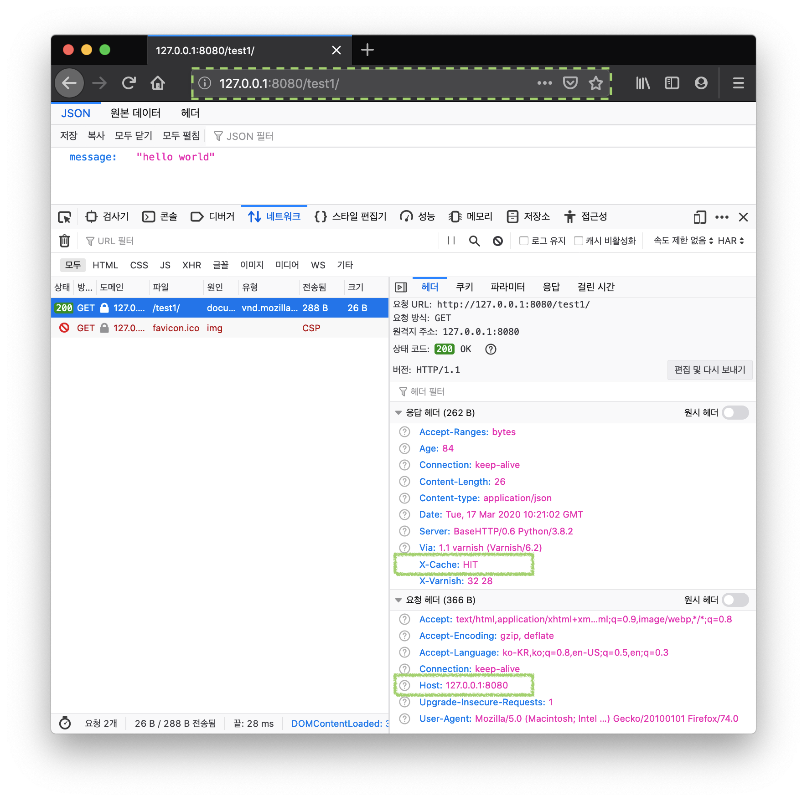
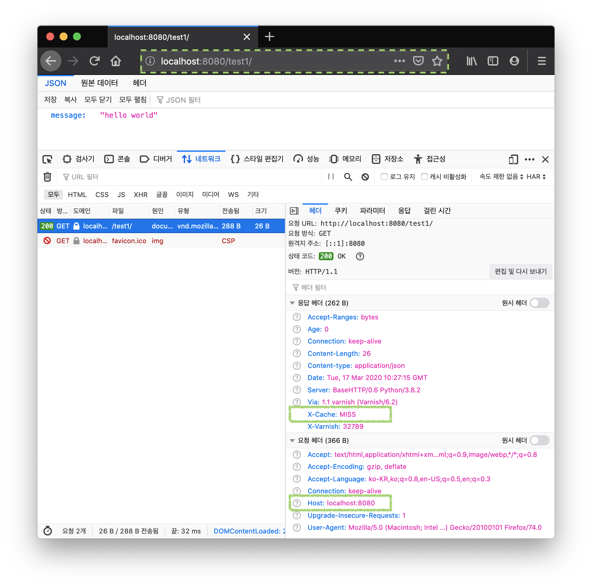
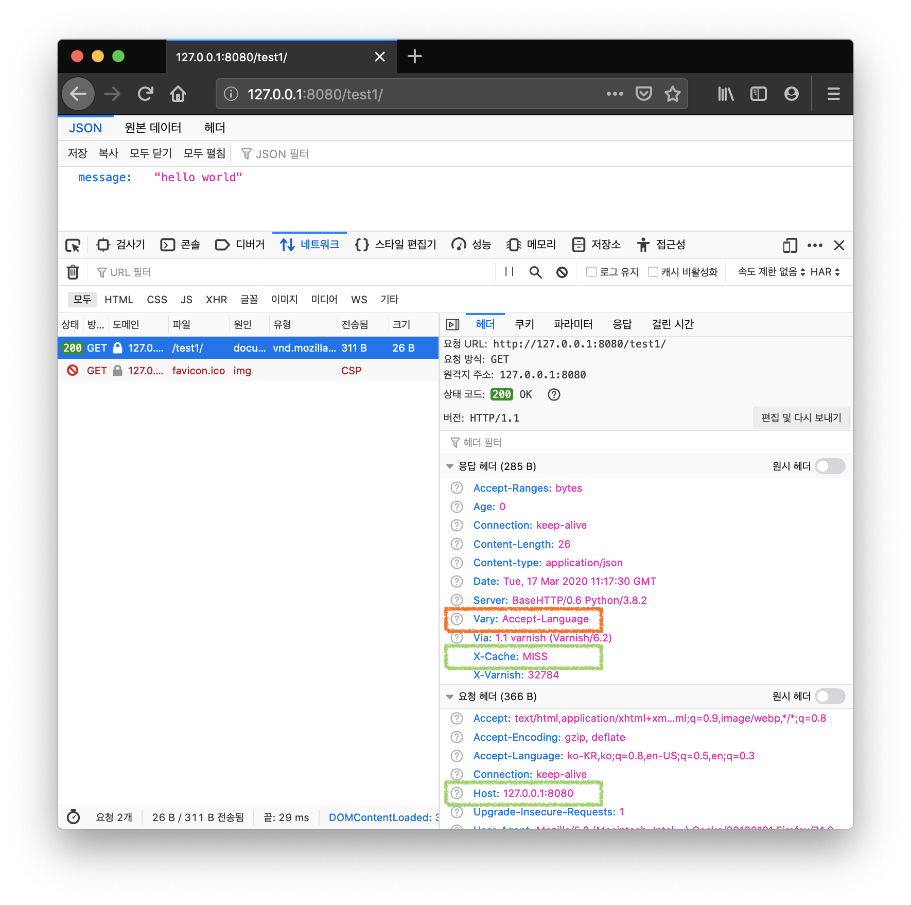

> 이 글은 웹 서버 또는 API 서버의 응답 결과를 캐시하기 위한 Reverse Proxy로서 활용되는 Varnish 캐시 서버에 대해서 다룬다.  
> 하지만 설치와 실행 방법은 다루지 않으며 Varnish 캐시 서버가 어떤 방식으로 요청에 대한 캐시 데이터 생성하는 지 원리를 이해하고, 캐시 효율을 높일 수 있는 방법에 대해 이야기 한다.   
> 실습을 통해 캐시가 히트되는 원리를 이해하는 과정이 조금 길게 느껴질 수 있다. "캐시 히트 효율을 높이는 방법"을 먼저 확인하려면 마지막 "결론" 부분을 참고하면 된다.   

## Varnish 캐시 서버 소개

**Varnish**는 HTTP 요청에 신속한 응답을 제공하기 위해 결과 데이터를 캐싱(Caching)한 뒤 동일한 요청이 다시 들어오면 캐시된 데이터로 내려줘서 응답 시간을 줄여줄 수 있는 리버스 프록시(Reverse Proxy)이다. 흔히 웹 가속기라고도 불려진다.   

요청한 URL을 기준으로 캐시 데이터를 생성하고, 만료 시간(TTL)을 설정해서 캐시가 자동 소멸되는 라이프 타임을 유지한다.   
그리고 백엔드(Origin) 서버가 여러대인 경우를 위해 로드 밸런싱 기능도 제공한다.   

**VCL(*Varnish Configuration Language*)** 이라는 문법을 사용해서 제약과 정책을 정의하고, 프로그램을 작성하듯 다양한 흐름으로 표현할 수 있다.   

Varnish에 대해 더 자세히 알아보려면 [Varnish 공식 문서](https://varnish-cache.org/docs/index.html)를 참고하자.   

<br/>
<br/>

## Varnish가 캐시 Key를 만드는 방식
Varnish는 캐시를 만들 때 Key로 사용할 해시를 만들기 위해 가장 먼저 **URL**을 사용한다.   
그리고 HTTP Request에 포함된 `Host` 헤더가 참조해서 조합에 추가하고, 없다면  `IP` 주소를 사용한다.   
기본적으로 `Host` 헤더 값은 대소문자를 구분하지 않기 때문에 대소문자가 다를 경우 다른 캐시가 만들어질 수 있다. (하지만 최신 브라우저에서는 보통  소문자 `Host`를 전달하고 있음)

아래 VCL 코드는 Varnish가 캐시 Key를 만들 때 호출 되는 기본 내장된 서브루틴 로직이다.     

```
sub vcl_hash {
    hash_data(req.url);
    if (req.http.host) {
        hash_data(req.http.host);
    } else {
        hash_data(server.ip);
    }
    return (lookup);
}
```

<br/>

> Varnish 캐시가 실제로 어떻게 HTTP 요청을 캐시하는지 로컬 환경에서 간단한 구성을 통해 확인해보자.   
> 어떤 OS 환경에서든 쉽게 테스트 환경을 실행할 수 있도록 Docker 컨테이너를 활용할 것이다.  
> Docker 이미지는 Varnish 캐시 서버와 파이썬으로 구현한 간단한 HTTP 서버를 준비하고, 동일한 네트워크 상에서 Varnish가 HTTP 서버로 요청을 전달하는 과정을 살펴본다.   

<br/>

## 로컬 환경에 Varnish 캐시 서버와 HTTP 서버 환경 구축하기
### (1) Varnish 서버 도커 이미지 만들기
아래 코드는 Varnish 설정을 정의한 `default.vcl`과 Docker 이미지를 만들기 위한 `Dockerfile`이다.   

아래 `default.vcl`에는 백엔드(`default`) 서버로 `simple-python-httpd:8000`라는 호스트명으로 지정되어 있다.  
이 호스트명은 뒤에 나올 **Docker Compose**를 통해 같은 네트워크 상에서 도커 컨테이너가 실행될 수 있도록 해주며, IP 주소 대신 `docker-compose.yml`에 정의한 Service 이름을 호스트명으로 사용할 수 있도록 해준다.   

아래 VCL에 정의된 `vcl_deliver` 서브 루틴은 요청의 최종 단계쯤에 실행되는 단계다. 이 단계에서 응답 결과를 수정하기 용이하다.   
여기서는 Varnish 서버에 캐시가 존재하는지 여부를 응답 헤더의 `X-Cache` 헤더 값을 추가해서 확인할 수 있도록 한다.   

<br/>

**default.vcl**

```
vcl 4.0;

backend default {
  .host = "simple-python-httpd";
  .port = "8000";
}

sub vcl_deliver {
    if (obj.hits > 0) {
        set resp.http.X-Cache = "HIT";
    } else {
        set resp.http.X-Cache = "MISS";
    }
    return (deliver);
}
```

<br/>

**Dockerfile**

```dockerfile
FROM varnish:6.2

COPY default.vcl /etc/varnish/
```

<br/>

**Docker 이미지 빌드 명령어**

```shell
docker build -t jonnung/varnish6 -f Dockerfile .
```

<br/>

### (1) 파이썬으로 HTTP 서버 구현 & 도커 이미지 만들기
HTTP 요청을 처리하기 위한 파이썬을 이용해 간단한 웹서버를 만들어보자. 파이썬은 HTTP 서버를 구현할 수 있는 `HTTPServer`모듈을 기본 내장하고 있다.   

**httpd.py**

```python
from http.server import HTTPServer, BaseHTTPRequestHandler
import json


class JsonServer(BaseHTTPRequestHandler):
    def do_GET(self):
        self.send_response(200)
        self.send_header("Content-type", "application/json")
        self.end_headers()
        self.wfile.write(json.dumps({"message": "hello world"}).encode("UTF-8"))


def run(server_class=HTTPServer, handler_class=BaseHTTPRequestHandler):
    server_address = ("", 8000)
    httpd = server_class(server_address, handler_class)

    print(f"Starting http on port {server_address[1]}...")
    httpd.serve_forever()


if __name__ == "__main__":
    run(handler_class=JsonServer)
```

이전 과정에서 만든 Varnish 서버 도커 이미지처럼 파이썬 HTTP 서버도 도커 이미지로 빌드하기 위해 `Dockerfile`을 작성한다.

<br/>

**Dockerfile**
```dockerfile
FROM python:3.8-slim-buster


COPY httpd.py /usr/src/httpd.py

WORKDIR /usr/src

CMD ["python", "httpd.py"]
```

<br/>

### (3) Docker Compose로 Varnish와 HTTP 서버를 컨테이너로 실행하기
Docker Compose는 여러 Docker 컨테이너를 동시에 실행하고, 같은 네트워크 상에서 서로 통신할 수 있도록 해주는 도구이다.   
이미 Docker를 설치 했다면 Docker Compose도 바로 사용할 수 있다.   

먼저 어떤 Docker 이미지로 컨테이너를 시작할 지 설정 파일을 작성하자. 기본적으로 `docker-compose.yml` 이름으로 만들면 Docker Compose 가 알아서 인식한다.    

<br/>

**docker-compose.yml**

```docker
version: "3"
services:
  simple-python-httpd:
    container_name: simple-python-httpd
    build: simple_python_httpd
    ports:
      - "8000:8000"
  varnish6:
    container_name: varnish6
    build: varnish6
    ports:
      - "8080:80"
```

<br/>

**Docker Compose  실행하기**

```
$ docker-compose up 
```

아래와 비슷한 결과가 출력된다면 정상이다.

```
Starting simple-python-httpd ... done
Starting varnish6            ... done
Attaching to simple-python-httpd, varnish6
varnish6               | Debug: Version: varnish-6.2.1 revision 9f8588e4ab785244e06c3446fe09bf9db5dd8753
varnish6               | Debug: Platform: Linux,4.19.76-linuxkit,x86_64,-junix,-sdefault,-sdefault,-hcritbit
varnish6               | Debug: Child (18) Started
varnish6               | Info: Child (18) said Child starts
```

<br/>

### (4) HTTP 요청 보내기 & 캐시된 응답 확인하기
HTTP 요청을 보내기 위한 클라이언트는 웹 브라우저와 커맨드라인 도구인 [HTTPie](https://httpie.org/)를 사용할 것이고, 테스트는 아래 2개의 URL로 진행한다. 

- http://127.0.0.1:8080/test1/
- http://127.0.0.1:8080/test2/

먼저 HTTPie로 첫번째 URL에 요청을 보낸다.

```shell
$ http -v http://127.0.0.1:8080/test1/

GET /test1/ HTTP/1.1
Accept: */*
Accept-Encoding: gzip, deflate
Connection: keep-alive
Host: 127.0.0.1:8080
User-Agent: HTTPie/2.0.0


HTTP/1.1 200 OK
Accept-Ranges: bytes
Age: 0
Connection: keep-alive
Content-type: application/json
Date: Tue, 17 Mar 2020 10:10:58 GMT
Server: BaseHTTP/0.6 Python/3.8.2
Transfer-Encoding: chunked
Via: 1.1 varnish (Varnish/6.2)
X-Cache: MISS
X-Varnish: 5
{
    "message": "hello world"
}
```

응답 결과에 `X-Cache` 헤더 값이 `MISS`인 것을 볼 수 있다. 처음 들어온 요청이기 때문에 캐시된 데이터가 없는 상태다.   
동일한 요청을 다시 보내본다.   

```shell
$ http -v http://127.0.0.1:8080/test1/
GET /test1/ HTTP/1.1
Accept: */*
Accept-Encoding: gzip, deflate
Connection: keep-alive
Host: 127.0.0.1:8080
User-Agent: HTTPie/2.0.0


HTTP/1.1 200 OK
Accept-Ranges: bytes
Age: 13
Connection: keep-alive
Content-Length: 26
Content-type: application/json
Date: Tue, 17 Mar 2020 10:14:01 GMT
Server: BaseHTTP/0.6 Python/3.8.2
Via: 1.1 varnish (Varnish/6.2)
X-Cache: HIT
X-Varnish: 5 3
{
    "message": "hello world"
}
```

`X-Cache` 헤더 값이 `HIT`로 반환 되었다. 바로 전에 보낸 요청으로 Varnish 서버가 결과를 캐시했기 때문이다.   

다음은 웹 브라우저로 동일한 URL에 접속한 뒤 응답 헤더를 확인해보자.   
(참고로 Varnish 캐시 TTL 기본값은 2분이기 때문에 2분 안에 테스트를 해야 한다)


브라우저를 통해 받은 `X-Cache` 응답 헤더에도 `HIT`가 있는 것을 확인할 수 있다.    

과연 Varnish가 URL과 Host를 기준으로 캐시 했는지 확인하기 위해 방금 전 브라우저 주소창에 입력한 `127.0.0.1` 을 `localhost`로 변경해서 확인해보자.   


`X-Cache`응답 헤더값이 `MISS`로 나타났다.   
즉, 이 테스트를 통한 종합적인 결론은 Varnish 캐시는 **URL**과 **Host**를 조합해서 만든다는 것이 증명되었다.   

<br/>

## Vary 응답 헤더로 Varnish 캐시에 미치는 영향
HTTP 헤더 중 `Vary` 헤더는 응답 헤더로서 캐시 된 응답 결과에 대해 앞으로 들어오는 요청은 캐시된 데이터를 반환할지 아니면 백엔드 서버로 전달할 지 결정하는 과정에서 활용된다.   

> Vary: \<header-name\>, \<header-name\>, …  

`Vary` 헤더 값은 위와 같이 요청 헤더 이름이 콤마(,)로 구분되어 명시되어 있다.   

캐시 서버는 `Vary` 헤더를 보고 “이 응답 결과는 Vary 헤더에 명시된 요청 헤더의 값에 따라 다를 수 있다”는 사실을 인지하고, 캐시 데이터를 저장하게 된다.    

따라서 Varnish 캐시 서버도 기본적으로는 위에서 살펴본 것처럼 `URL` + `Host`요청 헤더값으로 캐시 데이터의 Key를 만들지만, 백엔드 서버에서 `Vary`헤더를 응답에 포함하게 되면 `Vary`헤더 값에 명시된 요청 헤더를 Key 조합에 사용하게 된다.    

<br/>


### HTTP 서버 응답에 Vary 응답 헤더 내려주기
위에서 파이썬으로 만든 HTTP 서버에 `Vary`응답 헤더를 내려주도록 수정해보자.   

```python
# 일부 생략
def do_GET(self):
    self.send_response(200)
    self.send_header("Content-type", "application/json")
    self.send_header("Vary", "Accept-Language")  # 응답에 Vary 헤더를 추가
    self.end_headers()
    self.wfile.write(json.dumps({"message": "hello world"}).encode("UTF-8"))
```

코드를 수정하고 다시 `docker-compose up`을 하더라도 Docker 이미지가 예전 버전이기 때문에 반영된 코드가 적용되지 않았다.   
`--build`을 추가해서 `Dockerfile`에 변경이 있는 경우 Docker 이미지를 다시 빌드 하도록 설정할 수 있다.   

```shell
$ docker-compose up --build
```

이제부터 보내는 HTTP 요청에는 `Vary`헤더에 명시된 `Accept-Language`를 주의깊게 살펴봐야 한다.   

먼저 웹 브라우저로 `http://127.0.0.1:8080/test1/`를 접속한 후 `X-Cache` 값을 확인한다.    
캐시가 없기 때문에 `MISS`로 나타난다.   


이제 Varnish 서버가 URL + `Host` 헤더 + `Accept-Language`헤더를 Key로 사용해서 캐시를 만들었는지 확인해보자.   
브라우저 개발자 도구 이용해 방금 전 전송한 HTTP 요청 정보에  `Accept-Language`값을 복사해서 HTTPie 명령어에 요청 헤더를 파라미터로 추가한다.    

```shell
$ http -v http://127.0.0.1:8080/test1/ \
  Accept-Language:'ko-KR,ko;q=0.8,en-US;q=0.5,en;q=0.3'

GET /test1/ HTTP/1.1
Accept: */*
Accept-Encoding: gzip, deflate
Accept-Language: ko-KR,ko;q=0.8,en-US;q=0.5,en;q=0.3
Connection: keep-alive
Host: 127.0.0.1:8080
User-Agent: HTTPie/2.0.0


HTTP/1.1 200 OK
Accept-Ranges: bytes
Age: 24
Connection: keep-alive
Content-Length: 26
Content-type: application/json
Date: Tue, 17 Mar 2020 11:23:52 GMT
Server: BaseHTTP/0.6 Python/3.8.2
Vary: Accept-Language
Via: 1.1 varnish (Varnish/6.2)
X-Cache: HIT
X-Varnish: 22 20
{
    "message": "hello world"
}
```

응답 결과를 확인해보니 `X-Cache` 값이 `HIT`로 나타났다!   

최종 확인을 위해 `Accept-Language` 값을 `ko-KR`로 수정해서 다시 요청을 보낸다.    

```shell
$ http -v http://127.0.0.1:8080/test1/ \
  Accept-Language:'ko-KR'

GET /test1/ HTTP/1.1
Accept: */*
Accept-Encoding: gzip, deflate
Accept-Language: ko-KR
Connection: keep-alive
Host: 127.0.0.1:8080
User-Agent: HTTPie/2.0.0


HTTP/1.1 200 OK
Accept-Ranges: bytes
Age: 0
Connection: keep-alive
Content-type: application/json
Date: Tue, 17 Mar 2020 11:26:36 GMT
Server: BaseHTTP/0.6 Python/3.8.2
Transfer-Encoding: chunked
Vary: Accept-Language
Via: 1.1 varnish (Varnish/6.2)
X-Cache: MISS
X-Varnish: 24
{
    "message": "hello world"
}
```
결과는 캐시 MISS가 발생했다.    

이 테스트를 통해 기대한 것처럼 `Vary`헤더에 명시된 요청 헤더가 캐시 Key로 사용된 것이 증명되었다.

<br/>

### 예상 되는 문제점
`Vary`응답 헤더에 따라 Varnish 캐시가 따로 저장될 수 있다는 사실을 알아보기 위해 `Accept-Language` 요청 헤더를 사용했다.    

하지만 `Accept-Language` 헤더 명세를 보면 언어와 장소(locale) 정보가 대쉬(`-`) 구분되고, `q`값에 가중치를 부여할 수 있는 구조다.   
그리고 여러 언어를 명시할 경우 앞뒤 순서가 바뀔 경우 Varnish 캐시 Key 조합에도 다른 문자열로 취급된다.    

그래서 같은 URL에 대해 여러 클라이언트마다 조금씩 다른 `Accept-Language`요청 헤더를 보낸다면 그만큼 다른 캐시가 생성될 것이고, 전체적인 캐시 히트 효율일 떨어질 수 있다.    

Varnish 공식 문서에서도 캐시 히트 효율을 높이기 위해 요청 헤더를 정규화 해서 다루는 것을 권장하고 있다.    

**[공식 문서에서 발췌](https://www.varnish-software.com/wiki/start/your_varnish_goals.html#http-vary)**

```
if (req.http.Accept-Language) {
    if (req.http.Accept-Language ~ “en”) {
        set req.http.Accept-Language = “en”;
    } elsif (req.http.Accept-Language ~ “de”) {
        set req.http.Accept-Language = “de”;
    } elsif (req.http.Accept-Language ~ “fr”) {
        set req.http.Accept-Language = “fr”;
    } else {
        # unknown language. Remove the accept-language header and
        # use the backend default.
        unset req.http.Accept-Language
    }
}
```

<br/>

## 결론 - 캐시 히트 효율을 높일 수 있는 방법
Varnish는 HTTP 응답을 가속화 하기 위해 데이터를 캐시하는 Reverse Proxy 서버다.   

HTTP 요청에 있는 URL과 Host 헤더를 통해 캐시 할 데이터의 고유 Key를 만들게 되며, 백엔드(Origin) 서버의 응답 결과에 포함된 `Vary` 헤더를 활용해 클라이언트(요청자)에 따라 다른 캐시 데이터를 저장할 수 있다.   

하지만 `Accept-Language`, `User-Agent` 같이 웹 브라우저와 클라이언트 프로그램에 따라 다양해질 수 있는 값을 캐시 Key로 사용하게 된다면 오히려 캐시 히트 효율을 떨어뜨릴 수 있다.    

만약 백엔드 서버의 `Vary` 응답 헤더를 제어할 수 없다면, Varnish VCL을 통해 `Vary` 헤더를 정규화 해서 매칭될 수 있도록 하거나 백엔드 응답 결과에  `Vary`헤더를 제거 하는 것도 캐시 히트 효율을 높일 수 있는 좋은 전략이 될 수 있다.   

**default.vcl**

```
sub vcl_backend_response {
    unset beresp.http.Vary;
    return (deliver);
}
```

<br/>

## 참고
- [What’s in the built-in VCL? — Varnish Wiki  documentation](https://www.varnish-software.com/wiki/content/tutorials/varnish/builtin_vcl.html)
- [Varnish-Book/vcl at master · varnish/Varnish-Book · GitHub](https://github.com/varnish/Varnish-Book/tree/master/vcl)
- [What do you want to achieve with Varnish? — Varnish Wiki  documentation](https://www.varnish-software.com/wiki/start/your_varnish_goals.html)
- [Achieving a high hitrate — Varnish version 6.4.0 documentation](https://varnish-cache.org/docs/6.4/users-guide/increasing-your-hitrate.html#the-role-of-http-headers)
- [Best Practices for Using the Vary Header](https://www.fastly.com/blog/best-practices-using-vary-header)
- [varnish cache keys](https://varnish-cache.org/lists/pipermail/varnish-misc/2008-November/016614.html)
- [Hashing — Varnish version 6.4.0 documentation](https://varnish-cache.org/docs/trunk/users-guide/vcl-hashing.html)
- [VCL Subroutines — The Varnish Book](https://book.varnish-software.com/4.0/chapters/VCL_Subroutines.html)
- [Vary - HTTP | MDN](https://developer.mozilla.org/ko/docs/Web/HTTP/Headers/Vary)
- [Varnish Vary User-Agent HTTP Header가 캐시 퍼포먼스에 미치는 영향](https://americanopeople.tistory.com/345)
- [Understanding The Vary Header — Smashing Magazine](https://www.smashingmagazine.com/2017/11/understanding-vary-header/)
- [http.server — HTTP servers — Python 3.8.2 documentation](https://docs.python.org/3/library/http.server.html)
- [Accept-Language - HTTP | MDN](https://developer.mozilla.org/ko/docs/Web/HTTP/Headers/Accept-Language)
