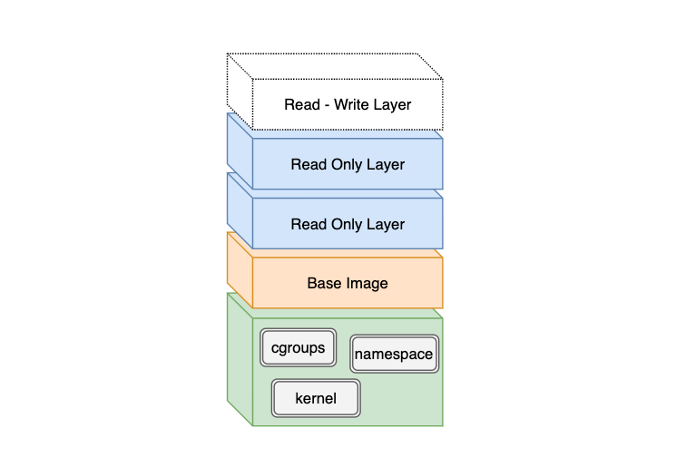
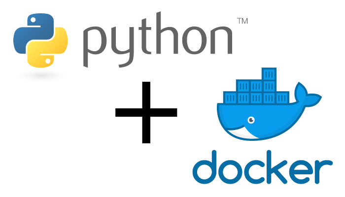

## 도커 이미지가 저장되는 방식
도커 이미지를 `pull` 받게 되면 마치 여러개로 분리된 조각을 내려받는 것처럼 보인다.   

```
$ docker pull nginx:latest

Using default tag: latest
latest: Pulling from library/nginx
c499e6d256d6: Already exists
74cda408e262: Pull complete
ffadbd415ab7: Pull complete
Digest: sha256:282530fcb7cd19f3848c7b611043f82ae4be3781cb00105a1d593d7e6286b596
Status: Downloaded newer image for nginx:latest
docker.io/library/nginx:latest
```

이렇게 분리된 데이터를 **레이어(Layer)** 라고 한다.   
레이어는 도커 이미지가 빌드될 때 `Dockerfile`에 정의된 명령문(Instructions)을 순서대로 실행하면서 만들어진다. 이 레이어들은 각각 독립적으로 저장되며 읽기 전용이기 때문에 임의로 수정할 수 없다.   

실제로 레이어가 어디에 어떻게 저장되는지 정확하게 확인하려면 `docker image inspect` 명령어를 실행한 뒤 출력된 결과에서 아래와 같은 해시값들을 볼 수 있다.   

```
"sha256:c3a984abe8a88059915bb6c7a1d249fd1ccc16d931334ac8816540b0eb686b45"
"sha256:99134ec7f247e5a211c7205fec587bf72a6d4aac339b21858b892e9c04f78920"
"sha256:d37eecb5b7691ec21bd19989e37f8bb4d20b340a775591d0f3db5897d606b0e4"
```

이 해시값으로 호스트 머신 내 어딘가 실제 레이어 내용이 저장된 것을 찾을 수 있다.   
좀 더 자세한 설명은 “[만들면서 이해하는 도커(Docker) 이미지: 도커 이미지 빌드 원리와 OverlayFS | 44BITS](https://www.44bits.io/ko/post/how-docker-image-work)”를 참고하는 것을 추천한다.   

그렇다면 **도커 컨테이너가 실행될 때 생성되는 결과물들은 어디에 저장될까?**   
도커 컨테이너가 실행되면 모든 읽기 전용 레이어들을 순서대로 쌓은 다음 마지막에 쓰기 가능한 신규 레이어를 추가하게 된다. 그다음 컨테이너 안에서 발생하는 결과물들이 쓰기 가능 레이어를 기록되게 되는 것이다.   

즉, <u>아무리 많은 도커 컨테이너를 실행하더라도 기존 읽기 전용 레이어는 변하지 않고, 컨테이너마다 생성된 쓰기 가능 레이어에 데이터가 쌓이기 때문에 서로 겹치지 않으며 컨테이너가 종료되면 모두 사라지게 된다.</u>      


<br>

## 도커 이미지 레이어에 대해
도커 이미지 레이어가 중요한 이유는 이미지를 빌드할 때마다 이미 생성된 레이어가 캐시 되어 재사용 되기 때문에 빌드 시간을 단축할 수 있다.   
하지만 `Dockerfile`에 정의된 모든 명령문(Instructions)이 레이어가 되는 것은 아니다.    

`RUN`,  `ADD`, `COPY`  이 3가지 단계만이 레이어로 저장되고, `CMD`, `LABEL`, `ENV`, `EXPOSE` 등과 같이 메타 정보를 다루는 부분은 임시 레이어로 생성되지만 저장되지 않아 도커 이미지 사이즈에 영향을 주지 않는다.   

이 글의 가장 첫 부분에서 `pull` 받은  `nginx:latest` 도커 이미지의 [Dockerfile](https://github.com/nginxinc/docker-nginx/blob/5c15613519a26c6adc244c24f814a95c786cfbc3/mainline/buster/Dockerfile)을 보면 처음에 베이스 이미지를 가져오는 부분을 포함해서 2개 `RUN` 명령까지 총 3개의 레이어를 받아왔다.    
만약  `Dockerfile`에 `RUN`, `ADD`, `COPY` 명령문이 수정되면 기존 캐시가 무효가 되어 새로운 레이어를 생성하게 될 것이다.    

<br>

## 도커 이미지 잘 만드는 방법
### (1) 베이스 이미지는 사이즈가 작은 것을 선택
너무나 당연한 말이지만 도커 이미지를 작게 만드는 가장 중요한 첫단계는 작은 베이스 이미지를 사용하는 것이다. 

<br/>


보통 *[Alpine 리눅스 도커 이미지](https://hub.docker.com/_/alpine)* 로 시작하는 것을 추천한다.   
그 이유는 다른 리눅스 배포판과 비교해 사이즈가 훨씬 작기 때문이다. Alpine 리눅스는 용량이 작은 이유는 C 라이브러리로 `musl`을 채택했고, 다양한 유닉스 도구들을 탑재한 `busybox`를 기반으로 하고 있기 때문이다. 

하지만 **Python 애플리케이션 환경**에서 베이스 이미지를 선택할 때는 Alpine 리눅스를 추천하지 않는다. 그 이유는 [Using Alpine can make Python Docker builds 50× slower](https://pythonspeed.com/articles/alpine-docker-python/) 글을 읽어보는 것을 추천한다.  


요약 하자면 PyPI에 올라간 파이썬 라이브러리들은 보통 `Wheel` 포맷을 사용하는 데 Alpine 리눅스는 `Wheel` 포맷을 지원하지 않기 때문에 소스 코드(.tar.gz)를 내려받아 직접 컴파일해야 하는 경우가 있기 때문이다.    
`Wheel` 포맷을 지원하지 않는 이유는 `musl` 라이브러리가 GNU C 라이브러리(`glibc`)로 컴파일된 `Wheel` 바이너리를 지원하지 않기 때문이다. 그래서 PyPI를 통해 `.whl`로 된 패키지가 아닌 소스 코드(`.tar.gz`)를 다운로드받게 되는 것이다. 

`Wheel` 포맷은 Python에서 설치 없이 바로 실행할 수 있다는 장점이 있다. 그 이유는 `Wheel` 포맷 자체가 `zip` 압축에서 확장자만 바꾼 것이며, Python은 Java의 `.jar`처럼 `zip` 파일을 바로 실행할 수 있기 때문이다.   

그래서 <u>Alpine 리눅스 이미지를 사용한다면 모든 Python 패키지에서 C 코드를 컴파일 해야 하므로 도커 이미지를 빌드하는 시간이 상당히 많이 소모된다.</u>    

```dockerfile
FROM python:3.8-alpine
RUN apk --update add gcc build-base freetype-dev libpng-dev openblas-dev
RUN pip install --no-cache-dir matplotlib pandas
```

실제로 맥북 15인치에서 위 `Dockerfile`을 빌드 했을 때 약 40분 정도 소요되었다. 😅   
추가로 덧붙이자면 Alpine 리눅스 이미지를 베이스 이미지로 사용한 Python 이미지는 용량도 크고, 몇 가지 버그들에 대한 취약점도 갖고 있다고 한다.   

결론적으로 Python 애플리케이션을 위한 도커 이미지 선택한다면 **Debian Buster**를 기반으로 한 `python:3.8-buster` 또는 `3.8-slim-buster`를 사용하는 것을 추천한다.   
(참고: [The best Docker base image for your Python application (January 2020)](https://pythonspeed.com/articles/base-image-python-docker-images/))   

<br/>

### (2) 이미지 레이어 개수를 줄이자
과거 도커 버전에서는 이미지 레이어 개수가 성능에 영향을 줬다고 한다. 하지만 이제는 그렇지 않다.

그래도 도커 레이어 개수를 줄이는 것은 최적화 측면에서 도움이 된다고 볼 수 있다.   
레이어는 `RUN`, `ADD`, `COPY` 명령문에서만 생성되기 때문에 아래와 같이 여러 개로 분리된 명령을 **체이닝(chaining)** 으로 엮어보자.   

레이어 개수가 적다고 도커 이미지/컨테이너 성능에 영향을 주진 않지만 `Dockerfile` 가독성과 유지 보수 관점에서 도움이 될 것이다.   

```dockerfile
RUN apt-get update
RUN apt-get -y install git
RUN apt-get -y install locales
RUN apt-get -y install gcc
```

위 내용을 아래와 같이 단일 `RUN` 구문으로 체이닝 하면 기존 4개 레이어가 생성되는 것을 1개 레이어로 줄일 수 있다.
그리고 하는 김에 설치할 패키지 순서를 알파벳 순서로 정렬하면 가독성도 높고, 중복 설치를 방지할 수 있는 효과도 있다.
```dockerfile
RUN apt-get update && apt-get install -y \
    gcc \
    git \
    locales
```


<br/>

### (3) 애플리케이션 코드를 복사하는 부분은 아래로
아래 샘플 `Dockerfile`에서는 `COPY`가 2번 실행된다.   
첫번째는 의존성 패키지가 명시된 파일이고, 두번째는 애플리케이션 소스 코드가 저장된 디렉터리다.   

```dockerfile
FROM python:3.8-slim-buster

WORKDIR /usr/src/app

COPY requirements.txt /usr/src/app
COPY django_project /usr/src/app

RUN pip install -r requirement.txt

CMD ["pip", "freeze"]
```
보통 의존성 패키지는 자주 바뀌지 않기 때문에 첫번째 `COPY` 명령으로 생성된 레이어는 캐시 될 것이다.   
하지만 두 번째 `COPY`는 빌드할 때마다 바뀔 수 있기 때문에 캐시가 자주 초기화될 것이고, 그 다음 실행될 `RUN`명령어에서 수행하는 의존성 패키지 설치가 매번 실행될 가능성이 높다.  
이렇게 될 경우 불필요하게 빌드 시간이 늘어나고, 자칫 의존성 패키지 버전을 `latest`나 `*`로 해뒀다면 예기치 못하게 패키지 버전이 올라갈 수 있다.    

따라서 **애플리케이션 코드 복사 명령은 자주 변경되지 않는 명령문 다음에 오는 것이 이미지 빌드 시간을 단축하는 데 유리하다.**   

<br/>

### (4) 프로그래밍 언어마다 패키지 매니저가 제공하는 Lock 파일 시스템을 활용
이전 단락에서 의존성 패키지를 명시한 파일로 `requirements.txt`를 사용했다. 이 파일은 Python의 공식 패키지 관리자인 `PIP`에서 사용하는 관행적으로 지칭하는 파일이다. 

Python 개발 환경을 기준으로 봤을 때 `PIP`는 패키지별 상호 의존성에 관계를 관리할 때 부족한 면이 있다. 
그래서 요즘은 좀 더 발전된 Locking 시스템을 갖춘 `Pipenv`나 `Poetry`를 사용하는 것을 추천한다.


이 도구들을 이용해 생성된 **Lock 파일** (예: `Pipfile`)을 기반으로 패키지가 설치될 수 있도록 한다면 위 (3) 단락에서 설명한 캐시 레이어의 장점을 얻을 수 있고, 예상치 못한 패키지 버전 업데이트도 방지할 수 있다.   

```dockerfile
FROM python:3.8-slim-buster

WORKDIR /tmp
RUN pip install pipenv

COPY Pipfile /tmp/Pipfile
COPY Pipfile.lock /tmp/Pipfile.lock

RUN pipenv install --system --deploy

CMD ["pip", "freeze"]
```

<br>

### (5) 멀티-스테이지 빌드를 활용
**멀티-스테이지 빌드** 는 위 (2), (3), (4) 단락에서 했던 노력보다 훨씬 더 효과적으로 도커 이미지 사이즈를 줄이는 방법이다. 

멀티-스테이지 빌드는 `Dockerfile` 1개에 `FROM` 구문을 여러 개 두는 방식이다.   
각 `FROM` 명령문을 기준으로 스테이지를 구분한다고 했을 때 특정 스테이지 빌드 과정에서 생성된 것 중 사용되지 않거나 불필요한 모든 것들을 무시하고, 필요한 부분만 가져와서 새로운 베이스 이미지에서 다시 새 이미지를 생성할 수 있다.    

아래 샘플을 통해 살펴보자.   
`Pipfile`에는 `uwsgi`라는 패키지의 의존성을 명시하고 있고, 이 패키지를 설치하기 위해서는 `gcc`가 필요하기 때문에 `apt-get install gcc`를 실행해야 한다.    

여기서 예상되는 점은 `gcc`가 `uwsgi`설치에만 관여하고 실제 애플리케이션 실행 환경에서는 필요하지 않기 때문에 멀티-스테이지 빌드를 사용한다면 이 부분이 구분점이 될 수 있겠다는 것이다.   

```dockerfile
FROM python:3.8-slim-buster AS builder

RUN apt-get update && apt-get install -y gcc

WORKDIR /tmp
RUN pip install pipenv

COPY Pipfile /tmp/Pipfile
COPY Pipfile.lock /tmp/Pipfile.lock

RUN pipenv install --system --deploy

FROM python:3.8-slim-buster
COPY --from=builder /usr/local/lib/python3.8/site-packages /usr/local/lib/python3.8/site-packages

CMD ["pip", "freeze"]
```

`COPY --from=builder`를 통해 전 단계 스테이지 빌드에서 생성된 특정 결과물만 새로운 BASE 이미지로 복사해서 이미지를 생성했다.   

```
REPOSITORY                          TAG     IMAGE ID       CREATED         SIZE
python-using-lockfile-multi-stage   uwsgi   7e6a652a326d   4 seconds ago   231MB
python-using-lockfile               uwsgi   17a4afc08bf7   2 minutes ago   375MB
```

멀티-스테이지를 사용하는 것과 아닌 것의 사이즈 차이는 약 140MB 정도 발생했다.    
특별한 이유가 없다면 멀티-스테이지 빌드를 사용하지 않을 이유는 없을 것 같다.   

<br>

## 참고 자료
- [How to Optimize Docker Images for Smaller Size? | coderbook](https://coderbook.com/@marcus/how-to-optimize-docker-images-for-smaller-size-and-speed/)
- [Using Alpine can make Python Docker builds 50× slower](https://pythonspeed.com/articles/alpine-docker-python/)
- [Best practices for writing Dockerfiles | Docker Documentation](https://docs.docker.com/develop/develop-images/dockerfile_best-practices/#minimize-the-number-of-layers)
- [Docker Best Practices - Banksalad Tech - Medium](https://medium.com/banksalad/docker-best-practices-8b4f28ab3a65)


