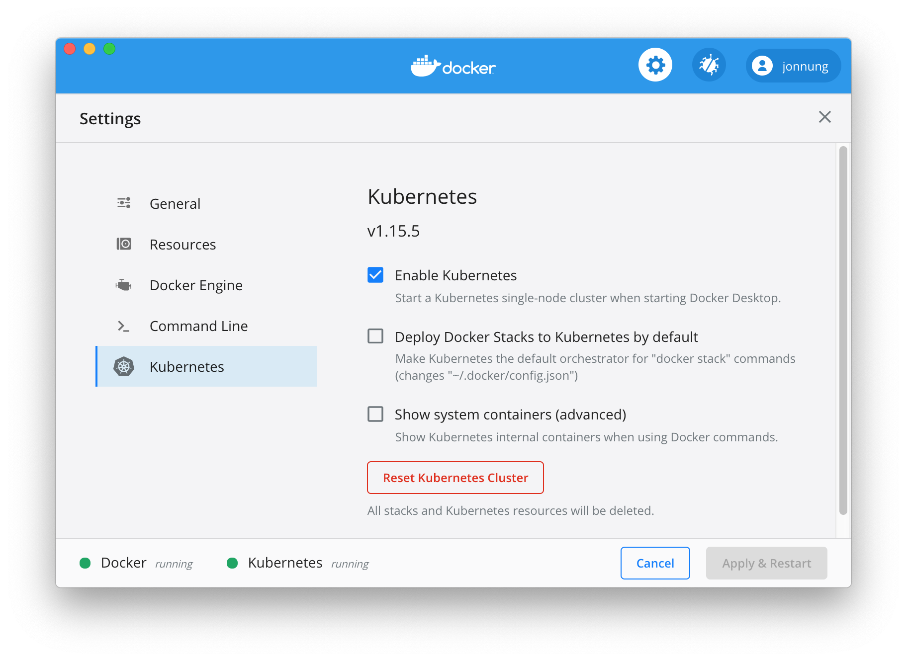
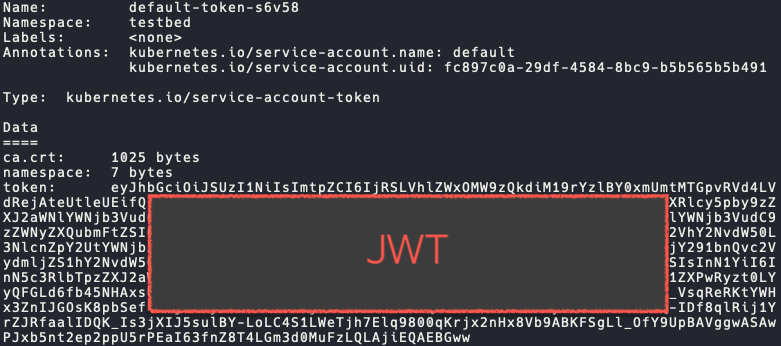

## 우리는 어떻게 쿠버네티스 클러스터에 접근할 수 있는 것일까?
쿠버네티스를 사용해 본 경험이 있다면, 보통 CLI 기반의 `kubectl` 명령어를 사용한다.  
만약 MacOS에 Docker를 설치해서 사용하고 있다면, 쿠버네티스 클러스터를 바로 사용해볼 수 있기 때문에 당장 `kubectl` 설치해서 쿠버네티스 리소스에 접근할 수 있다.  

```shell
$ kubectl get nodes

NAME             STATUS   ROLES    AGE    VERSION
docker-desktop   Ready    master   128d   v1.15.5
```

이 결과는 내 컴퓨터 환경에 쿠버네티스 클러스터가 실행되고 있다 보니 당연하게 여겨질 수 있다.   
하지만 실제 원격 서버에 구성된 버네티스 클러스터에 접근하려고 하면 어떻게 해야 할까?


> 이 상황은 마스터 노드와 워커 노드 개수와 관계없이 실제 리눅스 서버에서 실행되고 있는 쿠버네티스 클러스터 API에 공인 IP 또는 도메인을 통해 접근할 수 있는 상태를 가정한다.   

`kubectl` 명령어는 자신이 접근할 수 있는 클러스터 환경 정보를 `$HOME/.kube/config`  파일이나 `KUBECONFIG`환경 변수에 지정된 설정 파일을 참조한다.   

이 쿠버네티스 설정(이하 kubeconfig)은 크게 3가지 부분으로 구성되어 있다.   

- **clusters** : 쿠버네티스 API 서버 정보(IP 또는 도메인). 이름 그대로 여러 클러스터를 명시할 수 있다.
- **users** : 쿠버네티스 API에 접속하기 위한 사용자 목록. 아래에서 살펴볼 예정이지만 인증 방식에 따라 형태가 다를 수 있다. 
- **context** : clusters 항목과 users 항목 중에 하나씩 조합해서 만들어진다. 즉, 여러 개의 컨텍스트가 나올 수 있다. 결국 컨텍스트를 기반으로 "**어떤 Cluster에 어떤 User가 인증을 통해 쿠버네티스를 사용한다.**" 의미로 해석하면 된다.

정리하자면 `kubectl`은 kubeconfig에 정의된 Context 중 하나를 이용해서 쿠버네티스 클러스터에 접근한다. 당연히 이 Context에 명시된 사용자(User)는 인증을 거쳐야 접근이 허용된다.  
인증 절차를 위해 쿠버네티스는 여러 가지 인증 모듈을 플러그인처럼 함께 사용할 수 있도록 유연하게 설계되어 있다.  
활용할 수 있는 인증 방법은 '**X.509 인증서**', '**파일 기반 토큰 목록**', '**파일 기반 비밀번호 목록**', '**OpenID 연결 토큰**', '**웹 훅 토큰**', '**프록시**', '**ServiceAccount 토큰**' 방식이 있다.   

전부 다 사용할 필요는 없겠지만 '**X.509 인증서**'와 '**ServiceAccount 토큰**' 방식이 가장 기본이 되는 인증 방식이라고 생각한다.   

특히 '**X.509 인증서**' 방식은 쿠버네티스를 설치할 때 자동으로 생성되는데, 마스터 노드 서버에서 직접 `kubectl`을 실행할 때 `kubectl`이 참조하는 kubeconfig 파일에는 인증서 내용이 직접 들어가 있다. (인증서 내용은 BASE64로 인코딩되어 있다)   

이 인증서는 마스터 노드의 `/etc/kubernetes/pki`디렉터리에 있는 `ca.crt`를 루트 인증서로 하여 만들어진 하위 인증서 중 하나이다. 이 하위 인증서가 생성될 때 사용자(User)와 그룹(Group)이 지정되는데 이 때 그룹명으로 지정된 `system:masters`라는 값이 실제 쿠버네티스에 존재하는 `cluster-admin`이라는 ClusterRole에 연결되어 관리자 권한을 갖게 된 것이다.   

여기서 그룹을 표현한 `system:masters`라는 문자열과 권한을 정의한 ClusterRole 오브젝트와 Role을 연결하는 ClusterRoleBinding 오브젝트는 다음 단락에서 알아본다.   

결론은 쿠버네티스를 이용하는 사용자는 쿠버네티스 클러스터가 사용하기로 한 인증 방식에 따라 인증을 거쳐야 하며, 인증을 마친 사용자는 적절한 권한이 있는지 확인을 거치게 된다.   

따라서 외부에서 `kubectl`로 쿠버네티스 클리스터에 접근하려면 먼저 kubeconfig 파일에 Cluster 정보와 인증을 받을 User 정보를 추가하고, 그 조합된 Context 정보를 기반으로 쿠버네티스 클러스터와 통신한다.  

<br/>

## [TIP] 쉽게 kubeconfig 설정하는 방법
kubeconfig 파일을 직접 수정해서 Cluster, User, Context 항목을 입력해도 되지만, `$ kubectl config` 명령어를 사용하면 편리하다.

**▶︎ 모든 Context 확인하기**
```shell
$ kubectl config get-contexts
```

**▶︎ 현재 Context 확인하기**
```shell
$ kubectl config current-context
```

**▶︎ 새로운 Context 만들기**
```shell
$ kubectl config set-context new-context --cluster=local-kubernetes --user=jonnung
```

**▶︎ Context 바꾸기**
```shell
$ kubectl config user-context new-context
```

**▶︎ kubeconfig 설정 전체 보기**
```shell
$ kubectl config view
```

<br/>

## 쿠버네티스의 서비스 어카운트(Service Account)
서비스 어카운트(Service Account)는 쿠버네티스 상에 존재하는 오브젝트이며, 네임스페이스에 마다 각각 정의할 수 있다.  
각 네임스페이스에는 기본적으로 `default` 서비스 어카운트가 자동으로 생성된다. 

```shell
$ kubectl describe sa -n testbed default

Name:                default
Namespace:           testbed
Mountable secrets:   default-token-s6v58
Tokens:              default-token-s6v58
# 중략
```

서비스 어카운트를 만들면 JWT 토큰이 자동으로 함께 생성되어 쿠버네티스 Secret 오브젝트에 저장된다. 

```shell
$ kubectl describe secret -n testbed default-token-s6v58
```


이 토큰은 쿠버네티스 API에 인증하는 과정에서 사용될 수 있다.  
위 명령어 실행 결과에 출력된 JWT 토큰을 복사해서 쿠버네티스 API 서버로 HTTP 요청을 보낼 때 `Authorization: “Bearer {토큰값}”` 헤더로 실어 보내게 된다.  

하지만 `default` 서비스 어카운트는 쿠버네티스 API와 통신은 성공했지만, 권한이 없다는 응답을 받게 된다. 그 이유는 적절한 역할(Role)이 부여되지 않았기 때문이며 자세한 설명은 아래 RBAC에서 알아볼 수 있다.  

<br/>

## 쿠버네티스의 사용자(User)
쿠버네티스에는 사용자(User) 개념은 존재하지만 단지 추상적인 의미로 사용되며, 내부에 따로 저장되는 데이터가 아니라 단순히 문자열로 식별할 수 있는 값으로써 사용된다.  

위에서 다룬 인증 과정 중 X.509 인증서를 활용했다고 가정해보자. 만약 하위 인증서를 만들 때 CN(Common Name)으로 'jonnung’이라고 명시했다면, 이 인증서를 통해 인증된 사용자는 쿠버네티스 상에 User라는 개념에 따라 'jonnung'으로 지칭할 수 있게 된다.  

**서비스 어카운트(Service Account)** 도 User 개념에 포함된다. 따라서 서비스 어카운트도 위 예시처럼 `system:serviceaccount:<네임스페이스 이름>:<서비스 어카운트 이름>`라고 User로써 지칭할 수 있다.  

<br/>

## 쿠버네티스의 그룹(Group)
그룹(Group) 역시 사용자(User)와 마찬가지로 추상적인 개념으로 존재한다.  
따라서 쿠버네티스 오브젝트에서 그룹을 지칭하기 위해서는 사용자(User)처럼 문자열 형태로 표현된다.  

그룹 중에는 쿠버네티스에서 미리 정의해 둔 `system:` 접두사로 시작하는 그룹이 존재한다.  

- `system:unauthenticated` : 인증을 거치지 않은 사용자
- `system:authenticated` : 성공적으로 인증된 사용자
- `system:serviceaccounts` : 클러스터 전체에 있는 모든 서비스 어카운트
- `system:serviceaccounts:<네임스페이스 이름>` : 특정 네임스페이스에 있는 모든 서비스 어카운트

<br/>

## 역할을 기반으로 접근을 제어한다 (RBAC: Role Based Access Control)
쿠버네티스 내부에서 사용자로서 식별할 수 있는 3가지 개념에 대해 알아봤다.  
이 사용자가 쿠버네티스 API와 통신하기 위한 인증(Authentication)은 통과했다고 하더라도 실제로 쿠버네티스 오보젝트에 접근하기 위해서는 적절한 권한(Athorization)이 필요하다.  

사용자에게 권한을 부여하기 위해서는 먼저 Role을 정의하고, 그 역할을 사용자에게 연결(Binding)하는 방식으로 진행된다.  
이 Role은 2가지로 구분되는데 차이점은 네임스페이스에 속하는 Role인가 아니면 클러스터 전체에 속하는 Role인지로 구분된다.  

- **Role** : 특정 네임스페이스에 속하는 오브젝트에 대한 권한을 정의 
- **ClusterRole** : 클러스터  전체에 모든 네임스페이스에 대한 권한을 정의

아래 Role 매니페스트를 보면 `rules`항목에 정의된 `apiGroups`, `resources`, `verbs`를 통해 어떤 리소스에 어떤 동작을 허용할 지 지정한다.   

```yaml
apiVersion: rbac.authorization.k8s.io/v1
kind: Role
metadata:
  namespace: default
  name: nodes-reader
rules:
- apiGroups: [""]
  resources: ["nodes"]
  verbs: ["get", "list"]        
```
 
- `apiGroups` : 쿠버네티스의 오브젝트가 가지는 목적에 따라 분류되는 카테고리  
- `resources` : 권한을 정의할 쿠버네티스 오브젝트명  
- `verbs` : 어떤 동작을 수행할 수 있는지 정의  


ClusterRole의 경우 위에서 정의한 Role 매니페스트에서 `kind` 값만 `ClusterRole`로 바꾸면 된다.   
ClusterRole은 네임스페이스와 연관 없는 리소스나 네임스페이스마다  공통된 역할로 사용할 수 있기 때문에 동일한 역할을 다시 정의하지 않아도 되는 장점이 있다.  

마지막으로 Role과 ClusterRole을 사용자에게 부여하기 위해 사용하는 오브젝트는 **RoleBinding**과 **ClusterRoleBinding**이 있다.  

여기서 지정하는 사용자는 위에서 먼저 다뤘던 3가지 개념의 사용자가 될 수 있다.  
아래 ClusterRoleBinding 매니페스트에는 사용자로 SerivceAccount가 지정되는 경우를 나타낸다.   

```yaml
apiVersion: rbac.authorization.k8s.io/v1
kind: ClusterRoleBinding
metadata:
  name: nodes-reader
  namespace: default
subjects:
- kind: ServiceAccount
  name: jonnung
  namespace: default
roleRef:
  kind: ClusterRole
  name: nodes-reader
  apiGroup: rbac.authorization.k8s.io
```

<br/>

## 참고
- [RBAC recipes](https://recipes.rbac.dev/)
- [RBAC.dev | advocacy site for Kubernetes RBAC](https://rbac.dev/)
- [Effective RBAC - Jordan Liggitt, Red Hat - YouTube](https://www.youtube.com/watch?v=Nw1ymxcLIDI&t=38s)
- [Understand Role Based Access Control in Kubernetes - YouTube](https://www.youtube.com/watch?v=G3R24JSlGjY)
