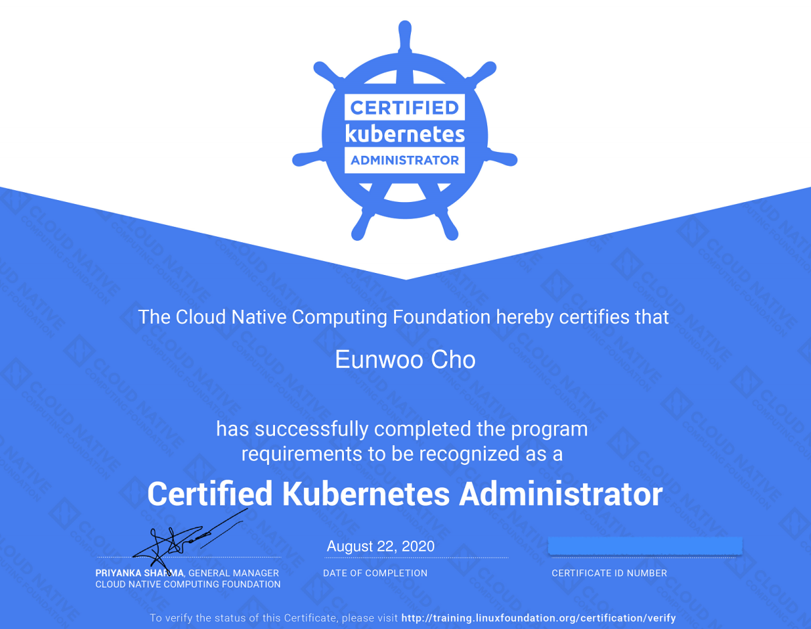

2020년 한 해 목표를 세울 때 CKA(Certified Kubernetes Administrator) 취득도 계획했었다.  
사실 이 자격 증명을 갖는다는 것에 어떤 큰 의미를 둔 것은 아니지만, 2년 넘게 쿠버네티스에서 서비스를 운영해오면서 항상 아직도 많이 모른다고 생각했다.   
회사에서 나름 이 시스템을 운영하는 데 중요한 역할을 하고 있고, 그에 따른 책임감과 부담도 많았기 때문에 항상 더 잘하고 싶다는 강한 의지가 있었다.  
그렇게 내가 CKA를 통해 얻고자 했던 것은 나 스스로 쿠버네티스에 대해 어느 정도 알고 있는지 파악하고, 관리자로써 어느정도 필요한 능력을 갖추고 있는지 확인하고 싶었다.   

본격적으로 CKA 준비를 시작한 것은 2020년 6월 초부터였다. 그전까지는 그동안 모은 쿠버네티스 관련 서적들을 거의 다 읽어봤다. 그리고 어차피 CKA 시험이 9월부터 개편된다고 했기 때문에 가능하면  참고 자료가 많은 현재 버전으로 시험에 응시하고 싶었다.  

그렇게 해서 CKA 시험에 대한 정보를 모으기 시작했다.  
이 글만 다 봐도 시험 방식은 충분히 파악할 수 있다. 그래서 나는 비슷한 내용은 정리하지 않았다.  

<br/>

### 취득 후기 모음
- [CKA vs CKAD - Which Exam Should You Take?](https://devopspages.io/cka-vs-ckad/)
- [CKA(Certified Kubernetes Administrator) 합격 후기 및 팁 공유](https://blog.dudaji.com/kubernetes/2019/06/24/cka-acceptance-review-soonbee.html)
- [Certified Kubernetes Administrator 취득 후기 | 커피고래의 노트](https://coffeewhale.com/kubernetes/cka/2019/01/13/cak/)
- [CKA 자격증 개요 - KubeTM Blog with Kubernetes](https://kubetm.github.io/practice/cka/ready/)
- [CKA(Certified Kubernetes Administrator) 시험 후기](https://ok-cp.tistory.com/4)
- [CKA (Certified Kubernetes Administrator) 준비 과정과 합격 후기 - 한우형의 기술 블로그](https://woohhan.tistory.com/10)

<br/>

### 나의 학습 방법
CKA를 취득했던 누구나 인정하는 최고의 학습 강좌인  [Certified Kubernetes Administrator (CKA) Practice Exam Tests | Udemy](https://www.udemy.com/course/certified-kubernetes-administrator-with-practice-tests/) 코스를 시작했다.   

목차만 봐도 분량이 많은데 영어로 되어 있고 한글 자막도 없을뿐더러 영문 자막도 소리 나는 대로 만들었는지 틀린 단어도 꽤 많다.   
그래서 여러 번 구간 반복해서 듣다 보니 학습 시간이 꽤 걸렸다. 게다가 중간에 실제 시험과 유사한 터미널 환경에서 연습 문제를 풀어야 해서 마음처럼 빨리 진도를 나갈 수가 없었다.   

원래 계획은 강좌를 2회 정도 정주행하고, 연습 문제는 3회 풀어보려고 했지만, 너무 오래 걸릴 것 같았다. 이대로 가다가는 9월 전에 시험을 못 보겠다 싶어서 강좌는 1회만 제대로 정주행하는 것으로 계획을 바꿨다. 이렇게 해도 강좌를 다 보는데 두 달 정도 걸렸다....  

강좌를 보면서 핵심 내용만 영문 대본의 내용을 그대로 복사해서 노트에 정리했다. 일단 영어로 옮겨놓고 나중에 복습할 때 한국어로 번역할 생각이었다. 이렇게 정리한 내용은 아래 Github 저장소에 올려두었다.  

**[GitHub - jonnung/cka-practice: Certified Kubernetes Administrator (CKA) Preparation](https://github.com/jonnung/cka-practice)**  

이 시험에 성공하는 유일한 방법은 무조건 연습이라고 생각한다. 그래서 가능하면 뭐든지 실제로 직접 해보고 그 사용법에 익숙해져야 한다.   
그래서 시험 일주일 전부터는 연습 문제만 처음부터 다시 풀어봤다.  
참고로 강좌의 후반부에 있는 Mock Exam 3개는 정말 좋다. 이건 꼭 최소 2번은 해보는 것을 추천한다.  

<br/>

### 시험 팁
실제 시험 내용을 공개하면 안 되는 것은 당연하기 때문에 공부할 때 조금 더 신경을 쓰면 좋을 것 같은 것들만 집어보려고 한다.   

#### 1. 터미널 환경과 쿠버네티스 컨텍스트 확인
먼저 시험이 시작되면 터미널에 접속된 계정과 호스트 명을 확인해보자. 아마 `student` 계정에 `node-01` 일 것이다. (`student@node01`)   
SSH를 이용해 다른 호스트에 접속할 경우가 생기는데 해당 호스트에서 `sudo -i`를 사용해 `root` 계정으로 전환한 경우 다시 처음 위치로 돌아오기까지 `exit`를 하면서 조금 헷갈릴 수 있다.    

문제 상단에는 항상 현재 어떤 쿠버네티스 컨텍스트에서 수행해야 하는지 알려준다.  

```shell
$ kubectl config use-context wk8s
```

위와 같이 컨텍스트 명령어도 주어지기 때문에 문제를 시작할 때마다 항상 복사해서 실행했다.  
그래도 불안해서 현재 컨텍스트가 맞는지 다시 확인했다.  

```shell
$ kubectl config current-context
```

<br/>

#### 2. POD와 Deployment(DaemonSet) 만드는 명령어 숙달하기
어떤 POD를 만들든 간에 일단 아래 명령어로 문제에서 요구하는 정확한 POD 이름으로 기본 스펙 구성을 YAML 파일로 시작하자.  
그 외 문제에서 요구하는 속성들을 YAML 파일에 추가한다. (예: `labels`, `volumeMounts` 등)  

```shell
$ kubectl run some-pod --image=nginx \
  --dry-run=client -o yaml > some-pod.yaml
```

Deployments와 DaemonSet은 거의 유사하고 `kind`만 다르다고 볼 수 있다.   
보통 Deployments는 `kubectl create` 명령어로 생성할 수 있는데 DaemonSet은 지원하지 않기 때문에 필요하면 Deployment로 시작한 뒤 `kind`만 바꾸면 된다.  

```shell
$ kubectl create deployment some-deploy --image=nginx \
  --dry-run=client -o yaml > some-deploy.yaml
```

그리고 `create` 명령어를 사용할 때는 `replicas`옵션을 제공하지 않기 때문에 YAML 파일에서 `replicas`를 조정하든 우선 Deployment 오브젝트 생성 후 `scale` 명령어로 `replicas`를 변경해도 된다.   

<br/>

#### 3. Service를 만들 때는 expose를 사용하자
Service를 만들 때 `kubectl create service`를 사용해도 되지만 이미 POD나 Deployment가 주어졌거나 직접 만든 상태에서 Service를 연결할 때는 `expose`가 편하고 빠르다.  

```shell
# 어떤 POD에 Service 연결하기
$ kubectl expose pod some-pod \
  --type=ClusterIP \
  --port=80 \
  --target-port=8000 \
  --dry-run=client -o yaml > some-pod-svc.yaml

# 어떤 Deployment에 Service 연결하기
$ kubectl expose deployment some-deploy \
  --type=ClusterIP \
  --port=80 \
  --target-port=8000 \
  --dry-run=client -o yaml > some-deploy-svc.yaml
```

위 명령어에서 `--type=ClusterIP`는 기본값이기 때문에 명시하지 않아도 괜찮다. 하지만 만약 `NodePort` 타입을 만들어야 할 경우 `--type=NodePort`로 지정하면 된다.   

<br/>

#### 4. 쿠버네티스 신규 클러스터 구축
kubeadm 설치부터 해야 한다. 따라서 공식 문서에서 참고할 페이지가 2개이다.  

- [Installing kubeadm | Kubernetes](https://kubernetes.io/docs/setup/production-environment/tools/kubeadm/install-kubeadm/)
- [Creating a cluster with kubeadm | Kubernetes](https://kubernetes.io/docs/setup/production-environment/tools/kubeadm/create-cluster-kubeadm/)

마스터 노드를 설치하는 과정에서 필수로 수행하는 CNI 플러그인 설치 과정은 v1.18 버전부터 공식 문서에서 직접적인 명령어를 제공하지 않는다.   
분명히 몇 주 전까지 Calico, Flannel, Weave 명령어가 있었는데 갑자기 안 보이길래 한참 찾았다. 다행인 것은 시험에도 이 내용을 고려해서 Calico 설치 YAML URL이 제공된다.   

<br/>

#### 5. ETCD 백업과 복구
이 내용은 공식 문서에 나오지 않는다. 따라서 반드시 암기 해야 한다. 긴 명령어를 완전히 암기한다기 보다 눈에 익혀두는 게 맞겠다.  
일단 `--help` 명령어를 쳐보면 기본값을 써도 되는 것도 있고, 문제에서 `Certificates` 파일 경로를 알려주기 때문에 눈치가 있다면 그것들에 해당하는 옵션만 넣어도 쉽게 해결할 수 있다.  

**ETCD 스냅샷 백업하기**
```shell
$ etcdctl \
  # --endpoints=https://[127.0.0.1]:2379 \  # 기본값
  --cacert=/etc/kubernetes/pki/etcd/ca.crt \
  --cert=/etc/kubernetes/pki/etcd/server.crt \
  --key=/etc/kubernetes/pki/etcd/server.key \
  snapshot save /tmp/some-snapshot.db
```

**ETCD 스냅샷 복구하기**
```shell
$ etcdctl \
  # --endpoints=https://[127.0.0.1]:2379 \  # 기본값
  --cacert=/etc/kubernetes/pki/etcd/ca.crt \
  --cert=/etc/kubernetes/pki/etcd/server.crt \
  --key=/etc/kubernetes/pki/etcd/server.key \
  --name=master \
  --data-dir /var/lib/etcd-from-backup \
  --initial-cluster=master=https://127.0.0.1:2380 \
  --initial-advertise-peer-urls=https://127.0.0.1:2380 \
  snapshot restore /tmp/some-snapshot.db
```

<br/>

#### 6. 클러스터 장애 상태 해결하기
클러스터가 문제가 있는 경우를 크게 2가지로 생각해볼 수 있다.  

1. `kubectl`을 통해 정보를 확인할 수 없는 경우
2. `kubectl get nodes` 결과에서 특정 노드 상태가 `READY`가 아닌 경우

(1번)은 당연히 kube-apiserver 문제일 가능성이 크다. 하지만 그 전에 `kubectl`이 사용하는 설정 파일에 문제가 없는지 확인해보자.   
연습 문제에서는 kube-apiserver URL에 포트가 정확하지 않은 경우가 있었다. (2379 -> 6443)  
만약 마스터 노드에서 `docker ps` 명령어로 실행중인 컨트롤 플레인 컴포넌트 중 kube-apiserver가 보이지 않는다면 Static POD 실행 오류로 짐작할 수 있다.   
보통 Static POD 명세는 `/etc/kubenetes/manifests` 폴더 안에 있지만, 이 경로를 결정하는 것은 kubelet 옵션이라는 점을 반드시 기억해야 한다.  

(2번) 경우는 가장 먼저 kubelet 실행 상태가 정상인지 확인하는 것이 우선이다. kubelet 프로세스가 정상인지 실행 옵션에 문제가 있는지 확인해보자.   

<br/>

### 진짜 후기
난 평소에 잘 안 떠는 체질이고, 면접 자리에서도  긴장을 안 하는 편이다. 그런데 시험은 좀 다른 것 같다.   
시험 전까지 계속 긴장되는 기분이 들었고, 시험이 시작되고 나서도 실수하지 않으려고 잔뜩 경직되어 있었는데 첫 문제가 너무 어이없게 쉬워서 갑자기 당황스럽기도 했다. 그런데 하다 보니 연습 문제 풀 때처럼 재밌어서 금세 마음이 편해졌다.   
총 3시간 중에 2시간 만에 24문제를 다 풀었다. 너무 피곤해서 종료하고 싶었지만, 혹시나 작은 실수로 아쉬운 상황이 생기지 않을까 싶어서 30분 정도 검토를 했다.  
시험을 마치고 나니 꽤 뿌듯했다. 그리고 왠지 100점을 맞을 것 같은 자신감이 들었다. 사실 그동안 나름으로 열심히 준비했기 때문에 기대해볼 만 하다고 생각했다. (일단 못 푼 문제는 없었다.)  

결과는 이틀도 안 돼서 메일로 왔다.  

> Congratulations! You have successfully completed Certified Kubernetes Administrator (CKA). Click the link below to view and download your certificate.  

**"95점으로 통과!"**  

100점은 아니지만 진짜 100점을 맞을 뻔한 것 자체만으로도 뿌듯했다.   
어떤 문제가 틀렸는지 알 수가 없다는 점이 조금 아쉽다.  


앞으로는 좀 더 의도적으로 다양한 실전 경험을 많이 쌓아보려고 한다. 이미 했던 것들도 다시 돌아보고 계속 신경 쓰면서 더 좋은 것들을 많이 익히고, 시도해볼 것이다.
