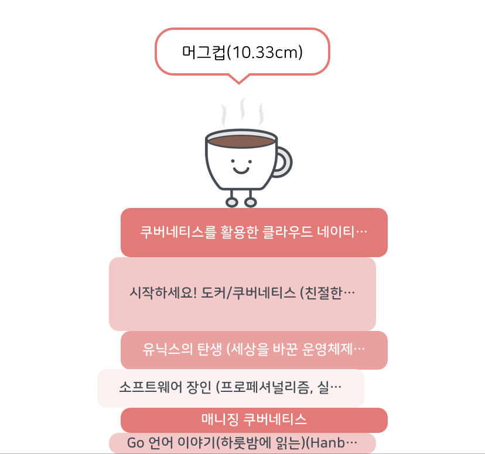
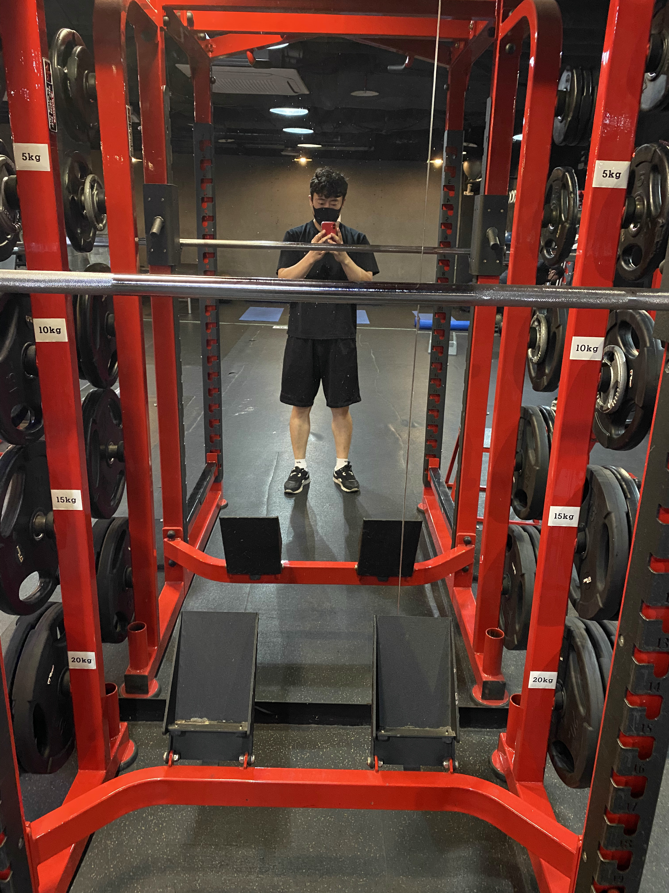
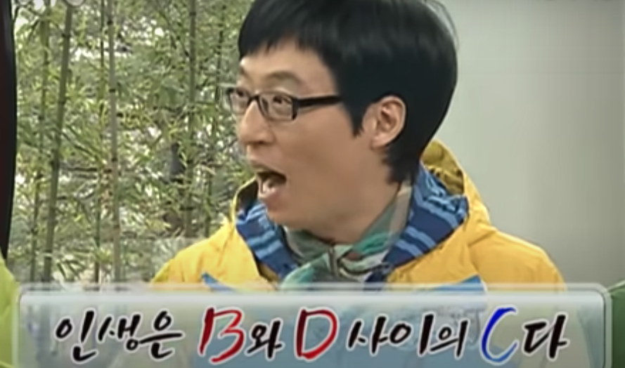

흘러가는 시간에 시작과 끝을 구분할 수는 없지만, 그래도 이상하게 해가 바뀌는 이쯤이 되면 지난 1년을 돌아보게 된다.  
살면서 항상 좋은 일만 생기길 바란다고 좋은 일만 생길 수도 없고, 계획했던 일들은 거의 계획대로 되지도 않는다. 게다가 시작조차 못 해 본 일들도 많다.  
하지만 그래도 가끔 예상하지 못한 대단한 일들을 해내기도 한다.  

내가 보내온 2020년은 너무나 그랬다.

 
## 큰 발전 없는 블로그와 책 읽기
한 달에 가볍게 2개씩 쓰자고 계획했었다.  
그런데 자꾸 잘 써야 한다는 부담감 때문에 처음부터 무겁게 시작한다. 그래 봐야 뭐 대단한 걸 쓴다고...  
그래도 한 달에 1개 정도는 쓰면서 그 정도로 만족하고 있었는데, 9월에 이직한 뒤로 한 번도 쓰질 않았다.  
올해는 진짜 가볍고 짧은 글, 정리한 내용이라도 매주 1개씩은 써보자.  

독서량은 2019년도와 비교했을 때 정말 1도 좋아지지 않았다.  
북적북적 앱, 리더스 앱을 이용해서 책 읽는 습관과 성취감은 조금 늘고 있는 편이다.  
올해는 아내와 한 달에 소설 1권 같이 읽기와 기술 서적 1권이 목표이다.  

 
## 사이드 프로젝트 제로
0개...  
아무것도 만든게 없다.  

요즘 앱 개발을 배워서 나중에 앱 개발자로 전향하거나, 앱 스토어에 내가 많든 앱을 올려보겠다는 목표로 앱 개발자 부캐를 키우고 있다.  

12월부터 Flutter를 공부하고 있는데 예상보다 재밌고, 꽤 잘 만든 프레임워크 같다. 모든 것이 위젯이고, 그걸 쌓아 올리면서 화면을 구성하는 컨셉이 이해하기 쉬웠다.  
Flutter에서 사용하는 프로그래밍 언어로 Dart는 Javascript랑 비슷한 느낌을 받아서 기본적인 것들은 쉽게 익숙해질 수 있었다.  

현재 간단한 앱 아이디어가 2가지 정도 있는데 꼭 완성해서 출시해볼 것이다.

 
## 공부한 보람
CKA 시험은 2020년 목표 중 하나였다. 자격증에 큰 의미를 두는 것은 아니지만 쿠버네티스로 서비스를 운영해 온 경험에 대해 내가 어느 정도 수준인지 확인하고자 하는 목적뿐이었다.  
9월에 CKA 시험이 개편되기 때문에 가능하면 그 전에 응시하는 게 나름 유리하다고 생각해서 6월부터 준비하기 시작했다.  

시험을 준비하는 기간에 때마침 이직 절차도 함께 진행되고 있었는데 내가 지원한 포지션이 DevOps/SRE였기 때문에 인터뷰 과정에서 쿠버네티스 관련 지식과 경험에 관해 물어보는 질문을 많았다.  
이때 CKA 시험을 준비하면서 그동안 잘 안써봐서 몰랐던 기능이나 자주 썼지만 확실한 원리를 몰랐던 내용들을 알게 된 것이 인터뷰에 많은 도움이 되었다.  

정말 오랜만에 시험이란 것을 다시 보게 되면서 긴장도 많이 했지만, 결과적으로 내가 나 자신에게 주는 도전을 달성 해나가는 과정에서 맛보는 성취감이 좋았다.  

[🔗 CKA 도전 후기와 스포 없는 팁 공유](https://jonnung.dev/kubernetes/2020/08/24/cka-challenge-and-spoiler-free-tips/)

 
## 역시 가족
올해는 가족과 함께 한 추억이 참 많다.  
코로나19가 확산 되어 재택근무를 하게 되면서 집에서 아내와 단둘이 보내게 되는 시간이 정말 길어졌다.  
연애와 결혼 생활을 포함해서 9년째 사랑하는 아내와 함께했지만, 잘 생각해보면 이렇게 오랜 시간을 함께 붙어있어 본 적은 없기 때문이다. (이건 누구나 마찬가지)  

이 생활의 유일한 부작용은 가끔 아내가 집을 비울 때 혼자서 아무 말도 하지 않고 있을 때 상당히 외롭다는 것이다. 너무 붙어 있다가 떨어지니까 그런가 보다.  

철이 조금 든 것일까? 이제는 장모님도 우리 엄마처럼 편하고, 처남이랑도 티키타카가 생길 정도로 친해졌다.  
친동생이 가까이 살지만, 주요 가족 행사 때만 봤었는데 이제는 심심할 때나 맛있는 거 생각날 때도 보러 간다.  
형제끼리 길게 통화할 일도 없었는데 요즘은 자주 통화하고, 이런저런 고민 얘기도 많이 털어놓곤 한다. 예전에 형(나)에게 살갑지 않았던 동생에게 서운했던 적도 있었지만, 이젠 내가 먼저 동생을 그리워하고 동생과 함께 하는 시간을 기대한다.  

2021년에는 우리 가족이 더 늘었으면 좋겠다. 그리고 그렇게 될 거라 믿는다.  

 
## 헬린이
무슨 바람이 불었을까... 그동안 살면서 헬스장에 다녀본 적도 없는데 직장 동료들과 함께 점심시간에 헬스장을 다니기 시작했다.  
그냥 앞으로 뭐든 오래 하려면 건강해야 하고, 더 잘하려면 튼튼해야 하니까...  

어디서 봤는데 인간은 중력과 반대로 자리 머리보다 높이 올릴 때 성취감을 느낀다고 한다.  
그래서 그런지 나는 밀리터리프레스가 제일 좋더라ㅋㅋ  
하지만 코로나19 때문에 중간에 공백기가 생기면서 다시 초기화...  
그래도 헬스장 5개월 차에 3대 측정해서 딱 300을 달성했다.  

 
## 이직 Part1 - 결심과 후기
이직을 해야겠다고 생각했다.  
이유는 단 한 가지.  
현재 익숙한 환경에서 벗어나 새로운 환경에서 나의 부족한 부분을 찾아가고, 내가 잘하는 부분을 더 발전시키는 것이 목적이다.   

나는 은근히 게으른 편이다. 혹독한 상황을 주지 않으면 굳이 내 스스로가 도전하지 않을 거란 것을 잘 알고 있다.  
처한 환경 자체가 주는 다양한 기회와 위기 상황을 온전히 내가 헤쳐나갈 때 비로소 성장한다고 생각한다.  

7월부터 시작한 이직 과정은 9월에 새 회사로 출근하게 되면서 마무리가 되었다.  
보통 처음 3개월 동안은 온보딩 기간으로 최대한 나를 보여주고, 나도 회사를 알아가는 과정이다.  
서로를 알아가는 과정에서 익숙하지 않은 부분에서 갈등도 찾아올 때도 있었고, 기대하지 않았던 부분에서 만족하기도 했다.  
그러면서 나도 점점 더 나은 사람이 되고 있다고 생각한다.  

과거 무한도전에서 '인생은 B와 D사이의 C다.'라는  말이 나온다.  
Birth와 Death 사이에 수많은 Choice!  
2021년에도 나는 많은 Choice를 하게 될 거다.   
기본적으로 항상 잃지 않는 선택, 더 나아질 수 있는 선택만 하기로 하자!  

 
## 이직 Part2 - 뻔하지만 괜찮은 전략 공유
그동안 가고 싶은 회사로 찍어 둔 목록 중 6개의 회사에 지원했다.   
다행히 모두 서류는 통과했고, 1차 인터뷰는 5개의 회사만 진행했다. (코딩 테스트는 2번)  

이번이 세 번째 이직 경험이고, 그동안 면접관으로서 인터뷰를 해보면서 경험한 노하우를 바탕으로 나름의 전략을 짰다.   

이직 준비를 할 때 비교군을 만들지 않으면 더 나은 선택을 하기가 어렵다.  
조급한 마음에 맘에 들지 않는 조건으로 수락해 버리면 결국 나중에 두고두고 마음에 짐이 된다.  
어차피 일하게 될 거면 이런 기본적인 부분에서는 마음은 편하게 일에만 집중할 수 있는 게 낫지 않을까?  

아무튼 결론은 최소 두 군데 회사의 채용 절차가 동시에 진행될 수 있도록 스케줄을 짜는 것이다.  
단, 여기서 가장 중요한 핵심은 내가 제일 들어가고 싶은 회사를 후반부에 배치하는 것이다. (그 이유는 마지막에...)  
물론 이게 생각처럼 쉽게 되는 것은 아니겠지만, 서류 지원 단계에서 약간의 시간 간격을 두면 어느 정도 가능하다.  

만약 내가 보낸 입사 지원서를 인사 담당자 또는 실무 채용 담당자가 최소 1주 안에 확인하고, 1차 인터뷰 제안이 온다고 가정하면 보통 그 시점부터 1주 안에 인터뷰 일정이 잡힌다.  
때에 따라 코딩 테스트 일정이 포함되기 때문에 2주까지 예상할 수 있다.  
그리고 1차 인터뷰에 합격하게 되면 거의 2~3일 안에는 2차 인터뷰 일정을 잡게 되고, 그 기간도 대략 1주 안에 결정된다.  
2차 인터뷰 후 탈락이면 거의 바로 피드백이 오는 편이지만 합격 발표는 거의 1주가 걸렸던 것 같다.   

정리하자면...  

> 서류 지원 -> 인사팀 검토 후 피드백 (1주) -> 1차 인터뷰 일정 조율 (1주) -> 1차 인터뷰 합격 시 2차 인터뷰 일정 조율 (1주) -> 합격 발표 (1주)

뻔한 이야기를 정성 들여 자세히 적었는데 이 기간을 염두에  둬서 최소 2개 회사를 한 그룹으로 일주일 간격으로 지원하면 4주 정도 지나면 대부분 채용 절차 후반부에 접어들게 된다.  

만약 초반에 진행했던 회사들과 처우 협상이 진행될 때 아직 2차 인터뷰나 최종 합격 발표를 기다리고 있더라도 얼마든지 양해를 구하고 결정을 미룰 수 있다.  
그 이유는 이미 채용의 막바지에 접어든 이상 나와 회사 모두 시간과 노력을 들였기 때문에 딱히 조금 더 기다린다고 손해 볼 건 없기 때문이다.  

이직해서 가게 될 회사가 좋을지는 별로일지 직접 가기 전에는 모른다.  
하지만 누구나 새로운 환경에서 새롭게 시작하게 되면 큰 꿈을 품게 될 것이다.   
그리고 그곳에서 그동안 경험했던 모든 경험과 능력을 쏟아붓겠지 말이다.   
그렇기 때문에 회사를 선택하기 전에 최대한 많이 고민하고, 비교해 보고 합당한 대우를 받고 가는 것이 장기적으로 회사와 나 자신에게 의미 있는 투자가 될 것이다.  
