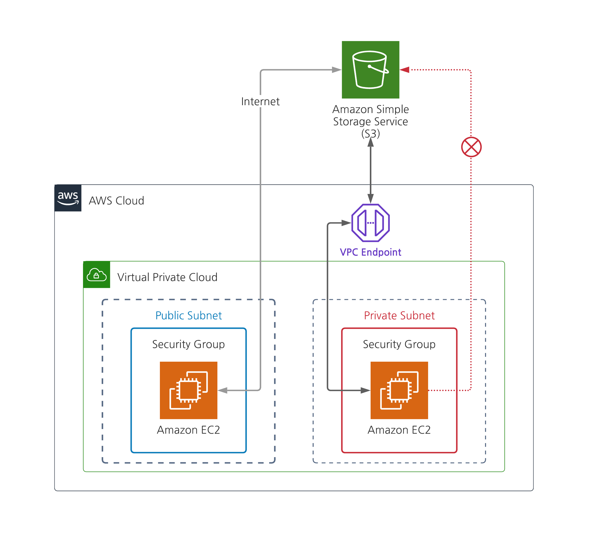
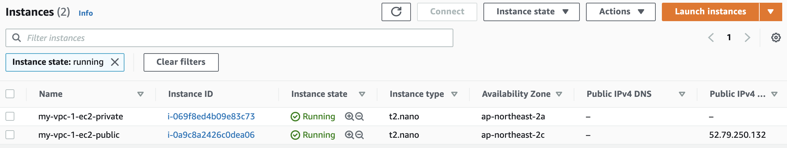
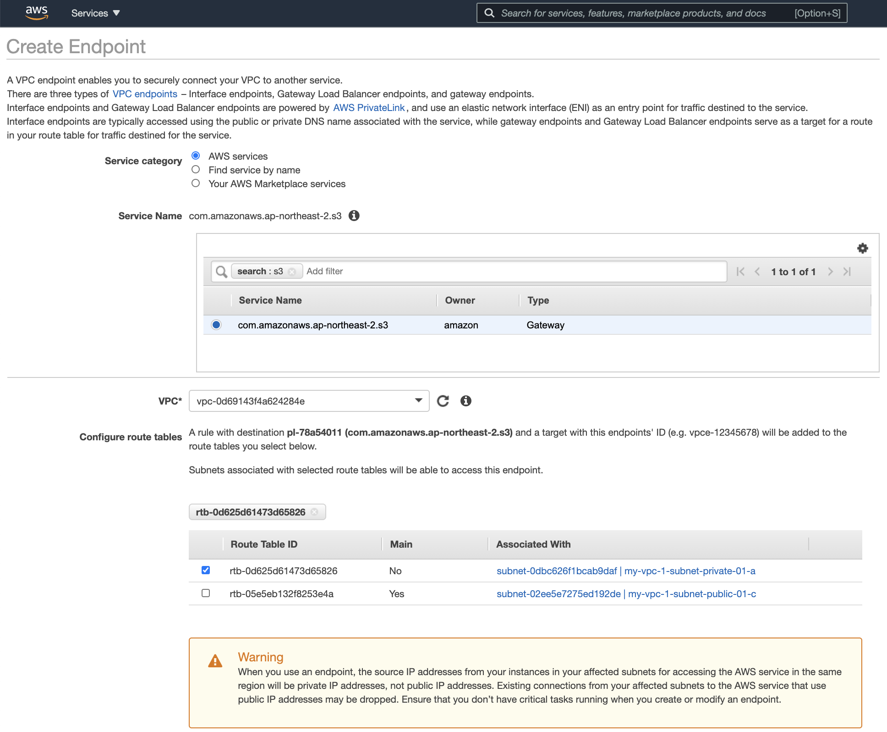

VPC 외부에서 실행되는 대표적인 서비스 중 S3와 VPC 내부의 리소스(예: EC2)가 통신하기 위해서는 기본적으로 인터넷을 통해서만 가능하다.  
하지만 VPC 밖에서 들어오는 트래픽에는 과금이 되기 때문에 비용을 줄이기 위해 AWS 네트워크 안에서 통신할 수 있도록 하는 것이 좋다.  

**VPC 엔드포인트**를 이용하면, S3와 VPC를 Private 하게 연결할 수 있다.   
그래서 어떤 트래픽도 AWS 네트워크에서 벗어나지 않기 때문에 비용을 상당히 절약할 수 있고, Public IPv4 주소나 인터넷 게이트웨이, NAT 게이트웨이, Direct Connect 등이 없어도 된다.   

VPC 엔드포인트는 가상 디바이스이며, 수평적 확장되는 중복 VPC 구성 요소이다.   
즉, 네트워크 가용성 위험이나 대역폭 제약이 발생하지 않는다.   

여기서 설명하고 있는  VPC 엔드포인트는 S3와 DynamoDB에만 지원하는 [게이트웨이 VPC 엔드포인트](https://docs.aws.amazon.com/ko_kr/vpc/latest/userguide/vpce-gateway.html)를 의미한다.  


<br/>

## 간단한 실습 과정
> 모든 과정을 자세히 설명하지 않고, VPC Endpoint를 어떤 상황에서 사용해야 하는지를 이해하는 간단한 흐름을 설명합니다.   
> Public/Private Subnet을 만드는 방법이나 Security Group을 설정하는 방법은 다른 자료를 참고하시길 바랍니다. 😉 

1. S3에 Bucket을 하나 만든다. 
2. VPC 안에 Public/Private subnet을 준비한다.
3. 각 Subnet 안에 EC2 인스턴스를 생성한다. SSH 접속을 위한 KeyPair 등록이 필요하다.
4. SSH로 접근하기 위해 Security Group 설정에 22번 포트에 대한 Inbound 규칙을 추가한다.
5. 먼저 SSH로 Public subnet에 있는 EC2 인스턴스에 접속한다. 
	1. AWS CLI를 이용해 AWS S3의 Bucket 목록을 불러온다. ```$ aws s3 ls ```
	2. 정상 동작 확인!
6. 현재 Public subnet에 위치한 EC2에서 Private subnet에 생성한 EC2 인스턴스에 접속한다. (Public IP가 없기 때문에 VPC 밖에서는 접근할 수 없음)
	1. AWS CLI를 이용해 AWS S3의 Bucket 목록을 불러온다. ```$ aws s3 ls ```
	2. 한참이 지나도 안됨!!
7. AWS 콘솔에서 VPC > Endpoints 메뉴에서 "Create Endpoint"를 선택한다.
	1. "Service Name" 항목에서 "s3"를 검색한 후 "com.amazonaws.ap-northeast-2.s3"를 선택한다.
	2. 위에서 생성한 EC2가 있는 VPC를 선택한다.
	3. 아래 "Configure route tables"가 표시되면 Private subnet에서 사용하고 있는 Route Table을 선택한다.
	4. 아래 "Policy"에서 특정 Bucket에 대한 정책을 제한할 수 있지만, 지금은 그냥 "Full Access"를 선택한다.
8. 다시 (6)번 과정을 수행한다. 
	1. 정상 동작 확인!!!

