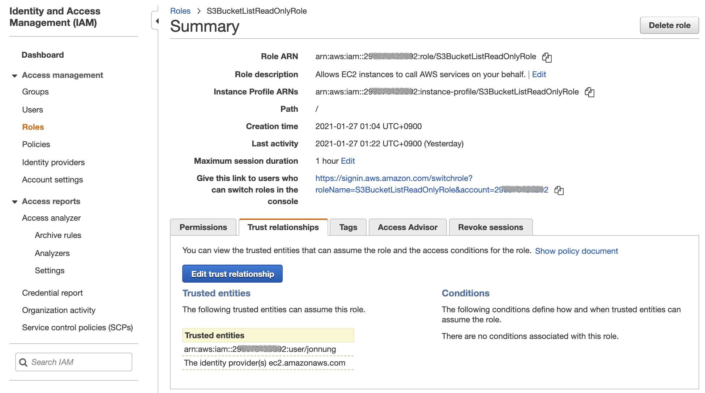

이 글에서는 IAM 역할(Role)에 대해 이해하기 위한 내용을 다뤄보려고 한다.  
역할?이라고 하면 뭔가 뻔해 보이지만 자세히 들여다보기 전에는 조금 아리송한 부분이 있었다.   

먼저 AWS IAM의 기본적인 내용을 살펴보자.  

**IAM**은 AWS 클라우드 인프라 안에서 신분과 접속/접근을 관리하기 위한 서비스이며, 크게 **사용자(Users)**, **그룹(Groups)**, **역할(Roles)**, **정책(Policies)** 으로 구성되어 있다.  

먼저 **IAM 정책(Policy)** 부터 알아보자.  
정책은 권한을 부여하는 방법이다. 하나 이상의 AWS 리소스에 대한 어떤 작업을 수행할 수 있는지 허용 규칙을 JSON 형식으로 작성된다.   
이렇게 만들어진 정책이 IAM 사용자와 그룹, 역할에 연결된다.  

**IAM 사용자**는 실제 사용자 단 한 명을 의미한다.   
하지만 AWS 계정을 처음 만들었을 때 만든 루트 계정(email)이랑 완전 다르다는 점을 알아야 한다. 왜냐하면 루트 계정은 모든 권한을 갖고 있고, IAM 사용자는 단지 루트 계정에 의해 만들어졌을 뿐이다.    
AWS에서는 루트 계정을 직접 사용하지 말고, 어드민 권한(`AdministratorAccess`)을 부여한 IAM 사용자를 따로 만들어서 사용하는 것을 권장하고 있다.  

<br/>

**IAM 그룹**은 다수의 IAM 사용자를 모아놓은 개념이다.  
그룹이 필요한 이유는 IAM 사용자마다 매번 정책을 직접 연결해줘야 하는 번거로움과 관리 포인트를 줄일 수 있기 때문이다.   
예를 들어 `backend_developers`라는 그룹에 S3와 Cloudwatch에 Read Only 정책을 연결한다면, 이 그룹에 속한 IAM 사용자들에게 자동으로 이 정책이 적용되는 것이다.   

이제 이 글에서 정말 다루고자 했던 **IAM 역할(Role)** 에 대해 알아보자.  

'_IAM 역할은 무엇인가?_' 에 대해 AWS 공식 사이트에 나온 내용을 조금 더 쉽게 풀어보았다.  

> AWS 서비스를 요청하기 위한 "권한 세트"를 정의하는 IAM 기능이다. 권한이라 하면 정책(Policy)에 부여하는 권한과 같은 것을 의미한다.   
> 역할의 큰 특징은 IAM 사용자나 IAM 그룹에는 연결되지 않는다는 것이다.  
> 대신 **신뢰할 수 있는** IAM 사용자나 애플리케이션 또는 AWS 서비스(예: EC2_)가 역할을 맡을 수 있다.  

여기서 **신뢰할 수 있다**는 말은 신분이 증명되었다는 것으로, IAM 사용자라면 로그인을 했거나 AWS CLI 또는 AWS SDK를 통한 Access Key/SecetAccess Key로 인증(Authentication)된 상태를 의미한다.  
EC2 같은 AWS 서비스는 이미 내 AWS 계정 안에서 실행되고 있어서 신뢰할 수 있다고 볼 수 있다.   

즉, 신뢰할 수 있는 존재만이 역할(Role)을 맡을 수 있다(Assume)는 것이다!  

예를 들어 아무런 권한이 없는 IAM 사용자가 S3 버킷에 접근하기 위해 S3 Read 권한이 연결된 역할을 맡겠다는 요청을 보내면, 그 권한이 부여된 자격 증명을 얻게 되는 방식이다.  

그리고 이렇게 역할을 맡게 되는 과정을 "**임시 보안 자격 증명**"이라고 한다.  

정리하자면 역할(Role)은 권한(Policy)을 갖는다는 점에서 IAM 사용자 비슷하다.  
하지만 IAM 사용자는 딱 그 사용자에게만 권한이 적용되지만, IAM 역할은 그 권한이 필요한 사용자라면 얼마든지 획득할 수 있다.  
물론 아무나 역할을 통해 권한을 가질 수 있는 건 아니고 IAM 역할을 만들 때 누가 이 역할을 맡을 수 있는지 담당자(Principal)를 지정해야 하는 신뢰 정책(Trust Policy)이 추가되어야 해당하는 IAM 사용자나 AWS 리소스가 역할을 얻을 수 있다.  

<br/>

## 간단한 실습 과정
간단한 실습으로 "임시 보안 자격 증명"을 이용한 S3 접근 권한을 획득해보자.  
> 이 실습 전에 미리 IAM 사용자(User)를 하나 만들고, 'S3BucketListReadOnlyRole' 이라는 역할(Role)을 생성해서 'List' 관련 Action을 허용하는 정책(Policy)을 연결해 둔다.  

<br/>

#### (1) AWS CLI 프로필 설정하기
```shell
$ aws configure --profile jonnung

AWS Access Key ID [None]: *****
AWS Secret Access Key [None]: *****
Default region name [None]: ap-northeast-2
Default output format [None]: json
```

<br/>

#### (2) S3 버킷 목록 가져오기 (권한 없어서 실패)
```shell
$ aws s3 ls --profile jonnung

An error occurred (AccessDenied) when calling the ListBuckets operation: Access Denied
```

<br/>

#### (3) S3BucketListReadOnlyRole 역할 획득하기
```shell
$ aws sts assume-role --profile jonnung \
  --role-arn arn:aws:iam::***********:role/S3BucketListReadOnlyRole \
  --role-session-name "jonnung-s3-role"

An error occurred (AccessDenied) when calling the AssumeRole operation: User: arn:aws:iam::***********:user/jonnung is not authorized to perform: sts:AssumeRole on resource: arn:aws:iam::***********:role/S3BucketListReadOnlyRole
```

'S3BucketListReadOnlyRole' 역할의 신뢰 정책(Trust Policy)에 담당자(Principal)로 'jonnung'이라는 IAM 사용자가 등록되어 있지 않기 때문에 실패!

<br/>

#### (4) S3BucketListReadOnlyRole 역할에 Principal로 IAM 사용자 ARN 추가
```json
{
  "Version": "2012-10-17",
  "Statement": [
    {
      "Effect": "Allow",
      "Principal": {
        "AWS": "arn:aws:iam::298xxxxx3292:user/jonnung",
        "Service": "ec2.amazonaws.com"
      },
      "Action": "sts:AssumeRole"
    }
  ]
}
```

<br/>

#### (5) 다시 역할을 획득한 후 발급된 임시 보안 자격 증명 사용하기 
```shell
$ export AWS_ACCESS_KEY_ID="*****"
$ export AWS_SECRET_ACCESS_KEY="******"
$ export AWS_SESSION_TOKEN="**********"

$ aws s3 ls
2021-01-17 14:44:34 jonnung-sample-bucket
```

<br/>

### 도움받은 자료들
- [Amazon Linux 2에서 Boto 3 라이브러리를 사용하여 Python 3 가상 환경 생성](https://aws.amazon.com/ko/premiumsupport/knowledge-center/ec2-linux-python3-boto3/)
- [AWS IAM FAQ](https://aws.amazon.com/ko/iam/faqs/)
- [역할 용어 및 개념 - AWS Identity and Access Management](https://docs.aws.amazon.com/ko_kr/IAM/latest/UserGuide/id_roles_terms-and-concepts.html)
- [AWS JSON 정책 요소: Principal - AWS Identity and Access Management](https://docs.aws.amazon.com/ko_kr/IAM/latest/UserGuide/reference_policies_elements_principal.html)
- [AWS 리소스에서 임시 자격 증명 사용 - AWS Identity and Access Management](https://docs.aws.amazon.com/ko_kr/IAM/latest/UserGuide/id_credentials_temp_use-resources.html#using-temp-creds-sdk-cli)
