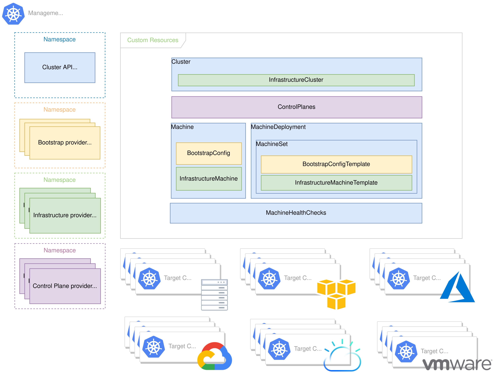
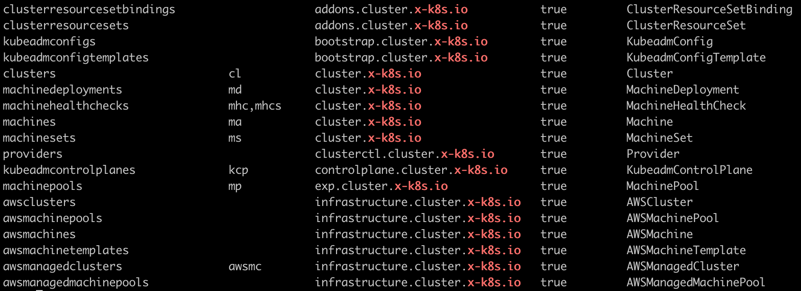

> 이 글은 페이스북 Kubernetes Korea Group에서 진행한 [Cluster-API 스터디 모임](https://www.facebook.com/groups/k8skr/permalink/2935581473390173/)에 참여하면서 공부했던 것을 정리한 내용입니다.  

## Cluster API란?
Cluster API가 무엇인지 알아보기 전에 이게 필요하게 된 이유를 먼저 살펴보자.

`kubeadm`은 쿠버네티스 클러스터를 구축할 수 있는 가장 표준적이고 좋은 방법 중 하나다. 하지만 `kubeadm`이 클러스터를 구축하는 복잡성을 많이 줄여줬지만, 클러스터 환경을 지속해서 관리하는 방법은 제공해주지 않는다.

이와 관련해서 다음과 같은 물음을 생각해볼 수 있다.  

1. 다양한 인프라 환경마다 얼마나 일관성 있는 방식으로 클러스터를 구성할 수 있는가?(VM, LB, VPC 등)
2. 클러스터 버전을 업그레이드하거나 삭제하는 Lifecycle 관리는 어떻게 자동화할 것인가?
3. 클러스터 개수와 상관없이 이런 프로세스들을 계속 확장해 나가려면 어떻게 해야 하는가?

**Cluster API(aka CAPI)**는 쿠버네티스 API 스타일을 따르며, 쿠버네티스 클러스터 구성을 선언적인 형태로 작성하고 자동으로 생성하고 관리하는 방법을 제공하기 위해 시작된 프로젝트다.  

즉, Cluster API는 마치 애플리케이션 개발자가 서비스 배포하고, 운영하는 과정과 동일한 방식으로 가상머신, 네트워크, 로드 밸런서, VPC 같은 인프라 구성과 쿠버네티스 클러스터 설정을 정의하고 관리한다.  

결국 Cluster API를 이용하면 다양한 인프라 환경에서 일관되고 반복적인 클러스터 배포를 가능하게 해준다.  

<br/>

## Cluster API의 목표
- 선언적인 API를 사용해서 쿠버네티스 클러스터의 Lifecycle을 관리한다.
- 클라우드와 온프레미스 환경과 같이 서로 다른 환경에서 구동될 수 있도록 한다.
- 기존 에코 시스템 구성 요소와 중복되는 기능은 복제하지 않고 재사용될 수 있도록 한다. (예: node-problem-detector, cluster autoscaler, SIG-Multi-cluster)
- 쿠버네티스 라이프사이클 관리를 위한 도구들이 점차 클러스터 API를 채택할 수 있도록 돕는다.

<br/>

## Cluster API 구성
Cluster API는 쿠버네티스 Operator와 Custom Resource Definition(CRD)을 활용해 선언적인 형태로 **Cluster**를 정의하고, 그 하위로 컨트롤 플레인과 워커 노드 구성을 위한 **Machine**을 관리하는 **MachineSet**, 인프라 구성을 포함과 MachineSet을 관리하는 **MachineDeployment**를 생성한다.  

MachineDeployment는 쿠버네티스에서 ReplicaSet을 관리하는 Deployment와 같은 개념이라고 볼 수 있다.  

따라서 Cluster API Controller들은 이 CRD의 상태를 지속해서 유지할 수 있도록 동작하는 것이다.  

<br/>

## Cluster API를 이용해서 쿠버네티스 클러스터 만들기
Cluster API는 [다양한 Infrastructure Provider](https://cluster-api.sigs.k8s.io/reference/providers.html)을 지원한다.  
이 글에서는 [Cluster API provider for AWS(CAPA)](https://github.com/kubernetes-sigs/cluster-api-provider-aws) 구현체를 활용해서 **AWS**에 쿠버네티스 클러스터를 배포해 보도록 한다.  
[The Cluster API Bookd의 "Quick Start"](https://cluster-api.sigs.k8s.io/user/quick-start.html)를 따라 진행한 내용이며, **Cluster API v1alpha3**을 기준으로 작성되었다.  

<br/>

### (1) Management Cluster 시작하기
Cluster API에서 "**Management Cluster**"라고 함은 아래 나올 "Workload Cluster"를 생성하고, 관리하기 위한 관리자 쿠버네티스 클러스터이다.

먼저 이 연습에서 Management Clusetr을 할 쿠버네티스 클러스터가 필요하다.  
공식 가이드에서는 [kind](https://kind.sigs.k8s.io/)를 추천하고 있어서 이번에 처음 Kind를 알게 되어 사용해봤는데 뭔가 가볍다는 느낌이 들어서 좋았다.  

Kind를 설치했으면 쿠버네티스 클러스터가 잘 동작하고 있는지 확인해본다.
```shell
kubectl cluster-info

Kubernetes master is running at https://127.0.0.1:60646
KubeDNS is running at https://127.0.0.1:60646/api/v1/namespaces/kube-system/services/kube-dns:dns/proxy

To further debug and diagnose cluster problems, use 'kubectl cluster-info dump'.
```

다음은 `clusterctl` CLI를 설치한다.  
`clusterctl`은 Cluster API를 실행할 Management Cluster를 설치하고 관리하기 위해 사용한다.  
[👉 Install clusterctl](https://cluster-api.sigs.k8s.io/user/quick-start.html#install-clusterctl)
  
이제 `clusterctl init` 명령어를 이용해서 쿠버네티스 클러스터(Kind)가 Manangement Cluster 역할을 할 수 있도록 변경해줄 것이다.   
하지만 그전에 Infrastructure Provider 종류마다 몇 가지 다른 환경변수가 미리 선언되어 있어야 한다.  

AWS Provider를 사용할 경우 AWS Credential 정보가 필요하다. (보통 `awscli`를 이용해 AWS에 접근할 때 `$ aws configure`로 생성되는 `~/.aws/credentials`와 같다)  

AWS Credential 정보는 `AWS_BASE64ENCODED_CREDENTIALS` 환경변수에 Base64 문자열로 저장되어 있어야 하는데 이 과정을 쉽게 해주는 `clusterawsadm`이라는 CLI가 있다. ('뭐가 이렇게 많아'라고 생각할 수 있지만 어차피 한 번만 쓰고 말 거라서 그냥 그러려니 넘어가자)   

`clusterawsadm`은 [여기서](https://github.com/kubernetes-sigs/cluster-api-provider-aws/releases) 실행 바이너리를 직접 다운로드받을 수 있다.

```shell
export AWS_REGION=ap-northeast-2
export AWS_ACCESS_KEY_ID=<your-access-key>
export AWS_SECRET_ACCESS_KEY=<your-secret-access-key>

export AWS_B64ENCODED_CREDENTIALS=$(clusterawsadm bootstrap credentials encode-as-profile)
```

`AWS_BASE64ENCODED_CREDENTIALS` 환경변수는 나중에 `capa-system`네임스페이스의 `capa-manager-bootstrap-credentials` Secret으로 저장된다.
```shell
$ kubectl get secret capa-manager-bootstrap-credentials -n capa-system -o json |jq -r ".data.credentials" |base64 -D
```

`clusterawsadm`은 AWS Credentials 데이터(Base64)를 만들어 주는 것 말고도 EC2 인스턴스에서 Control Plane과 Worker 노드를 프로비저닝할 때 여러 AWS 서비스 리소스에 접근하기 위한 정책(policy)을 획득할 수 있는 역할(role)을 미리 생성해두는 과정도 수행한다.(중요)
```shell
clusterawsadm bootstrap iam create-cloudformation-stack
```

이 과정은 AWS CloudFormation Stack을 만들어 필요한 정책(policy)과 역할(role)을 미리 생성한다.  
단, 주의할 점은 위에서 지정한 AWS Access Key와 Secret Access Key의 주인(AWS IAM 사용자)은 이 스택에 정의된 각 작업을 실행할 수 있는 충분한 권한을 갖고 있어야 한다. 

대략적으로 파악한 IAM 사용자에게 필요한 권한은 아래와 같다.  

- AmazonEC2FullAccess (AWS managed policy)
- AmazonVPCFullAccess (AWS managed policy)
- 그밖에 IAM, Cloudformation, SecretManager (아래 JSON)

```json
{
    "Version": "2012-10-17",
    "Statement": [
        {
            "Sid": "VisualEditor0",
            "Effect": "Allow",
            "Action": [
                "iam:CreateInstanceProfile",
                "iam:DeleteInstanceProfile",
                "iam:GetRole",
                "iam:GetInstanceProfile",
                "iam:GetPolicy",
                "iam:RemoveRoleFromInstanceProfile",
                "iam:CreateRole",
                "iam:DeleteRole",
                "iam:AttachRolePolicy",
                "iam:AddRoleToInstanceProfile",
                "iam:CreatePolicy",
                "iam:PassRole",
                "iam:DetachRolePolicy",
                "iam:ListPolicyVersions",
                "cloudformation:CreateStack"
            ],
            "Resource": [
                "arn:aws:iam::{{AWS ACCOUNT ID}}:instance-profile/*.cluster-api-provider-aws.sigs.k8s.io",
                "arn:aws:iam::{{AWS ACCOUNT ID}}:policy/*.cluster-api-provider-aws.sigs.k8s.io",
                "arn:aws:iam::{{AWS ACCOUNT ID}}:role/*.cluster-api-provider-aws.sigs.k8s.io",
                "arn:aws:cloudformation:ap-northeast-2:{{AWS ACCOUNT ID}}:stack/cluster-api-provider-aws-sigs-k8s-io/*"
            ]
        },
        {
            "Sid": "VisualEditor1",
            "Effect": "Allow",
            "Action": [
                "secretsmanager:UntagResource",
                "secretsmanager:GetSecretValue",
                "secretsmanager:DescribeSecret",
                "ec2:DescribeVpcs",
                "secretsmanager:CreateSecret",
                "secretsmanager:DeleteSecret",
                "secretsmanager:ListSecrets",
                "secretsmanager:TagResource"
            ],
            "Resource": "*"
        }
    ]
}
```

이제 Management Cluster를 초기화한다.
```shell
clusterctl init --infrastructure aws
```

생성된 결과를 확인해보자.
```shell
kubectl api-resources |grep 'x-k8s.io'
```

<br/>

## (2) Workload Cluster 생성하기
Management Cluster 세팅을 마쳤기 때문에 이제 AWS 인프라에 Workload Cluster를 배포할 수 있다.   
먼저 `clusterctl config` 명령어로 Workload Cluster를 위한 YAML 데이터를 만들어준다.  

```
export AWS_REGION=ap-northeast-2
export AWS_SSH_KEY_NAME=jonnung
export AWS_CONTROL_PLANE_MACHINE_TYPE=t3.micro
export AWS_NODE_MACHINE_TYPE=t3.micro

clusterctl config cluster capi-example \
  --kubernetes-version v1.19.8 \
  --control-plane-machine-count=1 \
  --worker-machine-count=2 \
  > capi-example.yaml
```

이렇게 만들어진 `capi-example.yaml`을 Management Cluster에 Apply한다.

```
kubectl apply -f capi-example.yaml
```

참고로 AWS Provider의 경우 기본적으로 3개의 AZ에 각 Private/Public Subnet을 생성하게 되어 있다.  
그렇기 때문에 NAT Gateway도 3개가 생성되어 EIP도 3개를 확보한다는 점을 참고하자. (모든 AWS Account 기본적으로 5개의 EIP로 제한됨)  
이 부분은 변경하려면 `AWSCluster` 리소스의 [networkSpec](https://github.com/kubernetes-sigs/cluster-api-provider-aws/blob/dafe0711b279a6c04735338f9ccffa392a6d0f36/docs/book/src/topics/multi-az-control-planes.md#changing-az-defaults)을 추가하면 된다.  

이제 Workload Cluster가 제대로 생성되었는지 확인해보자.
```shell
kubectl get cluster --all-namespaces

NAMESPACE   NAME           PHASE
default     capi-example   Provisioned
```

<br/>

## 참고 자료
- [Webinar: Cluster API (CAPI) - A Kubernetes subproject to simplify cluster lifecycle management](https://www.youtube.com/watch?v=A2BBuKx1Yhk)
- [Introduction - The Cluster API Book](https://cluster-api.sigs.k8s.io/introduction.html)
- [Introduction - Kubernetes Cluster API Provider AWS](https://cluster-api-aws.sigs.k8s.io/introduction.html)
- [Deploy K8s using K8s with Cluster API and CAPA on AWS | by Arash | Kubernauts](https://blog.kubernauts.io/deploy-k8s-using-k8s-with-cluster-api-and-capa-on-aws-107669808367#2758)
