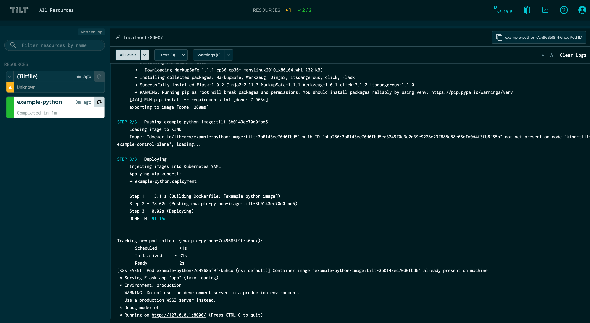
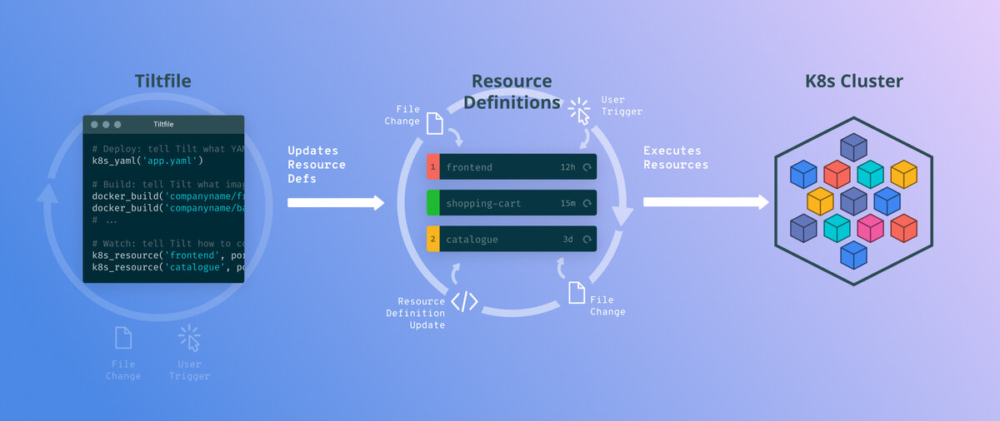

## Tilt 소개
**Tilt**는 개발자 로컬 환경에서 애플리케이션을 개발하고, 배포하는 반복 과정을 도와주는 도구이다.  
만약 로컬 환경에서 Kind나 Docker Desktop을 이용해 Kubernetes에서 실행되는 애플리케이션을 개발할 때 코드 수정부터 배포까지 반복적인 과정을 자동화해준다.  
Tilt는 코드가 변경되거나 Kubernetes의 리소스 매니페스트가 변경되는 것을 자동으로 감지해서 이 과정을 수행한다.  
보통은 터미널을 여러 개 띄워 놓고 다양한 명령어를 직접 실행시키면서, 출력 로그를 보고 개발하는 과정을 Tilt는 한 화면에서 모두 확인하고 처리할 수 있게 도와준다.  

<br/>

## 간단하게 직접 해보기
1. 당연히 Tilt를 설치해야 한다.
2. 로컬 환경에 Kubernetes 클러스터를 준비한다.
3. 간단한 웹 애플리케이션를 만들어서 배포한다.

### (1) Tilt 설치

설치는 공식 가이드를 참고합니다. 😉  
[👉 Tilt 설치](https://docs.tilt.dev/install.html)  

### (2) Kubernetes 클러스터 준비

로컬 환경에 Kubernetes 클러스터를 실행하는 방법은 Docker for Desktop을 사용하고 있다면 함께 포함된 Kubernetes를 써도 좋지만, 좀 더 가볍(다고 느껴지)고 생성과 삭제가 편했던 Kind를 활용하는 것도 추천한다.  
Kind는 Docker 컨테이너를 노드로 사용해서 Kubernetes 클러스터를 구성한다고 한다. 🤔  
[👉 Kind 설치](https://kind.sigs.k8s.io/docs/user/quick-start/#installation)  

Kind 설치가 완료되었다면 아래 명령어를 실행해서 Kubernetes 클러스터를 하나 만든다.  

```shell
$ kind create cluster --name kind-tilt-example
```

`kubectl`이 꼭 필요한 건 아니지만, Kind로 Kubernetes가 제대로 설치되었는지 확인해본다.  
참고로 Kind가 자동으로 `kubectl config` 설정까지 해준다.  

```shell
$ kubectl cluster-info

Kubernetes control plane is running at https://127.0.0.1:52849
KubeDNS is running at https://127.0.0.1:52849/api/v1/namespaces/kube-system/services/kube-dns:dns/proxy

To further debug and diagnose cluster problems, use 'kubectl cluster-info dump'.
```

### (3) 간단한 웹 애플리케이션 만들기
Tilt Dev 팀에서 제공하는 Python Example을 활용해서 간단한 웹 애플리케이션 코드와 Dockerfile, Kubernetes Deployment 매니페스트를 준비한다.   
[tilt-example-python/0-base at master · tilt-dev/tilt-example-python · GitHub](https://github.com/tilt-dev/tilt-example-python/tree/master/0-base)  
우선 이 저장소를 `git clone` 받은 후 `0-base` 디렉터리로 이동한다.  
(좀 날로 먹는 거 같다는 생각이 든다. 🤪 )  
 
<br/>

## Tilt 사용하기
Tilt를 실행하려면 `Tiltfile`이라는 파일이 필요하다. 이 파일에 도커 이미지 빌드와 배포하는 과정을 정의한다.  
`Tiltfile`은 [Starlark](https://github.com/bazelbuild/starlark)라는 언어로 작성되는데 Python과 비슷하게 생겼다. 그래서 프로그래밍하듯 조건식과 반복문, 함수 등을 정의할 수 있다.  

아래 `Tiltfile`은 3단계로 구성되어 있다.  

1. 도커 이미지 빌드
2. Kubernetes 클러스터에 Deployment 생성
3. Kubernetes POD에 포트 포워드 설정

```python
docker_build('example-python-image', '.')
k8s_yaml('kubernetes.yaml')
k8s_resource('example-python', port_forwards=8000)
```

`docker_build()`함수는 도커 이미지를 어떻게 빌드할 건지, `k8s_yaml()`함수는 Kubernetes 오브젝트를 배포한다는 의미를 갖고 있다.   

이제 Tilt를 실행하기 위해 아래 명령어를 실행한다.   

```shell
$ tilt up
```


Tilt가 실행되면 `Tiltfile`에 정의된 모든 리소스 정의가 Tilt 엔진에 전달된다.  
특별한 점은 `k8s_yaml()` 함수가 실행될 때 YAML을 클러스터에 직접 적용하는 것이 아니라 리소스 정보를 따로 패키징해서 Tilt 엔진에 전달한다는 것이다.  


그럼 무언가 변경 되었을 때 Tilt는 어떻게 할까?  
만약 `Tiltfile`이 변경되면 자동으로 `Tilefile`을 다시 읽어 들여 Tilt 엔진에 전달된다.   
그뿐만 아니라 `Tiltfile`에 정의된 리소스와 직간접적으로 연관된 파일들(예: K8S YAML, 소스 코드)이 변경되면 자동으로 다시 적용한다.  

<br/>

## Tilt 활용 팁

### (1) 로컬 도커 레지스트리 서버를 사용한다

`docker_build()` 함수에서 이미지가 빌드되면 도커 레지스트리에 Push 되고, Kubernetes에서 도커 레지스트리로부터 Pull 받게 된다.  
이 과정에서 외부 도커 레지스트리로 연결되는 네트워크 지연 시간이 Tilt의 반복 속도에 영향을 줄 수 있다.  
만약 Kind로 Kubernetes 클러스터를 띄워서 사용하고 있다면, Local Registry를 함께 활용하는 것을 추천한다.   
[GitHub - tilt-dev/kind-local: An example of how to set up a local image registry for Tilt+Kind](https://github.com/tilt-dev/kind-local)  

> 이미 Kind 클러스터가 실행 중이라면 제거 후 "kind-local" 저장소에서 제공하는 [kind-with-registry.sh](https://github.com/tilt-dev/kind-local/blob/master/kind-with-registry.sh) 스크립트로 재생성해야 한다.   
> 그래야 Kind 클러스터가 도커 레지스트리로 Local Registry를 사용하도록 설정된다.   

### (2) 도커 이미지 빌드 시간 단축하기

아무리 반복적인 과정을 자동화하더라도 반복적인 속도가 중요하다.  
위 샘플을 직접 해보면 가장 느리게 느껴지는 부분이 바로 "도커 이미지 빌드"일 것이다.   
즉, 도커 이미지 빌드 시간을 단축해야 Tilt가 반복하는 속도를 단축할 수 있는 것이다.  
도커 이미지 빌드를 시간을 줄이는 방법 중 가장 기본이라고 할 수 있는 도커 레이어의 순서 재배치와 패키지 설치시 Lock 파일을 활용하는 것도 좋을 것이다.   
자세한 내용은 [도커 이미지 잘 만드는 방법](https://jonnung.dev/docker/2020/04/08/optimizing-docker-images/)을 읽어보는 것을 추천한다.   

### (3) live_update 활용하기
`docker_buld()`함수에는 `live_update`라는 파라미터가 있는데 Kubernetes 클러스터에 이미 실행 중인 컨테이너 내부로 변경된 내용을 즉시 반영하는 방법을 제공한다.   
[https://docs.tilt.dev/live_update_reference.html](https://docs.tilt.dev/live_update_reference.html)  

<br/>

## 마치며
Tilt를 처음 접했을 때 엄청나게 잘 만들었다고 느꼈다.  사용 방법도 간단하고, 보여주는 화면 구성과 종합적인 내용이 꽤 훌륭하다.  
이제 막 개발 환경에 도입해서 사용해보려고 하는데 좀 더 사용 경험이 쌓이면 더 상세한 내용을 작성해볼 계획이다. 
