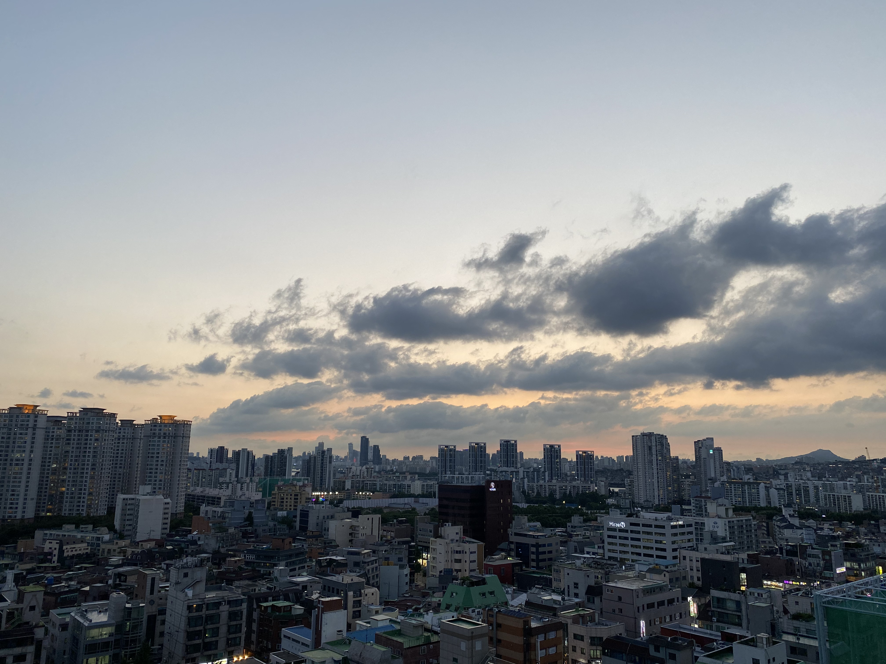
### 도저언

작년에도 이직이 핵심 이벤트였는데 올해 한번 더 이직을 했다. 다른 이유보다 지금 아니면 이런 경험을 못 할 것 같았다.  

이렇게 된 계기는 2020년 말에 시작되었다.  
오랜만에 반가운 연락이 왔고, 가볍게 가진 몇 번의 만남을 통해 호기심과 기대감 그리고 열정 같은 것이 생겼던 것 같다.  
그리고 이 결정을 통해 내가 지나온 시간과 앞으로 보낼 시간에 어떤 영향을 줄 수 있을지 고민했다.  
위험할 수 있지만 감수할 수 있을 만큼 가치가 있을까?  
흔적도 없이 사라질 수 있지만 반대로 제대로 흔적을 남길 수도 있지 않을까?  

그렇게 나는 '**닷슬래시대시**'에 합류했다.  

 

### 오늘의집에서는?
> 아래 내용은 2020년 하반기부터 2021년 초까지 '오늘의집'에서 경험했던 것들이다.  

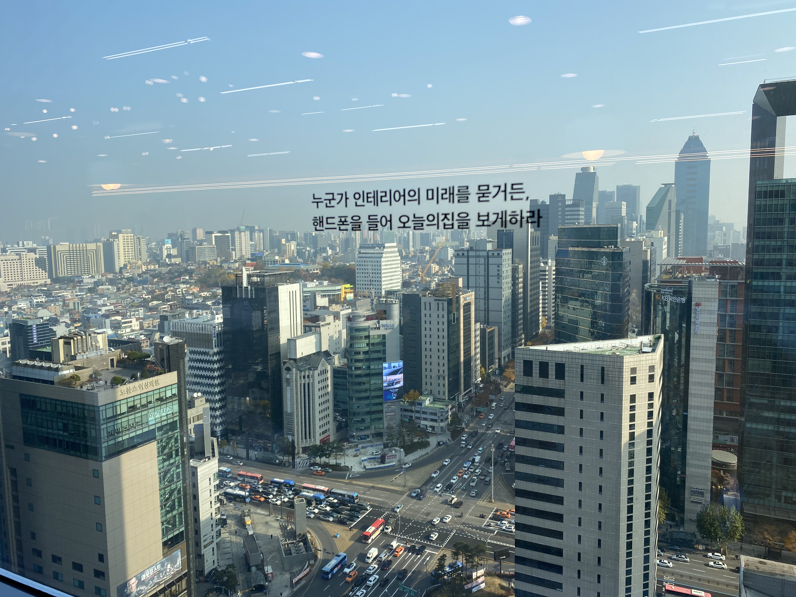
오늘의집 **DevOps** 엔지니어로서 일하면서 가장 좋았던 것은 할 수 있는 일들이 정말 많았다는 것이다.  
나랑 비슷한 시기에 입사했던 동료(제제님)와 죽이 잘 맞아서 앞으로 무엇을 해볼지 이야기하고, 협업하는 과정이 정말 좋았다.  

가장 중요한 목표는 EC2 환경에서 동작하는 루비온레일즈 애플리케이션을 **쿠버네티스** 환경으로 이전하는 것이었다.  
애플리케이션을 도커 컨테니어화 하는 것부터 쿠버네티스 클러스터를 띄우고, **Github Action**으로 배포 파이프라인을 만들었다.  
나는 이때 제제님 덕분에 AWS EKS(Managed K8S)를 처음 접했고, 그가 알고 있는 많은 지식을 배울 수 있었다. (나도 많은 도움이 되었길 바란다)  

모니터링 시스템 관련해서 마침 **Datadog** 도입을 검토하는 시기였고, 트라이얼 기간 동안 사용해보니 너무 좋았다. 계약 후 본격적으로 쓰면서 더 강력함을 느꼈다. (사실 한 달에 1번 정도 Datadog 장애가 있긴 했음)  
여담으로 이 때 Datadog 주가가 $70~$80 정도였는데 이제 막 한국 사업을 본격화하는 것 같았기 때문에 잘 될 것 같았다.  
근데 이때는 지금보다 더 미주린이라 망설이다 안 샀는데 지금은 2배가 넘었네...  

퇴사하기 전에 마지막으로 했던 일은 부하 테스트 환경 구축과 서버 성능 측정이었다.  
Python이 익숙하다는 이유이자 장점을 바탕으로 **Locust**를 사용해 쿠버네티스 환경 기반으로 테스팅 환경을 갖추고, Production과 동일한 사양의 애플리케이션의 부하 테스트와 성능을 측정했다.  
이 때도 Datadog이 많은 도움이 됐다. Datadog은 노트북(Jupyter notebook 같은) 형태의 공유 가능한 보고서를 만들 수 있었는데 이걸 통해 기록을 남기고, 관련 개발 파트와 소통할 때 유용했다.  

오늘의집에 고작 6개월밖에 있지 않았지만, 더 나은 서비스와 동료들을 위해 최선을 다해 잘하고 싶었다.  
잘 했는지 내가 스스로 판단하기 어렵지만 도전적인 업무와 좋은 동료들 덕분에 성장을 할 수 있었던 것 같다.  
짧게 있어서 아쉬운 것도 있지만 지금이 아니면 다시는 못 해볼 것 같아 발걸음을 옮기게 되었다.  

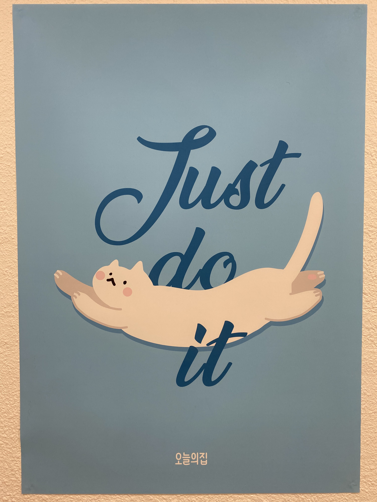
 

### 스타트업 이야기

**<누구나 꿈꾸는 그런 거>**  

내 꺼를 해보고 싶다는 생각으로 창업을 꿈꾼 적도 있고, 세상에 없었던 서비스를 만드는 스타트업에 대한 로망도 있었다.   

하지만 막연한 바람일 뿐 마음 속으로는 '절대 성공할 수 없을 거야' 라고 생각했다.  
누구나 사장이 될 수 있지만 경영은 누구나 잘할 수 있는 게 아니다. 잘할 만한 사람이 하는 거지...  
결국은 나도 그런 사람이 되고 싶다. 그렇다고 무작정 시도해 보는 것이 아니라 우선은 잘하는 사람 곁에서 보고, 느끼고 배우고 싶었다.  

**<새로 생긴 회사>**

3월, 새로운 회사다.  
진짜로 막 새로 생긴 회사 '닷슬래시대시'로 첫 출근을 했다.  

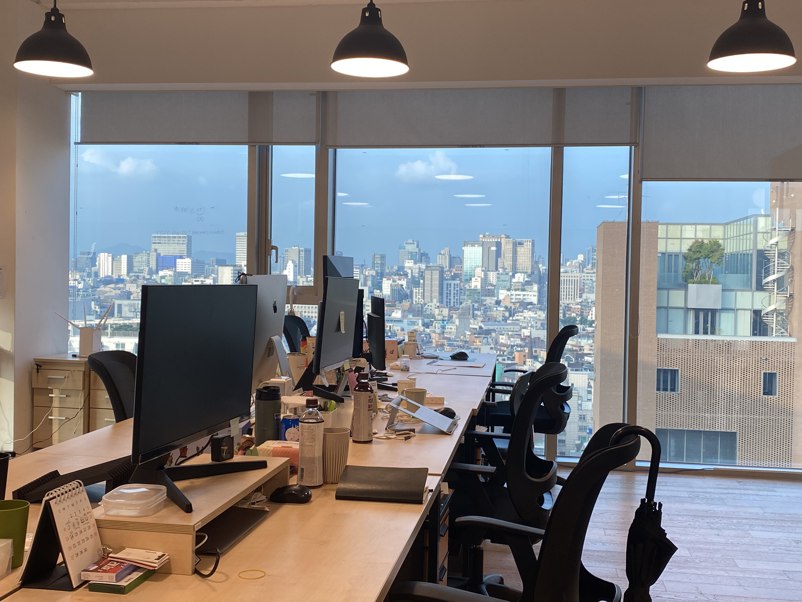
이때 개발자는 나 혼자였기 때문에 우선 함께 할 동료를 찾는 것이 시급했다.  
그러면서 서버는 어떤 언어와 프레임워크를 기반으로 개발할지 인프라는 어떻게 구성할지 계속 고민했다.  
오히려 단순하게 내가 해본 것들과 내가 잘 아는 것들만으로 잘만 하면 된다고 생각했고 그렇게 실행에 옮겼다.  

앱도 네이티브로 개발할지 멀티 플랫폼(예: RN, Flutter)으로 개발할지 고민했는데 카메라 기능과 UI 퍼포먼스를 고려해서 네이트브로 개발하기로 결정했기 때문에 이제 Android, iOS 개발자를 모시기만 하면 됐다.  

**<세 번째 창업하는 BOSS와 함께>**

아직 아무것도 없는 회사에 지원하게 하려면 어떤 특별함이 있어야 했다.  
나는 그 특별함이 우리 회사의 BOSS라고 생각한다. 멋진 성공 스토리를 가진 분이기도 하지만 과거에 함께 일 했던 경험에서 받았던 에너지와 긍정적인 영향력이 가장 큰 특별함이었다.  

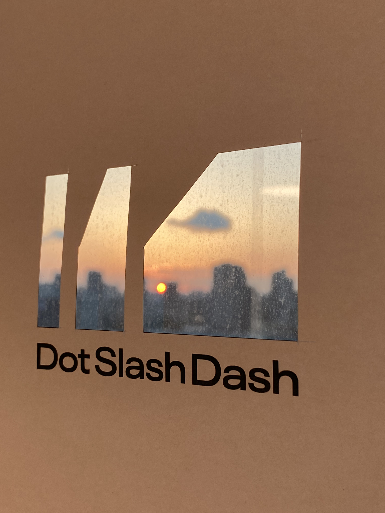
> 지인 개발자 중에 모시고 싶었던 분들도 있다. 하지만 강력한 동기를 심어주고 함께 도전해보자고 설득할 수 있는 자신감이 조금 부족했다. 괜히 섣부르게 제안하기보다 적절한 때가 오기를 기다리고 있다.  
> 이 글을 보고 "혹시 나인가?"라고 생각한다면, 맞습니다! 곧 만나러 갑니다. 🙇‍♂️  

**<우리 팀>**

5월, 다행히 Android 개발자 한 분과 iOS 개발자 두 분이 합류 하셨고, 본격적인 개발에 착수했다.  

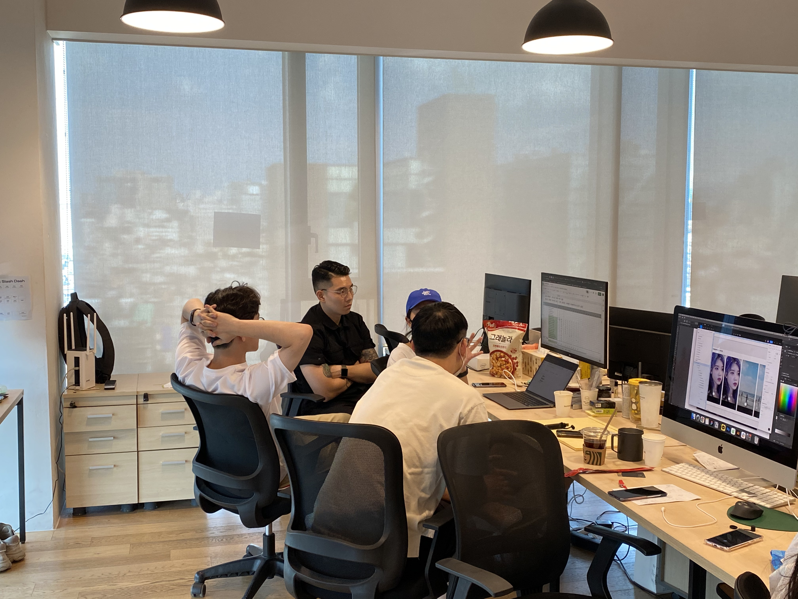
나 스스로는 정말 운이 좋았다고 생각하지만, 한편으로 동료들이 내 진심을 알아줬기 때문이라고 생각한다.  
어려운 결정을 내리고 어쩌면 나를 믿고 함께 해주신 동료들에게 진심으로 감사하다.  

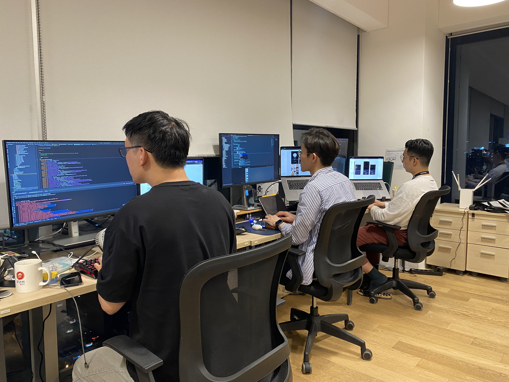

**<우리 서비스 탄생>**

8월 서비스 오픈, 주어진 시간은 3개월이 전부였다. 짧은 기간이라 오픈을 못 할 것 같다는 생각은 들지 않았다.
그저 내가 맡은 역할만 제대로 해내면 무조건 된다고 생각했다.  
기획자, 디자이너, 앱 개발자... 감히 내가 예상했던 것보다 훨씬 더 능력자들이었다.  
나는 정말 운이 좋아서 이렇게 멋진 동료들을 만날 수 있었던 것 같다.  
그러니까 앞으로도 나만 잘하면 되고, 잘하지 않으면 안 된다.  

**<우리는 앞으로>**  

11월에는 8월 서비스 오픈 후 사용자들 반응과 의견을 수렴해서 좀 더 SNS스러운 기능을 추가했다. (박수 치기와 마이페이지 한마디 남기기)  
그리고 지금까지 앱 안정화와 더 나은 사용성을 위해 노력하고 있다.  
우리를 공식적으로 '내향적인 사람들을 위한 SNS' 부르지만 나는 'K-SNS'라고 생각한다.  
그 의미가 한국형 SNS에 그치는 것이 아니라 전 세계가 열광하는 K의 하나가 되고자 하는 포부이다.  
이제 2022년이 시작되면 새로운 백엔드 개발자와 iOS 개발자 동료가 합류한다. (들뜬 거 맞음)
그리고 앞으로도 더 많은 분들과 함께 말 그대로 도전적으로 일해 보고 싶다.  
세상에 스크래치를 내보는거야!

 

### 새롭게 공부하고 적용한 것들
나는 **Python**을 좋아한다. 사실 잘하는 게 Python 밖에 없어서 그런 것도 맞다.   
그래서 그저 세상에 Python으로 잘 돌아가는 서비스를 하나 더 추가하고 싶었다.   

웹 프레임워크는 **FastAPI**를 사용했다. 예전에 처음 들었을 때 '무슨 이름을 이렇게 지었지' 하면서 별로 관심을 두지 않았는데 공식 문서를 한번 정독하고 정말 반했다. 잘 될 수밖에 없는 이유가 많은 녀석이다.  
Swagger API 문서가 자동으로 나오는 점도 앱 개발자와 소통하는 데 큰 도움이 됐다.  

우리가 할 비즈니스를 분석해보니 NoSQL 데이터베이스가 괜찮을 것 같다고 생각했다. 그래서 **MongoDB**를 메인 데이터베이스로 결정하고 아키텍처를 설계했다.   
MongoDB를 직접 설치하고 운영할까 고민했지만, 예전에 오늘의집에서 제제님이 과거에 **Atlas**를 사용했던 경험을 얘기해줬는데 '기가 막히다'고 했었던 기억이 났다.  
도입 검토하고, 막상 사용해보니 우리 같이 초기 단계에서는 꽤 괜찮은 선택이었다.  

클라우드 인프라는 **AWS**를 이용하고 있었고, 인프라 구성을 코드로 관리하는 IaC(Infrastructure as Code)에 대한 고민을 했다.  
Ansible은 개념은 알고, 가볍게 사용해본 적은 있지만 끌리지 않았다. Terraform은 아예 모른다. 그럼 어차피 계속 AWS를 쓸 것 같은데 그럼 CDK 어떨까?  

**CDK(Cloud Development Kit)** 는 AWS 인프라를 코드로 관리하는 프레임워크인데 Typescript, Python 같은 프로그래밍 언어로 인프라 구조를 정의하고, 관리할 수 있다.  
뭐 굳이 초기에 IaC까지 필요할까? 싶을 수도 있지만 나는 오히려 초기에 더 필요하다고 느낀다.  
이유는 관리자가 나 혼자 밖에 없기 때문에 IaC를 통해 (웹 UI 콘솔에서 하는 것보다) 작업 효율을 높이고, 이것 자체가 문서화가 되니까 앞으로 인원이 더 늘었을 때 시스템을 파악하는 데 훨씬 도움이 될 것 같다.  
마지막으로 CDK의 단점과 개인적인 아쉬움 한 가지씩 적어본다.  
CDK의 단점은 소개 자료는 많은데 보고 따라 하거나 참고할 자료가 적다. 근데 또 잘 찾으면 결국 있을 건 다 있다.   
CDK를 쓰면서 생긴 아쉬움은 나름대로 열심히 공부하고 삽질도 많이 했는데 마땅히 정리해둔 게 없다. 나중에 정리해서 블로그에 올려야지 했는데... ㅠㅠ  

 

### 독서
올해는 15권을 읽었다.  
작년(6권)보다 2배 이상 읽었다는 점에서 스스로 칭찬한다.   
내년에는 30권(2배) 읽는 것을 목표이다.    

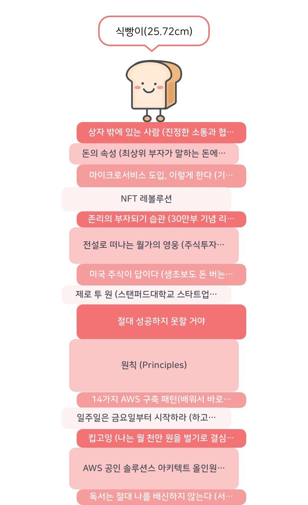
 

### 달리기
지인을 통해서 '런데이'라는 앱을 알게 되었는데 달리기 습관을 도와주는 서비스다.  
10월 한 달 동안 '런데이'와 함께 열심히 달렸다. 원래 목표는 8주 코스였지만, 갑자기 추워지는 바람에.... 중간에 끊겨버렸다.  
어쨌든 내가 이렇게 뛸 수 있을지 몰랐는데 이 정도라도 할 수 있었던 건 '런데이' 덕분이다.   
날이 조금 풀리면 다시 8주 코스 도전한다.  

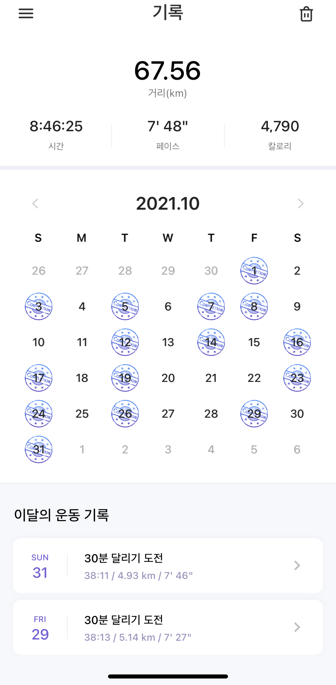
 

### 스터디 그룹
게으른 개발자를 벗어나는 좋은 방법 중 하나는 단체 스터디를 하는 것이다.  
그동안 뭔가 하나 해보고 싶어서 눈치만 보고 있다가 12월부터 Go 스터디를 시작했다.  
일단 기초적인 문법 코스만 마쳤고, 내년 초에 작은 토이 프로젝트 하나씩 완성해서 발표하는 시간을 가질 예정이다.  

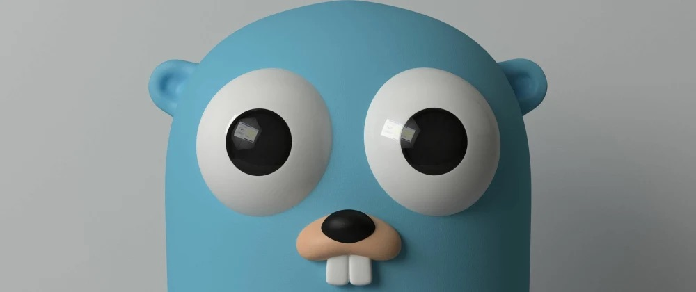
이 스터디가 끝나면 React 스터디를 시작할 것 같다. 이미 관심 있는 동료를 포섭해뒀다. 흐흐  

 

### 24
6년 동안 엘베 없는 5층에서 신혼 생활을 보냈다.  
그리고 드디어 8월에 엘베 있는 새 아파트로 이사했다. 당연히 아파트에 엘베가 있는 게 아닌가? 맞다. 하지만 우리 부부에게 엘베의 존재가 크다!  
그동안 계단 오르내리기 정말 힘들었을 아내에게 진심으로 감사하며, 앞으로도 더 행복하고 재밌게 살아보자고 다짐한다.  

 

### 잘 가 내 차
10년 동안 사고 한번 없이 내 발이 되어 주고, 어디든 함께 달려가 줬던 자동차를 떠나보냈다.  
다행히(?) 멀리 가진 않았지만, 어쨌든 좋은 주인을 만나서 앞으로도 아프지 말고 오래오래 달릴 수 있길 바란다.  

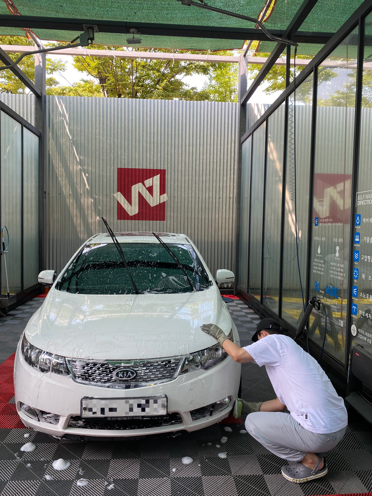
(추신: 사실 나는 네가 요르단으로 갈 줄 알았어ㅋ;;;)  

