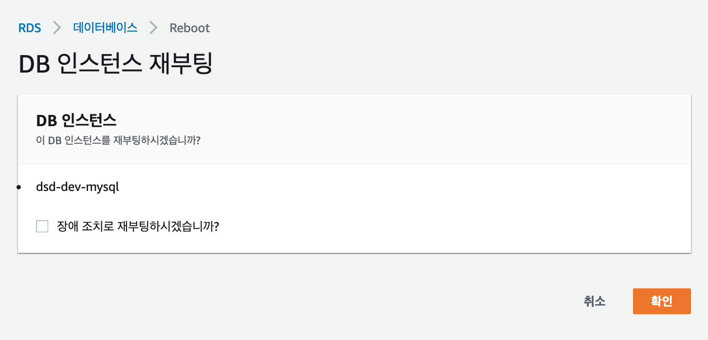
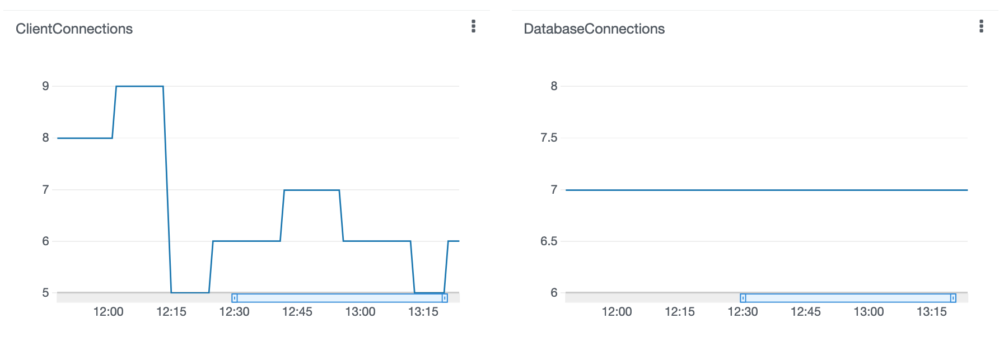

서비스 초기 인프라를 구축하는 과정에서 트래픽 규모를 예상하는 일은 쉽지 않다.  
적당히 (희망하는) 트래픽에 나름대로 적절하다고 생각했거나 혹시 대박이 터져서 대규모 트래픽이 들어올 것을 염려하며 살짝 여유 있게 구성하기도 한다.  
하지만 이렇게 선택한 것 중 일부는 실제 서비스를 운영하면서 변경할 일이 생기곤 한다.  
아마도 대부분은 비용을 고려한 의사 결정이 아닐까 생각한다.  

이 글에서는 AWS RDS 인스턴스를 수정할 때 발생할 수 있는 다운 타임을 최소화하는 방법을 설명한다.   

우선 어떤 AWS RDS 설정을 변경할 경우 다운 타임이 발생하는 지 알아봐야 한다.👇  
[Modifying an Amazon RDS DB instance - Amazon Relational Database Service](https://docs.aws.amazon.com/AmazonRDS/latest/UserGuide/Overview.DBInstance.Modifying.html#USER_ModifyInstance.ApplyImmediately)  

간단한 상황을 예로 들자면 M클래스 타입의 DB 인스턴스에 스토리지는 100GB 정도이며, 아직은 단일 가용 영역(AZ, Available zone)에 배포된 상황이다.  
여기서 가장 먼저 예상할 수 있는 문제점은 이 단일 DB 인스턴스에 장애가 발생한다면 딱히 대안이 없다는 것이다.  
만약 이 RDS 인스턴스의 설정을 바꿀 일이 생긴다면 똑같이 다운 타임이 생길 가능성이 높다.  

<br/>

### 다중 가용 영역(Multi-AZ deployment)으로 배포하기 설정

**다중 가용 영역(Multi-AZ)** 에 복제본 DB 인스턴스를 추가하는 설정이다. 이 변경은 다운 타임을 발생시키지 않기 때문에 필요할 경우 즉시 적용할 수 있다.  


변경이 완료되고 나면 장애 조치가 잘 이뤄지는 지 바로 확인해 볼 수 있는데 가장 쉬운 방법은 DB를 재부팅 하는 것이다.  


그럼 이제 복제본 DB 인스턴스가 예비로 있으니 다운 타임이 안 생기지 않을까 하는 생각이 들 수 있다.  
하지만 실제로는 다운 타임이 생길 수 있는데 그 원인은 **DNS**에 있다.  

보통 애플리케이션에서 DB 인스턴스에 연결하기 위해 RDS에서 기본 제공하는 (URL 형태의) "엔드포인트"를 이용한다.  
그리고 이 엔드포인트를 통해 DB 인스턴스의 실제 IP를 확인하기 위해 DNS에 쿼리를 하게 된다.  
그런데 때마침 [DB 인스턴스가 재부팅](https://docs.aws.amazon.com/ko_kr/AmazonRDS/latest/UserGuide/USER_RebootInstance.html) 중이라서 예비 DB 인스턴스로 자동 전환 되었다면, DNS 레코드가 예비 DB 인스턴스의 IP가 업데이트되더라도 클라이언트(애플리케이션)에서는 DNS 정보를 캐시 했을 가능성이 높기 때문에 즉시 반영되지 않을 수 있다.  

따라서 다중 AZ 배포가 단일 AZ보다 다운 타임의 심각성은 줄여줄 수 있지만, DNS 캐시에 따라 연결 오류가 지속될 수 있다는 점을 주의해야 한다.  

다운 타임을 조금 더 줄일 방법은 무엇이 있을까?  

<br/>

### RDS Proxy를 이용한 DNS 캐시 문제 해결 및 Connection Pool 관리

[Amazon RDS 프록시](https://docs.aws.amazon.com/ko_kr/AmazonRDS/latest/UserGuide/rds-proxy.html)는 말 그대로 RDS의 연결을 관리하는 프록시 서비스이다.  
말 그대로 프록시이기 때문에 특정 DB 인스턴스에 장애가 발생해도 예비 DB 인스턴스에 자동으로 연결하여 다운 타임을 최소화할 수 있게 해준다.  

또한 RDS 엔드포인트처럼 전용 엔드포인트를 제공하기 때문에 애플리케이션에서 이 엔드포인트를 통해 연결할 수 있다.  
**RDS Proxy**의 엔드포인트를 사용할 경우 위에서 살펴본 DNS 캐시 문제를 해결할 수 있다.  
그 이유는 메인 DB 인스턴스가 장애 조치로 상태일 때 복제본(예비) DB 인스턴스가 투입되더라도 클라이언트에서 바라보는 RDS Proxy의 엔드포인트는 그대로이며, 따라서 목적지 IP가 변하지 않기 때문이다.  

장애 조치로 인한 재부팅 외 [RDS 인스턴스 클래스를 변경할 때도 무조건 다운 타임이 발생된다.](https://aws.amazon.com/ko/premiumsupport/knowledge-center/rds-mysql-downtime-impact/)  
하지만 다중 AZ 배포가 되어 있고, RDS Proxy 붙어 있다면 다운 타임을 최소화 할 수 있을 것이다!  

사실 RDS Proxy의 가장 큰 장점은 **Connection Pool**을 제공하는 것이다.   
Connection Pool을 애플리케이션에서 직접 관리하지 않아도 RDS Proxy가 알아서 관리하기 때문에 불필요한 리소스 낭비를 줄일 수 있고, 트래픽이 급증할 때 연결 수를 제어하여 DB를 보호하는 역할을 한다.  


<br/>

### RDS Proxy 구성할 때 미리 알고 있으면 좋은 것들

#### 1. **RDS Proxy는 외부에서 접근할 수 없다**
안타깝게도 RDS Proxy는 VPC 밖에서 인터넷을 통해 접근할 수는 없다.  
따라서 Subnet을 지정할 때 Private Subnet을 선택하면 된다.  


#### 2. **RDS Proxy가 RDS 인스턴스에 접속하기 위한 인증 방식**
우리가 RDS 인스턴스에 접속할 때 `username`와 `password`로 인증하는 것과 동일한 방법으로 RDS Proxy도 RDS 인스턴스에 인증하는 과정을 거친다.  
대신 RDS Proxy는 `username`과 `password`를 정보를 AWS Secret Manager로부터 얻는다.  

따라서 RDS Proxy의 IAM Role에는 `secretsmanager:GetSecretValue`과 `secretsmanager:DescribeSecret` 허용이 필요하다.  

추가로 주의할 점은 AWS Secret Manager에서 "Credentials for Amazon RDS database" 타입으로 Secret을 만들 때 사용될 Encryption key를 기본 `DefaultEncryptKey`가 아니라 직접 KMS(AWS Key Management Service)에서 만든 Encryption Key를 사용해서 암호화할 경우 IAM Role에 `kms:Decrypt`에 대한 허용도 추가해줘야 한다.  


#### 3. **RDS Proxy가 배포되는 과정 확인하기**
RDS Proxy를 생성하고 배포되는 과정에서 어떤 문제가 생기면 AWS 웹 콘솔에는 딱히 보여주는 정보가 없다.  
그럴 때는 AWS CLI를 이용해서 적당히(?) 상세한 정보를 확인할 수 있다.  

```shell
aws rds describe-db-proxy-targets --db-proxy-name ${RDS_PROXY_NAME}
```

AWS CLI 실행 결과에 나오는 오류는 아래 문서에서 확인하면 된다.  
[RDS Proxy 문제 해결 - Amazon Relational Database Service](https://docs.aws.amazon.com/ko_kr/AmazonRDS/latest/UserGuide/rds-proxy.troubleshooting.html)
