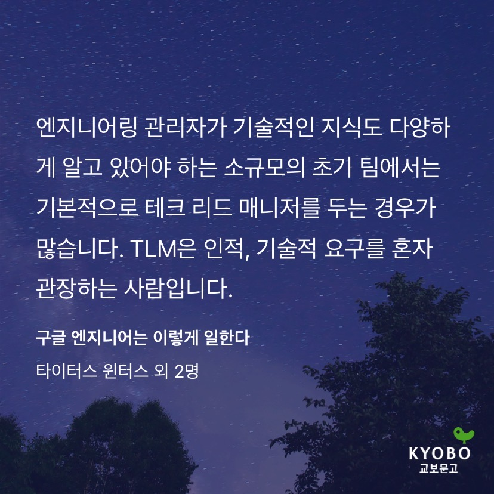
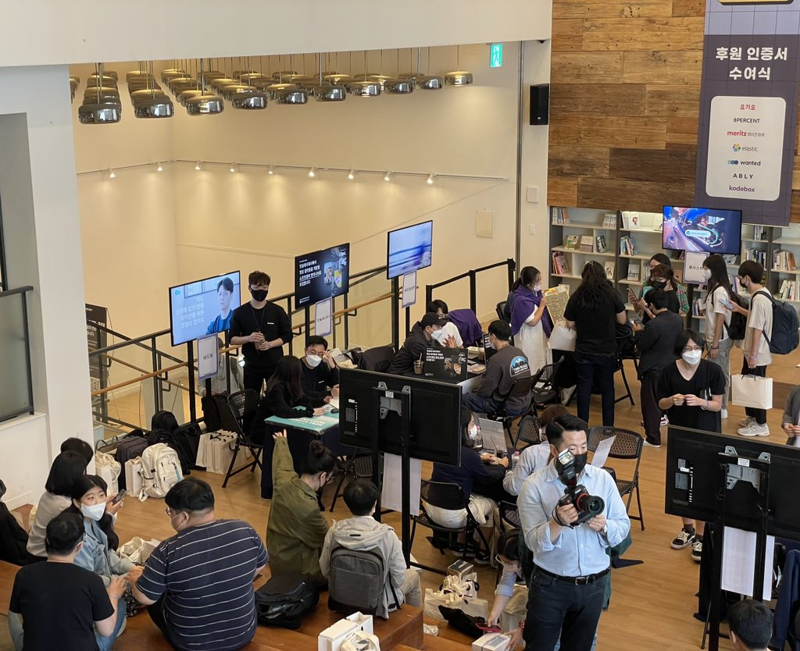
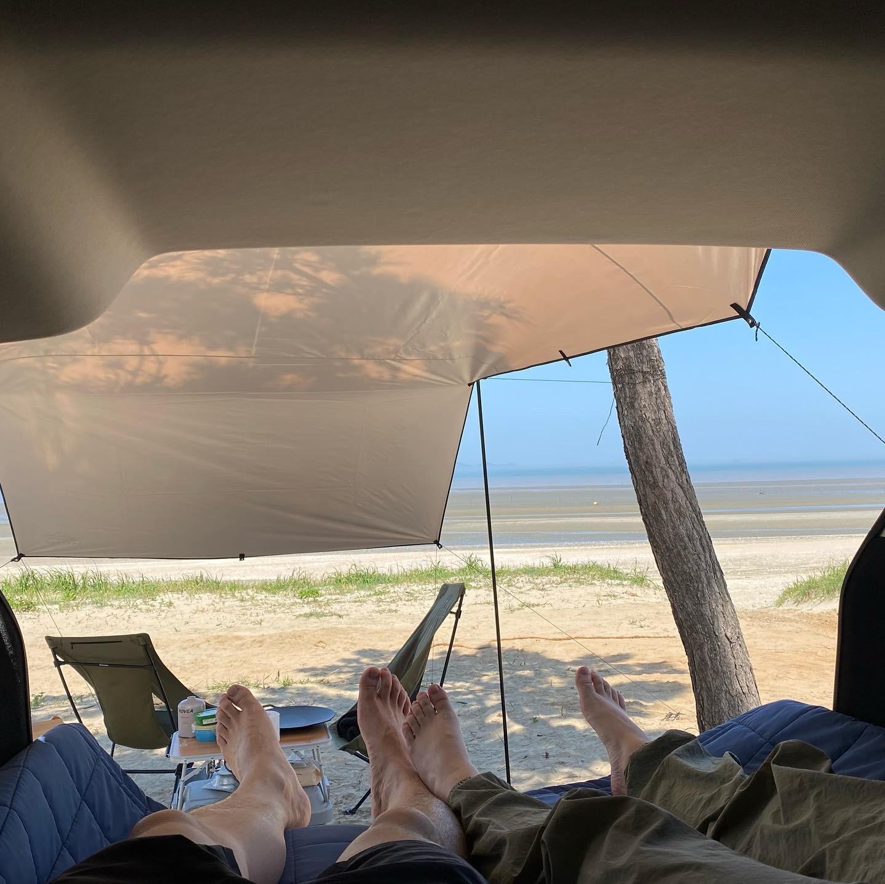
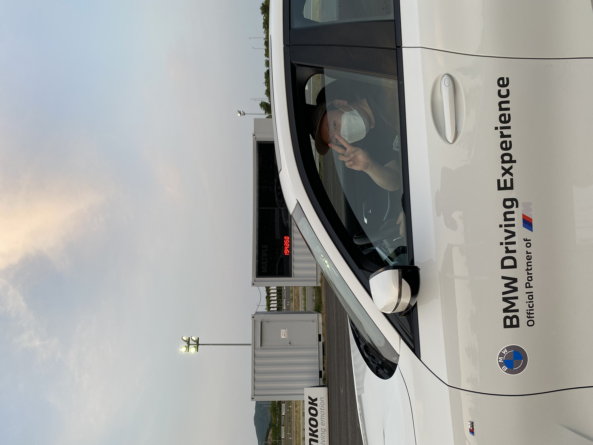
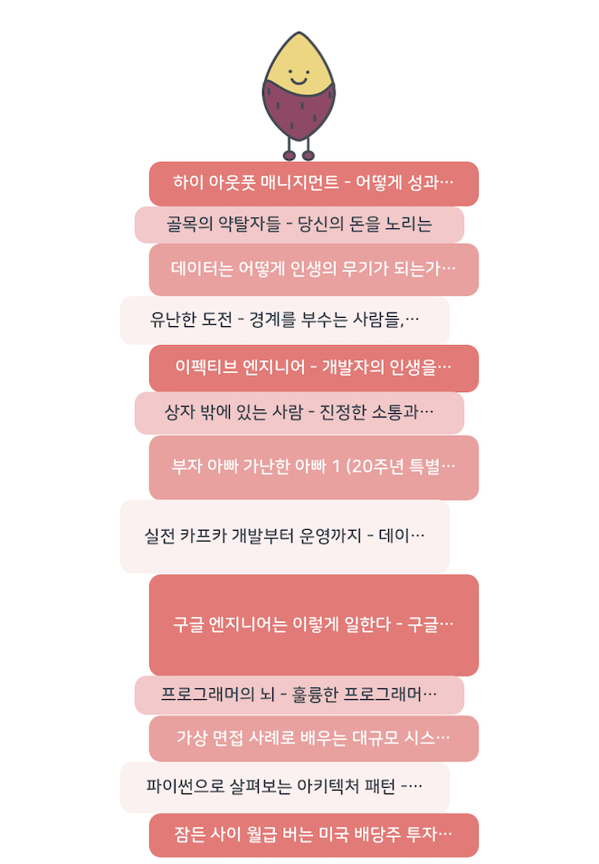
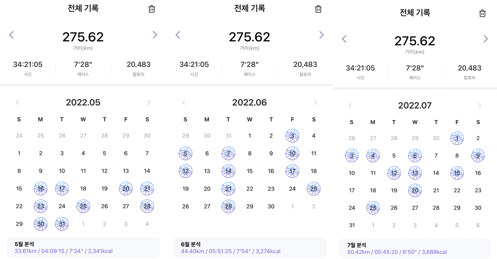
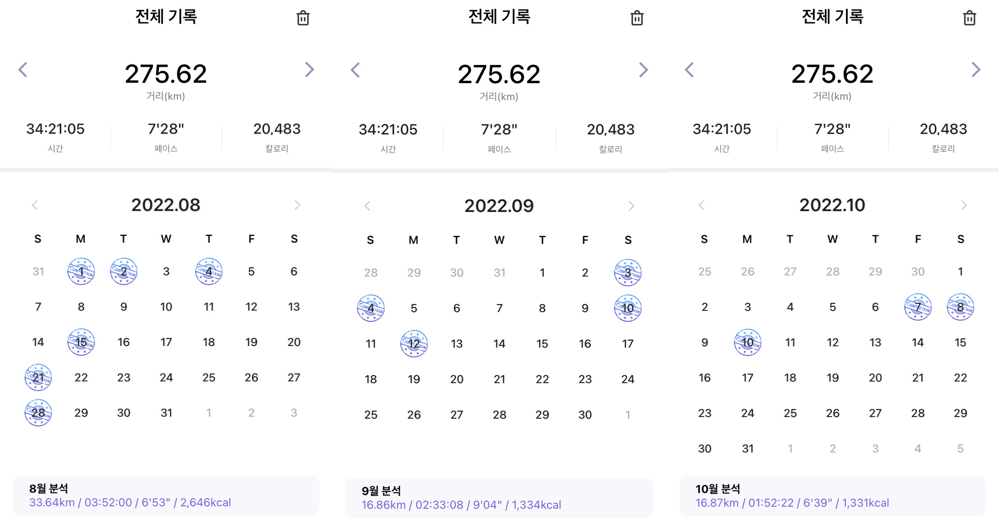

## 1. 테크 리더로 보낸 1년 10개월
2022년 회고를 준비하면서 가장 많이 떠오르는 기억은 대부분 회사와 관련된 것 같다.  
내가 닷슬래시대시(DotSlashDash)에 합류한 지 올해로 1년 10개월이 되었다.  
늘 그렇듯 시간은 참 빠르게 지나갔다. 그만큼 많은 일들이 있었고 어쨌든 잘 해내 왔다고 스스로 격려하며 회고를 시작해본다.  

2023년, 30대의 마지막 1년을 앞두고 있다.  
항상 40살이 되었을 때 나는 어떤 모습, 어떤 생각을 하고 있을지 궁금했었다.  
아무래도 마무리 1년을 어떻게 보내는지가 가장 큰 영향을 줄 것 같다는 예감이 들기도 한다.  
그렇게 지금까지 보낸 세월은 앞으로의 인생을 살아가기 위한 "준비 운동"이 아니었을까?  

(▲ 공유 오피스 옥상에서 교보빌딩을 바라보는 DSD 개발자들)

문득 닷슬래시대시에 처음 합류했을 때 가졌던 목표와 각오를 떠올려보았다.  

### 원칙
내가 현재 회사에서 가장 중요하게 생각했던 것들은 다음과 같다.  

1. 내가 해왔던 것 중에 좋은 것만 하자. (경험)
2. 내가 잘 할 수 있는 것을 하자. (학습)
3. 나의 역할과 책임을 다하자. (리더)

뻔한 말이지만, 항상 이 세 가지 원칙으로 행동하고 결정하려고 노력했다.  

내가 했던 것 중에 좋은 것만 하고, 나쁜 건 하지 않는다. 하지만 나쁜 것도 알아둘 필요는 있다. 그래야 무엇이 좋은 건지 판단할 수 있으니까...  

내가 무엇을 잘 하고 못 하는지는 직접 해봐야 알 수 있다. 하지만 나 혼자 모든 걸 다 할 수는 없다.  
언젠가 필요할 때를 대비해서 작게라도 미리 연습해야 한다.  

무엇이든 처음부터 잘할 수는 없겠지만, 처음이 있어야 계속할 수 있고 잘 할 수 있다.  
언제나 시작이 반이다.  

### 리더
팀을 리드하는 건 개발만 잘하는 것보다 훨씬 육체적, 정신적으로 노력이 필요하고 소모적인 활동이었다.  

사실 불과 2~3년 전에는 리더 역할을 맡기 싫었다. 개발자로서 더 많이 개발하고 더 다양한 기술력을 쌓는 것이 우선이라고 생각했기 때문이다.  

하지만 나를 둘러싼 상황이 변해가는 것처럼 내가 원하는 것에만 매달릴 수 없다는 걸 조금씩 깨달았다.  

그래서 스타트업에 합류한 것도 맞다.  
스타트업에 합류하면 모든 걸 다 직접 해야 하는데, 오히려 그 상황 속에서 내가 추구했던 것들을 더 빠르게 달성하고, 결국 내 경력 스펙트럼을 확장하는 길이 될 수 있을 거로 생각했다.  

지금 회사에서 나는 '개발 리더'로 불리지만, 나 스스로는 '테크 리더' (또는 테크 리드 매니저, TLM)로 정의했다.  
어차피 리더라는 건 회사와 내가 정하는 나의 역할과 책임일 뿐이다.  

내가 어떻게 불리는지 중요하지 않다.  
그저 우리의 성공을 위해 내가 해야 할 역할과 책임을 명확하게 상기시키려면, 나 스스로 '**테크 리드 매니저**'가 되어야 한다.  

(▲ 책 '구글 엔지니어는 이렇게 일한다'에도 비슷한 이야기가 나와서 반가웠다.)

리더는 실수와 반성을 통해 성장한다. 태어나면서부터 리더상으로 태어나는 사람은 없을 것이다.  
하지만 매번 같은 실수를 하고, 발전하지 않는 리더에게 동료들이 지쳐서 먼저 떠날지도 모른다.  

결국 좋은 리더가 되려면 공부해야 한다.  
실수를 줄이고, 불필요한 갈등과 불신을 남기지 않기 위해 항상 스스로 성찰하고 자세를 낮춰야 한다.  
그러려면 주변을 자주 돌아보고, 많이 배우자.  

### 신뢰
지난 1년 10개월 동안 테크 리더로서 가장 중요하게 생각한 건 동료들에게 신뢰받는 것이었다.  
더 잘하고 싶다는 의지와 용기를 얻을 수 있었던 것도 동료들의 신뢰 덕분이었다.  

그래도 여전히 가장 어려운 건 동료들의 신뢰는 받는 것이고, 가장 힘든 건 리더(나)의 리더에게 신뢰를 받는 것이었다.  

어쨌든 결과가 좋아야 신뢰를 쌓을 수 있고, 결과가 좋지 않더라도 과정에서 최선을 다하는 모습을 보여주고 싶었다.  
그리고 기끔은 누군가 나에게 더 나은 방향과 피드백을 주길 바라는 마음이 들기도 했다.  

### 자체 평가
결과만 봤을 때 "일단 해냈다"라고 평가한다.   
개발자로서 가장 중요한 덕목은 구현 능력과 일정 준수라고 생각한다.  
그 과정을 돌아보면 정말 뛰어난 동료들과 함께했기 때문에 가능했고, 원하는 결과를 만들어 낸 것만은 분명하다.  

#### 2021년, 제품의 탄생
우리가 만들고 싶어 하는 모습으로 제대로 동작하는 결과물을 만들어내는 것이 최우선 목표이자 전부였다.  

이때 내가 잘해야 되는 일은 당연히 개발이다. 개발보다 잘해야 할 건 없었다.  

나름 숙달된 클라우드 인프라 구축과 쿠버네티스 운영 경험을 바탕으로 애플리케이션 개발에 집중할 수 있었다.   
서버 구축과 인프라 관리를 혼자 했기 때문에 CI/CD나 특별한 자동화조차 필요하지 않았다.  
그걸 만들 시간에 기능 하나 더 만들어서 빠르게 시장에 선보이는 게 우선이었다.  

#### 2022년, 반복의 속도
연초에 새로운 멤버가 합류했다.  
혼자 일하던 걸 두 명이 나눠서 하게 되는 것만으로도 신경 쓸 게 많아졌다.  
그래도 1개를 말해도 10개가 통하는 그런 멤버를 만난 덕분에 그 전보다 더 속도가 올라갔다.  

'일로 만난 사이'에 가장 중요한 건 신뢰와 존중이다.  
내가 얼마나 상대를 신뢰하는지에 따라 결과물이 달라진다. 그리고 반대의 경우도 마찬가지다.  

### 이제 다음 단계로
서비스의 수명이 오래 가려면 사용자가 늘어나야 한다. 사용자가 늘어나려면 사용자에게 필요한 서비스를 제공해야 한다.  

우리는 사용자가 필요한 것을 만들고 있을까? 그건 잘 모르겠다.  
그렇다면 이렇게 생각하는 게 더 나을 것 같다.  

"우리는 누군가에게는 필요한 것을 만들고 있다."  

그러려면 한 명이라도 더 우리 앱을 써볼 수 있게 계속 문을 두드려야 한다.  
무엇이 필요할지 계속 고민하고, 어떤 결정 내렸다면 빠르게 만들어서 제공할 수 있어야 한다.  

이건 의지만으로 되는 일은 아니다.  

## 2. 도전과 성장

### Kafka
지금까지 분산 메시지 큐가 필요할 만한 상황이나 문제를 겪진 않았다.  
API 요청을 처리하는 도중에 별도로 동작해도 되는 작업은 FastAPI에서 제공하는 `Background Task`를 이용하는 것으로도 충분했다.  
하지만 모든 문제를 간단하게 해결할 수는 없는 법이다.  

실시간으로 발생하는 이벤트에 따라 즉시 처리할 수 있는 프로세스를 두기 위해 Kafka를 이용하게 되었다.  
Kafka를 학습하면서 어떻게 써먹는 게 비용이나 개발 리소스적으로 효율적일지 고민했다.  

우선 Kafka 자체에 대한 필요성부터 생각했다. 꼭 Kafka 여야만 하는가? 그리고 Kafka 클러스터를 직접 구축하고 운영할 수 있을까?  

솔직히 그렇지 않아도 된다.  
작업을 분산하는 목적이면 Celery를 쓸 수도 있다. 그렇다면 Celery는 간단할까?  
Celery의 개념과 사용하는 방법 자체는 간단하다. 하지만 Celery도 구축하고 운영하는 데 비용은 발생한다.  
그리고 Celery는 Publisher와 Consumer가 소스코드를 공유해야 하는데, 이게 어떨 땐 간편하지만 여러 서비스 간의 메시지를 교환하는 부분에선 한계가 있을 것이다.  

AWS SQS도 있지만 Kafka를 우선 고려 대상자로 생각했다.  
그 이유는 문제 해결책을 찾는 것과 함께 기술적인 새로운 경험과 성장도 중요하기 때문이다.  
Kafka를 배우고, 작은 것부터 시작하여 운영 해나가는 경험을 쌓고 싶었다.  

오히려 가장 많이 고민했던 건 어떻게 Kafka 클러스터를 구축하고 운영할지에 대한 결정이었다.  
AWS MSK를 쓸 것인가? Confluent Cloud를 쓸 것인가?  

결과는 일단 Confluent Cloud를 쓰는 것이다. Confluent는 트래픽당 과금을 하는 방식이기 때문에 사용 규모를 예측하기 어려운 초기 도입 단계에 적절할 것 같다는 판단이 들었다.  
그리고 Confluent에서 초반에 PoC를 함께 해주었는데 그 과정에서도 많이 도움을 받은 것도 한몫했다고 볼 수 있다.  

현재는 Kafka Connector와 몇 가지 Producer와 Consumer를 운영하고 있다.  
위에서도 말했지만, 어쨌든 시작해야 경험할 기회가 생기고 배울 수 있다.  

### 첫번째 Go Server
그동안 띄엄띄엄 Go를 배우면서 실제 서비스 환경에는 활용한 적은 없었다.  
때마침 간단하게 구현해야 할 마이크로 서비스가 있었는데 Go로 만들어 보았다.  
사실 DB 연동도 필요 없는 정적 데이터를 서빙하는 용도이기 때문에 부담이 없기도 했다.  
어쨌든 Go로 첫 삽을 떴으니 내년에는 다양한 부분에서 Go를 활용해볼 생각이다.  

아! 맞다. Go로 만든 서버가 하나 더 있다. 👇👇  

### 검색 엔진
함께 일하는 동료 개발자가 검색 엔진에 관심이 많아서 Go로 새로운 검색 API를 구현했다. (내가 개발한 거 아님)  
프레임워크는 Gin을 사용했고, 검색 엔진으로는 MongoDB Atlas의 Search를 이용했다.  
우선 기존 검색 기능이 그저 DB에서 Find 하거나 Like 검색을 하는 수준이었기 때문에 검색 품질은 월등하게 올라갔다. 그리고 Go로 만들어서 그런지 정말 빨랐다.   

### 파이콘 2022 후원사 참여
파이콘 2014부터 매년 참석하면서 언젠가 후원사 부스를 해보고 싶다는 소망이 있었다.  
그리고 올해 그 소망을 이룰 수 있었다.  

그렇게 할 수 있었던 가장 큰 힘은 역시 회사의 공감과 아낌없는 지원이었다.  
사실 후원사가 할 일이 이렇게나 많은지 몰랐다. 아마도 규모가 있는 회사에서는 행사를 전담하는 분도 계실 수도 있고, 많은 사람이 역할을 분담할 테니 말이다.  
이번 행사 준비에 적극적으로 도와주신 많은 동료분(디자이너, 에디터, 비디오 그래퍼)에게 진심으로 감사한 마음을 전한다.   

### EKS, Istio 업그레이드
연말을 앞두고 그동안 묵혀둔 Kubernetes와 Istio 버전 업그레이드를 진행했다.  
Kubernetes 버전이 `1.26`까지 나온 상황에서 우리는 `1.19`를 사용하고 있었기 때문이다.  
어차피 쫄리는 작업인데 더 미루면, 감당이 안 될지도 몰라서 추진하게 되었다.  

테스트용 EKS 클러스터를 만들어서 여러 번 연습하고 과정을 정리했다.  

[AWS EKS 버전 업그레이드 실습 가이드](https://jonnung.dev/kubernetes/2022/12/18/upgrade-aws-eks-kubernetes-version/)  
[Istio 버전 업그레이드 실습 가이드](https://jonnung.dev/istio/2022/12/15/upgrade-istio-version/)  

### 데이터독
작년 회고에도 데이터독(Datadog)을 언급했었는데, 올해는 데이터독과 인연을 맺게 되었다.  
물론 본격적으로 시작하는 건 내년이겠지만, PoC 하는 과정에서 2년 전보다 더 좋아졌다는 느낌을 받았다.  
진짜 잘 써봐야지. 안정적이고 빠른 서비스를 위해, 그리고 나를 (편해지기) 위해!  

## 3. 여가 (Leisure)

### 5월, 전북 고창, 차크닉
작년에 차를 왜건(wagon)으로 바꾸고 꼭 한번 해보고 싶었던 건 차크닉 그리고 차박이었다.  
가능할까? 뭐 누울 수만 있으면 되는 거 아닌가? ㅋㅋ  
결론은 나쁘지 않았다. 차체 특성상 높지 않아 앉을 수는 없지만, 어차피 쉬는 공간이니까 누워있기에 불편함은 없었다.   

### 5월, 강원도 화천 캠핑
우리 어머니를 모시고, 아내와 셋이 강원도 화천으로 캠핑하러 갔다.  
이것도 차를 바꾸고 가능하게 된 일이었다. 그동안 실내 공간이 캠핑 짐으로 가득 찼기 때문에 항상 둘이 다닐 수밖에 없었는데 이제는 딱 1명 더 탈 수 있게 됐다.   
이번 캠핑에서 가장 기억에 남는 것은 사람들이 내가 사위인 줄 안다는 거?  

### 6월, BMW 드라이빙센터
운 좋게 BMW M 50주년 기념행사에 초대받을 수 있었다.  
작년에도 비슷한 코오롱 모터스 기념행사(잠실)에 다녀온 적이 있어서 비슷할 거로 생각했다.  
그런데 규모나 내용이 완전 달랐다.  
이날 거의 모든 종류의 BMW M을 타고 서킷을 달려봤다. 그리고 여기서 운전을 다시 배웠다.  

### 6월, 포천에서 형제 가족 캠핑
동생네 가족과 몇 년 만에 캠핑을 갔다. 이번에는 귀여운 조카들과 함께!  
사실 아이를 데리고 캠핑한다는 게 어떤 건지 궁금하기도 했다.  
육아에 지친 동생과 제수씨가 잘 쉴 수 있도록 해주고, 되도록 내가 아이들과 많이 놀아주려고 했다.  
그리고 깨달았다. 이건 다른 캠핑이었다.  

### 7월, 21년만에 한국에 돌아온 미국 사람 친구
중학교 2학년 때 미국으로 이민 갔던 친구가 21년 만에 한국으로 돌아왔다. 아니 여행.  
그전에 내가 이 친구를 만나기 위해 미국으로 간 적이 2번 있긴 했지만, 친구가 한국으로 오기 위해서 정말 오랜 시간이 걸렸다.  
아내의 배려로 일주일 정도 우리 집에서 둘이 지냈고, 다른 친구들과 함께 오랜만에 남자끼리 2박 3일 여행(동해)도 다녀왔다.  
언제 다시 만날 수 있을까? 내년에 미국 갈 일이 생겼으면 좋겠다. AWS reinvent?  

### 8월, 강원도 삼척 차박
차박에 도전했다. 삼척에 있는 작은 해수욕장이 달린 동네로 갔다.  
신혼 초기에 우연히 발견한 곳인데 여전히 한적하고 좋았다.  
몇 년 만에 스노클링도 하고, 차량용 어닝 밑에서 고기도 구워 먹었다.  
이제 잠을 자볼까? 했는데.. 헉헉;;  

차박은 여름에 하는 게 아니었다. 
너무 더워서 창문을 열면 모기가 들어오고, 에어컨을 틀면 차에 안 좋을까봐 겁나고 공회전도 미안했다. 그렇게 에어컨을 끄면 다시 반복...  
그냥 집에 갈까 수십번 고민했지만, 다음날 또 놀고 싶어서 참으며 밤을 지새웠다.  

### 10월, 부산 광안리
5년 만에 찾은 부산.  
그냥 하고 싶은 거 다 하고 왔다.  
먹고 싶은 거 다 먹고, 타고 싶은 거 다 타고 술도 많이 마셨다.  
자주 오는 곳도 아니고, 이렇게 자유로울 수 있는 날이 많지 않을 것 같아서 맘껏 놀았다.  

### 11월, 운전해서 여수까지
원래 여수에 가려던 건 아니었고, 외할머니가 계신 전남 곡성을 가게 됐다.  
거기서 하룻밤 지내고 올라오는 게 조금 아쉬워서 당일치기로 여수에 가보게 된 것이다.  
여수는 여전히 아름다운 도시지만, 여전히 할 게 없다.  
그래도 케이블에서 바라보는 멋진 바다 풍경은 잊을 수가 없을 것 같다.  

## 4. 독서
작년에 15권을 읽었는데 올해는 13권밖에 읽지 못했다.  
올해 목표를 30권으로 잡았는데 목표 따위 아예 잊고 산 것 같다.  
그래도 최근 들어서 독서량이 늘고 있고, 읽는 속도도 빨라졌다.  
그럼, 내년 목표는 현실적인 능력과 열심히 노력하자는 취지에서 24권으로 잡는다.  

## 5. 달리기
작년에 실패했던 런데이 8주 코스를 달성했다.  
그리고 나름 작게나마 목표로 세웠던 30분 연속 달리기도 달성했다.  
이젠 달리기가 정말 취미가 됐구나 싶었다.  
마라톤까지 관심이 생겨서 찾아보고...  

그러나 굳이 핑계를 대자면 9월에 진행했던 프로젝트가 너무 바빴고, 육체적으로나 정신적으로 여유가 너무 없었다.  
프로젝트가 끝나니까 갑자기 추워진 날씨...  

내년에 날씨가 조금만 풀리면 다시 달려야지!   

