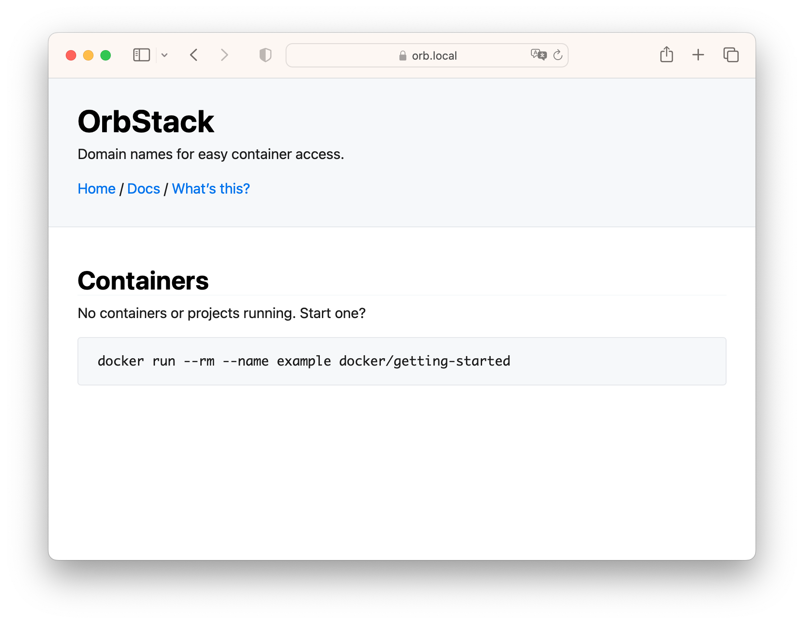

### OrbStack이란?

[OrbStack](https://orbstack.dev/)은 MacOS에서 Docker 컨테이너와 Linux 가상 머신을 실행할 수 있는 도구입니다.  
이는 WSL 2처럼 경량 Linux 가상 머신을 사용하여 오버헤드를 최소화하고 리소스를 절약합니다.  
OrbStack VM 내에서 Docker 엔진이 실행되기 때문에 Docker Desktop의 대체재가 될 수 있습니다.  

### 설치 및 구성

OrbStack 설치 시, 관리자 권한으로 `/var/run/docker.sock` 심볼릭 링크가 OrbStack의 Docker 엔진을 가리키도록 설정됩니다.  
이 과정은 사용자의 편의를 위해 자동으로 이루어집니다.  
설치 후에는 기존의 Docker Desktop을 종료하거나 제거하여 리소스를 절약하는 것이 좋습니다.  

### Docker Desktop과의 차이점

OrbStack은 네이티브 macOS 앱이며, Docker Desktop에 비해 CPU와 메모리 사용량이 현저히 낮습니다.  
특히, IDLE 상태에서 CPU 사용률이 0.1% 이하로 떨어질 수 있습니다.  
CPU는 컨테이너와 가상 머신이 동작할 때만 사용되고, 설정을 통해 최대 사용량을 제한할 수 있습니다.  
Memory도 필요할 때 최소로 할당되어 서서히 사용량이 증가하게 됩니다.  

OrbStack이 Docker Desktop보다 얼마나 더 나은 성능을 보여주는지는 공식 웹사이트의 Benchmark를 통해 확인해볼 수 있습니다.  

[https://docs.orbstack.dev/benchmarks](https://docs.orbstack.dev/benchmarks)


### OrbStack의 주요 기능

#### 1. 자체 도메인과 HTTPS 지원

OrbStack은 모든 컨테이너에 `container-name.orb.local` 형식의 도메인을 자동으로 할당합니다.  
이는 포트 포워딩을 사용하는 것보다 훨씬 간단하며, `localhost:포트번호`를 입력하지 않고도 도메인으로 직접 연결할 수 있습니다.  
또한, `*.orb.local` 도메인에 대한 HTTPS 지원이 자동으로 이루어집니다.  

[https://orb.local/](https://orb.local/) Index 페이지에 접속하면 현재 실행중인 모든 컨테이너의 도메인 링크를 확인할 수 있습니다.  




#### 2. 호스트 네트워킹 지원
OrbStack은 호스트 네트워킹 기능을 제공합니다. 이 기능을 통해 Docker 컨테이너는 호스트 머신의 네트워크 스택을 직접 사용할 수 있게 되어, 결과적으로 호스트의 IP와 포트를 바로 사용할 수 있습니다. 이는 포트 관리를 단순화하고 여러 컨테이너가 같은 네트워크 설정을 공유할 수 있게 해, 개발 환경 구축에 큰 도움이 됩니다.  

그러나, 호스트 네트워킹은 보안 취약점과 포트 충돌의 가능성을 내포하고 있습니다. 이러한 위험 요소들은 사용 시 반드시 고려해야 합니다.  

Docker 엔진은 `bridge`, `host`, `none` 등 세 가지 네트워킹 모드를 제공합니다.  
하지만 기존의 Docker Desktop 환경에서는 `host` 모드를 사용할 수 없었으며, 오직 Linux 환경에서만 지원되었습니다.  
Docker 네트워크에 대해 조금 더 이해하고 싶다면 [도커 네트워크 요약 (Docker Networking)](https://jonnung.dev/docker/2020/02/16/docker_network/)글을 참고하시길 추천합니다.  

반면, OrbStack은 MacOS 환경에서도 호스트 네트워킹을 지원합니다.  
이 기능을 활성화하기 위해 Docker 컨테이너를 실행할 때 `--net host` 옵션을 추가하기만 하면 됩니다.  
이를 통해 Mac에서 실행 중인 모든 Docker 컨테이너에 `http://localhost:{포트}`를 통해 접근할 수 있으며, 컨테이너 내부에서도 다른 컨테이너로의 접근이 가능해집니다.  

그러나, 호스트 네트워킹 기능을 사용하면 Orbstack이 제공하는 도메인 연결 기능과 HTTPS 지원을 이용할 수 없게 됩니다. 따라서 특별한 상황이 아니라면, 이 기능을 사용하지 않는 것이 좋을 것 같습니다.  


#### 3. 쿠버네티스 통합

OrbStack에는 가벼운 싱글 노드 쿠버네티스 클러스터가 내장되어 있어, 로컬 개발 환경에서 쿠버네티스를 손쉽게 사용할 수 있습니다.  

Docker Desktop에서도 쿠버네티스를 사용할 수 있지만, 실행시킬 때 다소 느리거나 리소스를 많이 잡아먹는 느낌이 있었습니다.  
그때부터 Docker Desktop의 쿠버네티스보다 다른 대체제인 Kind를 사용했었는데 사실 로컬 개발환경에서 여러 개의 쿠버네티스 클러스터를 실행할 이유가 있다면 Kind가 유용하겠지만, 보통 그럴 일이 많지 않을 것 같습니다.  
오히려 보통의 개발 환경에서는 Orbstack에 내장된 쿠버네티스 클러스터를 사용하는 것이 낫습니다.  

OrbStack에 내장된 쿠버네티스의 가장 큰 장점은 모든 Service 타입에 대해 직접 접근이 가능하다는 것입니다.  
예를 들어 `LoadBalancer` 타입의 Service를 만들고, Ingress 리소스를 직접 정의하면 `*.k8s.orb.local` 와일드카드 도메인을 통해 접속할 수 있습니다.  


간단한 실습으로 `jonnung.k8s.orb.local` 도메인으로 Ingress에 접근하는 것을 해보겠습니다.  
먼저 Ingress Nginx를 쿠버네티스 클러스터에 배포합니다.  

```shell
$ kubectl apply -f https://raw.githubusercontent.com/kubernetes/ingress-nginx/controller-v1.8.1/deploy/static/provider/cloud/deploy.yaml
```

`ingress-nginx` Namespace가 새로 생기고, `ingress-nginx-controller` Deployment와  `nginx` IngressClass가 생성되었습니다.  
이제 간단한 Nginx POD를 배포하고 Ingress를 정의해봅니다.  

```shell
$ kubectl create deployment demo --image=httpd --port=80
$ kubectl expose deployment demo
```

```shell
$ kubectl create ingress demo-localhost --class=nginx \
  --rule="jonnung.k8s.orb.local/*=demo:80"
```

이제 별도의 포트 포워딩 없이도 http://jonnung.k8s.orb.local 도메인으로 접속하면 "It works!"가 표시되는걸 확인할 수 있습니다.  

`NodePort`나 `ClusterIp` 타입의 Service는 Service에 할당된 Private IP로 해당 포트를 통해 접근할 수 있고, 또한 POD에 할당된 Private IP로도 직접 접근할 수 있습니다.  

### 가격 정책

OrbStack은 개인 사용자에게는 무료로 제공되며, 상업적 용도로는 Pro 플랜을 구매해야 합니다.  
OrbStack을 처음 다운로드 받아 사용하면 최초 30일 동안은 Pro 플랜을 무료로 이용할 수 있고, 이후에는 자동으로 무료 플랜으로 전환됩니다.  

Pro 플랜 라이센스를 구입해야 하는 상업적 사용의 정의는 연 매출 1만 달러를 넘는 회사, 프리랜서, 비영리 단체, 정부 기관 등에 해당됩니다.  
이러한 정책은 Docker Desktop의 유료화 정책과 비슷한 것 같습니다.  

### 마치며

개인적으로 Docker Desktop의 속도와 사용성에 불만이 있었기 때문에 컨테이너를 사용하지 않을 때는 꺼두곤 했습니다.  
최근 몇 일 동안 OrbStack을 사용해 보니 확실히 가볍고 빨랐습니다.  
특히 개발 환경에서 제공하는 추가 기능들이(도메인) 매우 유용하고 편리했습니다.  

OrbStack은 MacOS에서 Docker 컨테이너와 Linux 가상 머신을 손쉽게 실행할 수 있고, 낮은 자원 사용률과 추가 편의 기능들이 개발 환경을 크게 향상할 수 있을 것 같습니다.  
앞으로도 계속 발전될 것을 기대되며 Docker Desktop의 대안을 찾고 계신다면, OrbStack을 사용해 보시길 추천합니다.  

### 참고 자료
- [What is OrbStack?](https://docs.orbstack.dev/)

