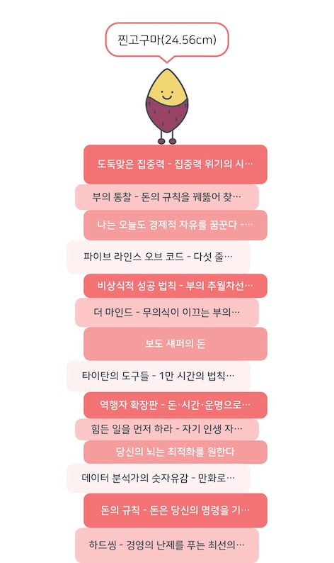

## 새로운 가족이 생기다
올해 가장 행복한 순간은 내 아이가 태어났다는 것이다.   
작년에 회고를 쓸 무렵, 오랜 기다림과 간절함 끝에 우리 부부에게는 소중한 아이가 찾아왔다.  
열 달 동안 엄마 뱃속에서 건강하게 자랐고, 폭풍 태동으로 우리에게 존재감을 알려주던 아이가 드디어 태어났다.  
임신과 출산 후의 생활은 크게 달라졌지만, 그 과정에서 느낀 감정과 추억들은 매우 소중하게 남아있다.  

아이가 태어나자 내 삶이 완전히 바뀌는 것을 느꼈다.  
이제 내 삶은 아이와 같은 방향을 향한다. 
내가 어떤 목표를 가지고 이뤄가는지에 따라 내 아이의 인생에도 큰 영향을 끼치리라는 것을 알게 되었다.  
그래서 나는 좀 더 구체적이고 도전적인 인생 목표를 세웠다.  
아이가 매일 성장함에 따라 내 목표 달성도 가까워지고 있다. 나는 반드시 목표를 이룰 것이다.   

## 리더쉽의 방향 전환
올해 상반기, 중요한 프로젝트가 시작되려는 시점에 동료들의 퇴사라는 위기가 찾아왔다.   
그 상황에서 남은 팀원들은 프로젝트를 완수하기 위해 최선을 다했다.   
그럼에도 부족했던 개발 자원을 확보하기 위해 처음으로 외주 개발사와 협업하기도 했다.  

동료가 회사를 떠나는 마음을 완전히 이해할 수는 없지만, 나는 스스로 책임을 물었다.  
"내가 더 잘 챙기고 잘못된 방향을 가고 있다는 걸 알았을 때 바로 잡았다면 어땠을까?"하는 아쉬움과 후회가 들었다.  
그러나 이러한 자책감을 반성과 성장의 기회로 삼기로 했다. 그리고 여전히 나를 믿고 신뢰해 주는 동료들에게 감사함을 느낀다.    

그렇게 팀을 다시 정상화하기 위해, 새로운 리더를 영입하는 것이 팀 분위기 개선과 성장을 이끌 수 있는 가장 빠르고 확실한 방법이라고 생각했다.   
이제 나는 표면상으로는 팀을 이끌지 않지만, 내 역할과 책임에는 변함이 없다.  
좋은 서비스를 만들기 위해서는 먼저 좋은 팀을 구성하는 것이 중요하다.   
앞으로도 나는 이 목표를 위해 최선을 다할 것이다.  

## 자신감 다시 쌓아올리기
2021년, 이 팀에 처음 합류했을 때 나는 자신감이 넘쳤다.   
그동안의 경험과 학습을 바탕으로 잘할 수 있는 것에만 집중하면 어떤 일이든 해낼 수 있을 것 같았다.  
하지만 최근에 되돌아보니, 내가 정말 좋아하고 잘했던 부분들에 소홀했다는 것을 깨달았다.   
특히, 올해 블로그 글을 한 개도 작성하지 않았다는 사실이 이를 증명한다.  

신입 개발자 시절부터, 나에게 블로그 글쓰기는 자존감을 높여주는 유일한 수단이었다.  
아직도 글을 잘 쓴다고는 할 수 없지만, 배운 것과 익힌 것을 기록하는 과정에서 큰 성취감을 느꼈다. 이를 통해 내 자신감은 더욱 강화되었고, 이는 나의 전문성과 열정을 뒷받침하는 중요한 요소였다.  
올해는 이렇게 아쉬움이 남는 한 해로 남았지만, 앞으로는 이제 내가 좋아하고 잘하는 것들에 다시 집중해야 할 때임을 깨달았다.  

## 더 많이 읽고 기록하기
올해 책을 많이 읽었다고 생각했지만, 실제로 권수를 세어보니 작년보다 단 1권만 더 읽었다는 것을 깨달았다. 올해 나의 주된 관심사는 정신력과 성장성, 그리고 부자 마인드에 대한 이해였다.  

자주 "나는 왜 이럴까?"라고 스스로 묻곤 한다.   
이는 나에 대한 실망과 부족함을 느낄 때가 많았기 때문이다.   
그래서 나는 자신감이 바닥에 떨어졌을 때, 독서를 통해 다시 일어서고 방향성을 찾을 수 있다고 믿고 행동하려고 한다.  

내년에는 독서량뿐만 아니라 독서의 질을 향상시키기 위해, 읽은 내용을 간단히 기록하고 느낀 점을 적는 습관을 만들 계획이다.  

그나저나 올해는 기술 서적을 거의 안 읽었다는 건 조금 충격적이다. 연말에 '카프카 핵심 가이드' 스터디를 진행하고 있긴 하지만 대부분 자기계발서 위주로 읽었구나...  

