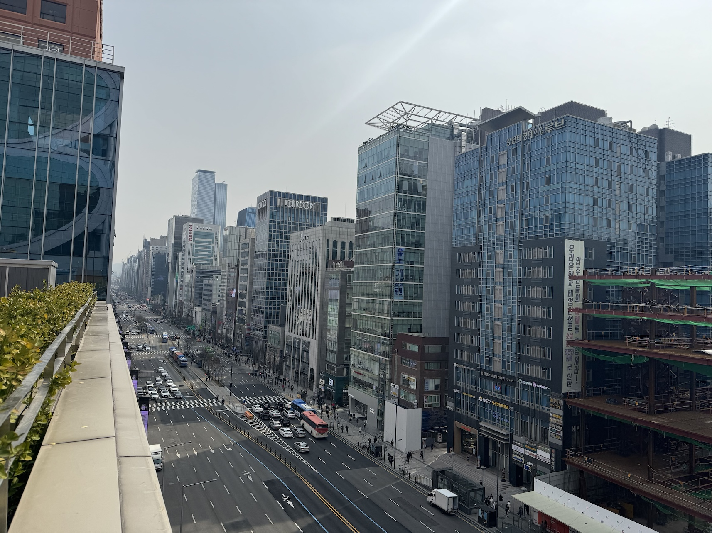
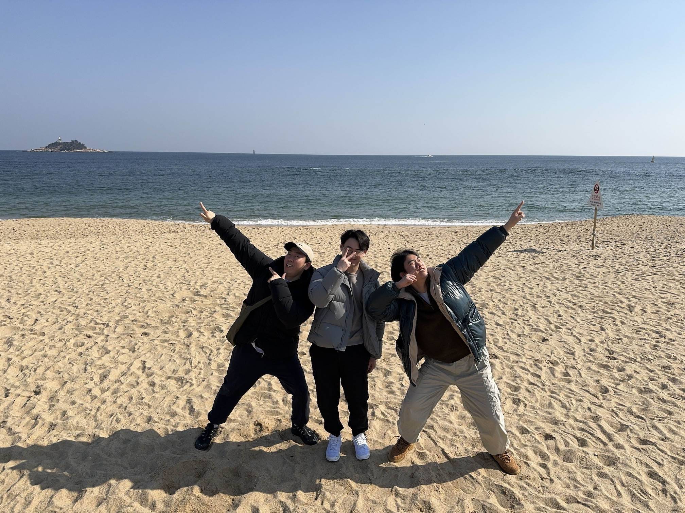
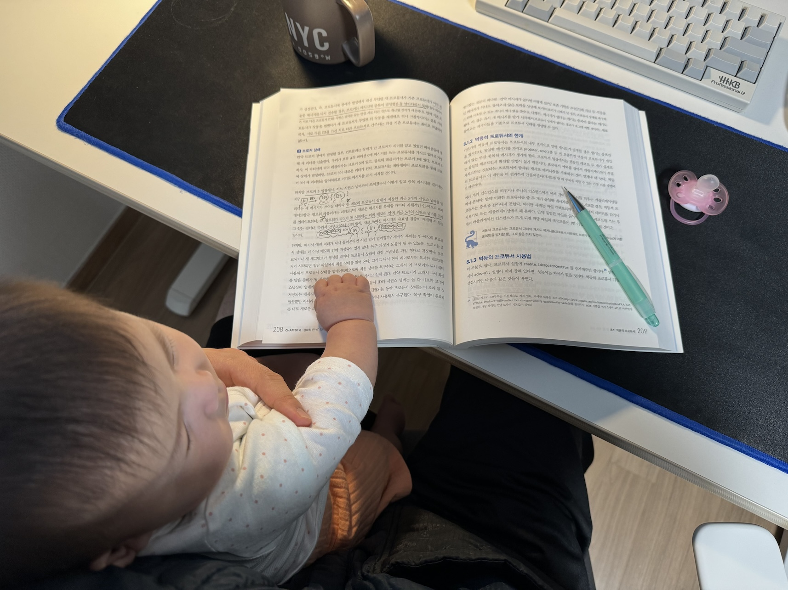
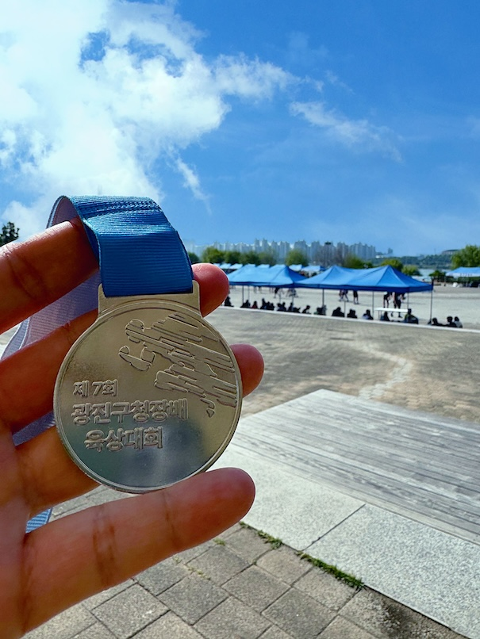
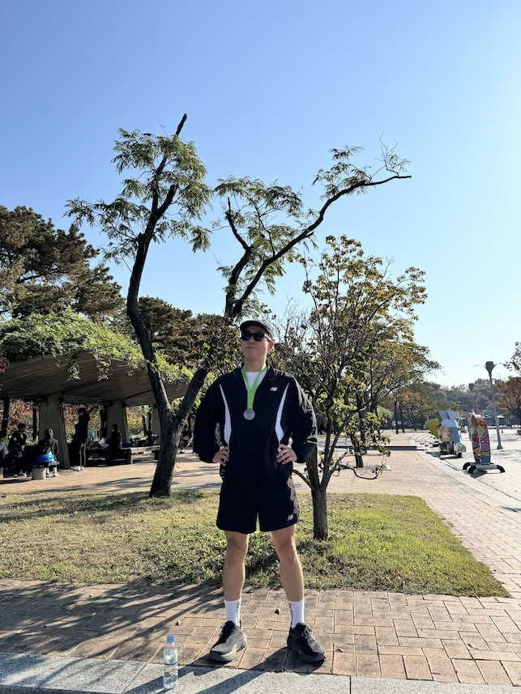
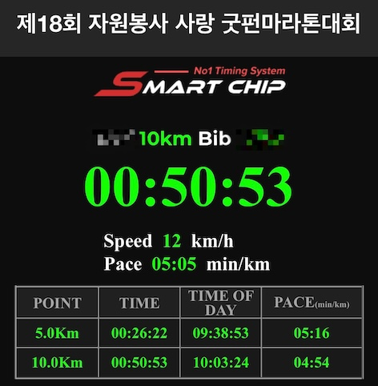
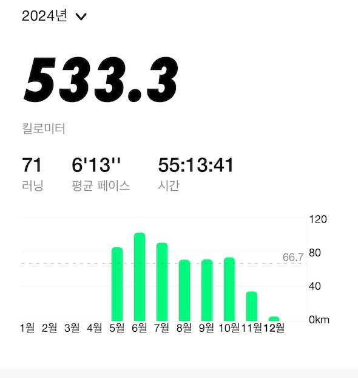
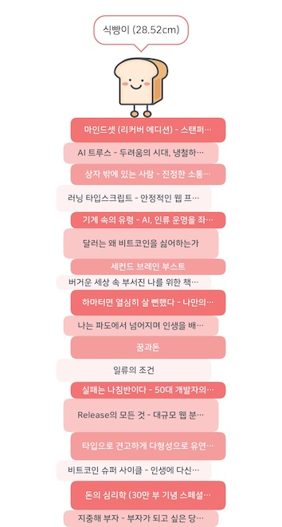
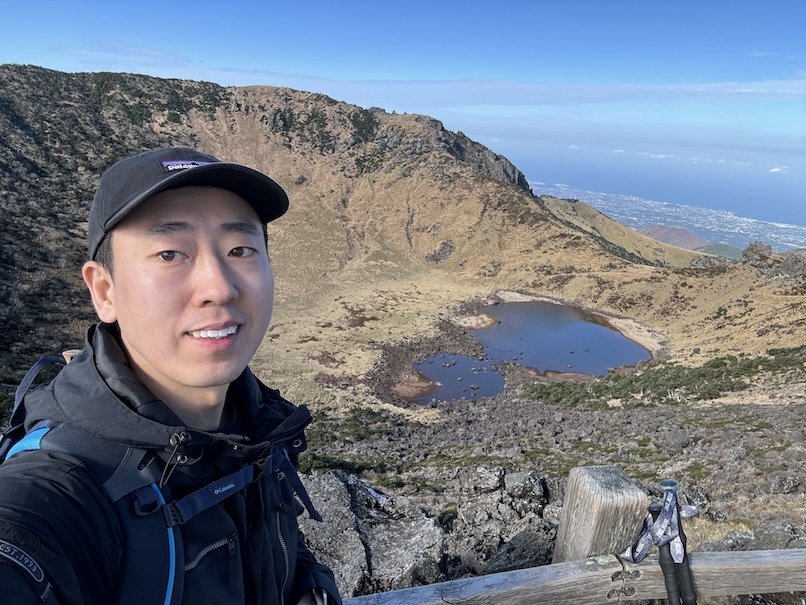

## 마무ㄹ/

회사의 시작부터 함께 걸어온 여정을 3년 만에 마치게 되었다.  
좋은 사람들도 많이 만났고, 좋은 경험도 많이 쌓았다.  
내가 할 줄 아는 것들은 거의 다 해본 것 같고, 문제 해결을 위해 새롭게 배운 것들도 많았다.  
항상 좋은 일만 있는 건 아니었지만, 그래도 지나간 것은 지나간 대로 의미가 있다고 생각하려 한다.  
그동안 잘했던 것은 더 발전시키고, 잘 못했던 것은 더 이상하지 않으면 되니까.  

이 회사의 1호 개발자로서 합류했을 때 나름대로 다짐하고 실천했던 것들을 돌아본다.  
- 내가 그동안 경험하고 배운 것 중에서 가장 확신 있는 것들, 확실한 결과를 만들어낼 수 있는 것들에 집중했다.
- 현재 뛰어난 실력보다는 함께 성장하며 점점 더 잘 해낼 수 있는 동료를 찾으려 했다.
- 회사가 나아가는 방향을 이해하고 그 결정에 따라 일이 되도록 최선을 다했다.
- 당장의 기술 부채와 비효율에 묶여있기보다는, 문제를 정확히 파악하는 능력을 키우고 반드시 해결할 기회를 만들어내려 했다.

처음 앱 출시를 앞둔 3개월 동안 서버 인프라 구성부터 동영상 업로드부터 스트리밍, 모든 백엔드 환경과 API 개발까지 해낸 건 나 스스로 내가 어느 정도 수준의 엔지니어인지 판단해 볼 수 있었던 계기가 되기도 했다.  
사실 부담도 컸고, 정해진 기간 안에 완성할지 못 할지도 모른다는 불안감도 들었다.  
하지만 함께했던 동료들의 밤낮없는 희생과 노력 덕분에 잘 해낼 수 있었다.  
추억도 많고, 애정이 많이 가는 서비스를 만들었던 것 같다.  
언젠가는 더 많은 사용자에게 사랑받는 서비스로 발전할 것이라 기대해 본다.  

좋은 팀을 만들고 싶었던 목표는 끝내 이루지 못한 가장 큰 아쉬움으로 남았다.  
돌이켜보면 회사가 내가 생각하는 기준과 가치에 대해 공감해 주고, 조금 늦더라도 신중하게 결정했으면 좋았을 것 같다.  

스타트업이기 때문에 빠른 변화에 적응하고 대처하는 것도 중요하겠지만, 회사는 그 변화의 방향에 대해 더 자주 이야기하고, 우리가 만들어 가고 있는 것들의 의미를 더 깊이 나누었으면 싶었다.  
최근에 들은 말 중에 매우 와닿은 말이 있었는데 이 표현이 적절할 것 같다.  
'하면 좋은 것이 아니라, 해야만 하는 것만 집중한다'  

기술 부채는 단순히 나쁜 것이 아니라, 현재의 문제를 해결하기 위해 미래의 무언가를 먼저 활용하는 것뿐이다. 그래도 당연히 부채는 상환해야 한다.  
하지만 무조건 서둘러 갚는 것이 최선은 아니다. 오히려 기술 부채를 방치하지 않고 잘 관리하는 것이 중요하고 적절한 시기에 해결하려는 의지와 실행력이 중요하다고 생각한다.  
안타깝게도 때로는 이러한 기술 부채가 팀 내 갈등의 도구로 악용되는 모습은 좋아 보이지 않았다.  

올해 초 마지막 프로젝트에서는 카프카 스트림을 활용해 서비스의 이벤트를 알림 수신함으로 전달하는 시스템을 구축했다.  
카프카 Streams API를 직접 활용한 건 아니었고, Confluent에서 제공하는 관리형 카프카 클러스터를 이미 운영 중이었기에 ksqlDB를 활용하여 구현할 수 있었다.  
사실 개념 자체가 쉽지 않았고, ksqldb의 time window 기능만으로 모든 이벤트 케이스를 처리하기는 어려웠다.  
그래도 작년에 동료들과 함께 공부했던 '카프카 핵심 가이드'가 큰 도움이 되었던 것 같다.  

## 아빠로서
그동안의 이직 과정에서 하루도 쉬어본 적이 없었다.  
아내와 해외여행을 다녀올 수도 있었지만, 한창 일하고 성장해야 할 시기에 굳이 쉴 필요가 있을까 하는 생각뿐이었다.  
하지만 이번에는 다음 회사를 정하지 않고 퇴사를 선택했다.  
온전히 나와 가족을 위한 진정한 휴식의 시간을 갖기로 한 것이다.  
이제 막 기어다니기 시작한 우리 아이와 아빠로서 함께할 수 있는 시간은 지금뿐이고, 회사는 언제든 다시 다닐 수 있으니까!  

때마침 이 시기가 봄이었는데 하늘은 매일 맑고 햇살도 너무 좋았다. 너무 놀기 좋은 계절이었다.  
아침에 아이가 깨면 꼭 안아주고 볼에 뽀뽀를 하며 하루를 시작했다.  
어젯밤에 아내가 준비해 둔 이유식을 데우고, 내가 먹을 식사를 준비한다. 그리고 함께 식탁에 앉아 웃고 떠들며 식사를 했다.  
식사를 마치면 아이와 산책하러 나갔다. 아기띠를 할 때도 있고 유모차를 타고 나가기도 했다.  
출근하는 사람들, 등교하는 형아, 누나들을 배웅하고 커피 한잔 사서 돌아오는 길은 말로 표현할 수 없는 행복이었다.  

이런 일상을 3개월 동안 거의 매일 했다.  
반복적인 일상 같지만, 영원히 반복해도 좋을 만큼 행복하고 소중한 시간이었다.  
그러면서 아이는 두 발로 일어서기 시작했고, 한 걸음씩 걸음마를 떼는 모습을 직접 볼 수 있어서 너무 감사했다.  

## 더 오래 더 멀리
몇 년간 취미로 달리기를 해왔지만, 겨울이 되면 중단했다가 다시 봄이 오면 시작하길 반복했다.  
이번에도 2023년 11월을 마지막으로 잊고 지냈던 달리기를 다시 시작했다.  

퇴사 후 나에게는 시간이 많았고, 하루 중에 언제든 할 수 있는 운동 중에는 달리기가 가장 적합했다.  

이틀에 한 번 정도 달리기를 해보니 어느 순간부터 늘 달리던 거리가 짧게 느껴지기 시작했다. 식습관을 바꾸지 않았는데도 체중이 서서히 줄어들었다.  
몸이 가벼워진 덕분인지 더 오래 달려도 부담이 없었다. 그렇게 조금씩 페이스가 줄어들고 달리는 거리는 늘어났다.  

언젠가부터 인지 무엇인가 목표를 달성하는 성취감을 느껴본 기억이 없는 것 같아서 6월에 열리는 광진구청장배 10km 마라톤에 참가해 완주했다.  

이때부터 평소 달리는 거리도 점차 늘어났다.  
컨디션 좋고 날씨가 좋을 때는 종종 10km씩 달렸다.  
물론 10km를 달리는 건 항상 힘들다. 달리고 나면 다리가 땡기고 고관절이 뻐근하다. 이 피로감은 다음날까지 이어지기도 한다.  
하지만 내 두 다리로 이렇게 먼 거리를 달릴 수 있다는 사실만으로도 나 자신이 대견하고 뭐든지 할 수 있다는 자신감이 생겼다.  

올해는 10km 마라톤을 두 번 완주했다. 특히 두 번째 참가한 마라톤에서는 기록을 상당히 많이 단축했다.  

한 해 동안 총 71번 달렸고, 거리는 533.3km이다. 역시 날씨가 추워지니까 안 하게 된다.  
그동안 신어 온 뉴발란스 1080v12가 500km를 넘기면서 새로 나온 러닝화 뉴발란스 1080v14 올블랙으로 교체했다.  
내년 4월에는 하프 마라톤에 도전할 예정이다. (2025 서울 하프 마라톤 신청 완료)  

## 조금 더 읽음
작년에 총 14권을 읽었기 때문에 올해 목표는 두 배로 늘려서 24권으로 정했다.  
매달 두 권씩 읽으면 되지만 읽는 속도가 느린 나로서는 철저하게 독서를 습관화하지 않으면 달성하기 어려울 것 같았다.  
하반기에 좀 게을러져서 결과적으로 올해는 18권을 읽었다.  

1년 동안 읽은 책들을 살펴보니 시기마다 고민하고 있던 것들과 주제가 비슷하다.  
연초에는 부자 되기와 투자에 대한 주제, 중반에는 마음 챙기기, 후반에는 개발과 일에 대한 것들이 주를 이루는 것 같다.  
물리적으로 독서 시간을 늘리기 위해 인스타와 유튜브도 과감하게 지웠고, 출퇴근 시간의 지하철에서는 졸음을 참아가며 책을 읽었다.  
육아로 살짝 더 피곤한 날은 지하철에서 기절하듯 잠들기도 했지만 적어도 항상 책을 펼치기는 했다.  

독서량을 늘리는 것만큼 좋았던 변화는 인스타를 완전히 끊고, 유튜브도 지운 것이다. 예상대로 이것들은 내 삶에 크게 필요하지 않았던 것들이었다.  

달리기하면서 오디오북도 들어봤는데 초반에는 잘 들리다가 몸이 점점 힘들어지면 무슨 말을 하는 건지 전혀 들리지 않았다.  
대신 운전 중일 때나 출퇴근할 때 너무 피곤하면  오디오북으로 독서하는 방식도 꽤 괜찮았다.  

올해 읽은 책 중에 특별히 기억에 남는 몇 권의 책을 선정해 보았다.  

### 📚 실패는 나침반이다
책에서 직접적으로 이렇게 표현한 건 아니지만 '그래도 된다', '그럴 수 있다', '결국은 다 잘 된다'라는 위로와 용기를 받을 수 있어서 자신감을 잃지 않을 수 있었다.

### 📚 달러는 왜 비트코인을 싫어하는가
책의 절반가량이 금과 달러에 관한 내용이다. 지금도 난 비트코인을 잘 모르지만 이 책을 통해서 금과 달러에 대한 이해는 높아졌다.  

### 📚 상자 밖에 있는 사람
2021년에 트위터에서 추천하는 것을 보고 읽었던 책이다. 그때부터 내 인생 책이 되었다.  
회사 동료들과 독서 모임을 시작하면서 이 책을 추천했고, 함께 읽을 수 있는 기회가 되었다.  

이번에 다시 이 책을 읽으면서 가장 크게 변화한 것은 가정에서의 내 생각과 행동이다.  
책에도 나온 사례처럼 육아하면서 '당연히 내가 해야 한다'고 생각하면서 하지 않았던 행동들, 그러면서 스스로 정당화하려 했던 생각이 곧 자기 기만이며, 상자 안에 있다는 사실을 깨달았다.  
지금도 가끔 지친 날에는 주변에서 핑곗거리를 찾아 상자 안으로 들어가려 할 때가 있지만, 의식적으로라도 나오려 노력한다.  
결국 상자 밖으로 나오는 가장 확실한 방법은 상자 밖으로 나오려는 생각부터 시작이기 때문이다.  

## 완전히 새롭게
6~7년 전부터는 백엔드 개발과 인프라 운영을 함께 하다가, 점점 더 클라우드 인프라를 중심으로 하는 개발 프로세스에 집중하게 되었다.  
그래서 DevOps부터 SRE 그리고 플랫폼 엔지니어링 쪽으로 계속 커리어를 발전시켜서 나가고 싶었다.  

내가 좋아하는 일들은 서비스를 얼마나 깊이 이해하고 있는가가 중요하다.  
그동안의 경험에서 배운 것은 서비스 내부를 제대로 이해하지 못하고, 개발자들과 충분히 공감하지 못하면 진정한 의미의 DevOps나 SRE 역할을 수행할 수 없다는 것이다.  

이번에는 서비스 개발 자체에 좀 더 비중 있는 역할을 해보기로 했다.  
심지어 주력으로 사용하던 Python이 아닌 Typescript로 메인 언어로 다루게 된 것도 큰 변화였다.  
Typescript는 수년 전 이커머스 회사 다닐 때 프론트엔드 개발 인력이 부족해서 회원가입과 로그인 기능을 개발하며 잠깐 경험해 본 것이 전부였다.  
하지만 Typescript 같은 정적 타입 시스템을 갖춘 언어로 서비스를 개발하고, 운영하는 것에 많은 관심을 두고 있었다.  

새 회사는 정말 온보딩 과정에 진심이었다.  
신규 입사자가 자연스럽고 편안하게 팀의 일원이 될 수 있도록 세심하게 배려하고 있다는 걸 느낄 수 있었다.  
특히 회사와 서비스를 이해하기 위해 필요한 기본적인 문서들이 잘 정리되어 있었다.  
그리고 매주 진행되는 온보딩 리뷰에서 서로 궁금한 점을 자유롭게 묻고 답하는 시간이 있어서 온보딩 과정에서 '과연 내가 잘하고 있는 걸까'하는 불안감이 들지 않았던 것 같다.  
이런 노력이 회사와 신규 입사자 모두가 기대하는 온보딩 결과의 도달할 수 있는 최소한의 기본이라고 생각한다.  
약 3개월 간의 온보딩 기간 동안 회사와 비즈니스를 이해하는 것뿐만 아니라 Typescript와 NestJS 프레임워크까지 충분히 학습할 기회가 주어졌다.  

새로운 팀에 합류하면서 첫 스터디 모임도 시작하게 되었다. 첫 번째 주제로 RxJS 기초를 선정했다.  
NestJS 프레임워크 안에서 선택적으로 RxJS를 사용할 수도 있는데, 우리 팀은 RxJS를 적극적으로 활용하는 것으로 방향을 정했기 때문에 이 주제가 가장 적절해 보였다.  

11월에는 제주도로 3박 4일 워크샵을 다녀왔다. 회사에도 달리기 좋아하는 동료들이 있어서 성산일출봉 근처 해변에서 아침 조깅을 함께 했다.  
자유 일정이 주어진 날에는 한라산을 올라 백록담을 보고 왔다. 이때까지도 날씨가 따뜻하고 맑아서 백록담을 선명하게 볼 수 있었다.  

최근에는 서비스 개발 과정에서 경험한 비효율적이거나 반복적인 작업을 자동화하고 개선할 수 있을지 고민하고 조금씩 시도해 보고 있다.  
특히 잘 정리되고 자동화된 로컬 개발 환경 구축과 클라이언트 개발자와 빠르고 원활한 협업을 위해, 더 나은 API 문서화와 독립된 테스트 서버 배포 방식을 구상하고 있다.  

내년에는 Typescript와 Node.js 그리고 NestJS에 대해 더 깊이 이해하면서, 서비스 성능 개선과 운영 효율을 높일 수 있는 방향으로 학습과 업무를 진행할 계획이다.  

