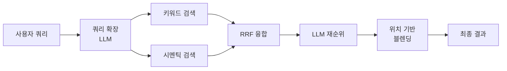

## Obsidian 검색의 아쉬움

옵시디언에 노트가 1,500개 넘게 쌓여 있다.  
요즘은 Claude Code로 옵시디언을 관리하고 있는데, 어느 날 특정 주제를 탐색하다 보니 Claude가 Grep으로 검색하고 Read로 파일을 하나씩 열어보는 방식이 뭔가 아쉽게 느껴졌다.  
토큰도 많이 쓰는 것 같고, 더 나은 방법이 있지 않을까 싶었다.  
그러다가 QMD를 써보게 됐는데, 원리가 궁금해서 살펴보다가 배운 게 꽤 있어서 정리해본다.  

---

## QMD

`qmd`는 로컬 마크다운 문서에서 원하는 내용을 찾을 수 있게 도와주는 CLI 도구이다.  
여러 마크다운 문서가 저장된 폴더를 하나의 컬렉션으로 묶어서 키워드 검색, 의미 검색, LLM 리랭킹까지 지원한다.  
특히 AI와 옵시디언을 함께 관리하고자 한다면, grep보다 훨씬 정확하게 원하는 문서를 찾을 수도? 있다.  



---

## 키워드 검색의 한계

만약 내 옵시디언 안에서 "MCP"라는 키워드를 찾는다고 해보자.  
MCP에 대해 공부한 기록도 있을 것이고, 유용한 MCP 서버를 모아둔 노트도 있을 것이다.  
처음에는 아마도 옵시디언의 기본 검색(Cmd + Shift + F) 기능으로 찾아볼 것이다.  
결과는 "MCP" 키워드가 포함된 노트를 전부 쏟아낼 뿐이라, 그 중에서 필요한 걸 골라내는 건 내 몫이다.  

QMD의 키워드 검색은 여기에 BM25 점수를 더한다.
1. 등장 횟수가 많을수록 순위가 높다.
2. 같은 빈도라면 긴 문서보다 짧은 문서에서 등장할 때 점수가 더 높다.
3. 전체 문서에서 드문 단어일수록 더 가치가 있다.

QMD는 이 BM25를 SQLite의 전문 검색 기능(FTS5)으로 구현한다. SQLite가 자체적으로 역인덱스를 만들고 BM25 점수를 매기는 기능을 제공하기 때문에, Elasticsearch 같은 별도 검색 엔진 없이 DB 파일 하나로 키워드 검색이 가능하다.  

grep보다 훨씬 똑똑하지만, 결국 검색어와 겹치는 단어가 문서에 있어야 찾을 수 있다는 한계는 그대로다.  
예를 들어 "MCP 서버 설정"이라고 검색하면 해당 단어들이 들어간 노트는 찾을 수 있겠지만, "Claude Code에서 tool을 연결하는 방법"이라고 적어둔 노트는 겹치는 단어가 없으니 결과에 나오지 않는다. 같은 주제를 다루고 있는데도 말이다.  

그런데 내 옵시디언의 노트 내용은 대부분 한국어로 작성되어 있다는데 문제가 있었다.  

BM25가 점수를 매기려면 먼저 문서를 단어 단위로 쪼개는데 SQLite FTS5의 기본 토크나이저(unicode61)은 사실상 공백과 구두점을 기준으로 나눈다.  
영어는 단어가 공백으로 깔끔하게 분리되니까 문제가 없겠지만, 한국어는 조사가 단어에 붙는다.  

```
"MCP 서버 설정"  →  ["MCP", "서버", "설정"]    ← 검색어 "MCP"와 매칭
"MCP는 유용하다" →  ["MCP는", "유용하다"]       ← 검색어 "MCP"와 매칭 안 됨
```

같은 단어인데 조사가 붙었다는 이유로 다른 토큰이 된다.  
한국어 형태소 분석기를 토크나이저로 쓰면 해결할 수 있지만 QMD 코드를 고쳐야 하는 애매함이 있다.  
그래서 현재로서는 QMD에서 한국어 키워드 검색은 사실상 제 역할을 하지 못한다고 보면 된다.  

---

## 시멘틱 검색

결국 키워드 검색의 한계는 "같은 단어가 있어야만 찾는다"는 데 있다. 그렇다면 단어가 달라도 의미가 비슷하면 찾아주는 방법은 없을까?  

시멘틱 검색은 이 문제를 임베딩으로 접근한다.  
임베딩이란 텍스트를 숫자 배열로 바꾸는 과정인데, 예를 들어 '로그인'이라는 단어도 숫자 배열이 되고, '인증 절차'라는 문장도 숫자 배열이 된다.  
이 숫자 배열을 벡터라고 부르는데, 벡터는 고차원 공간에서 하나의 점처럼 이해할 수 있다.  
이렇게 의미가 비슷한 텍스트는 이 공간에서 가까운 위치에 놓인다. '로그인'과 '인증 절차'는 다른 단어지만 의미적으로 가까우니 벡터도 비슷한 방향을 가리킨다.  

검색할 때 검색어도 임베딩을 하고, 임베딩되어 저장된 문서의 벡터들과 비교해서 얼마나 유사한지 탐색하는 것이다.  
이때 두 벡터 사이의 유사도를 코사인 유사도로 측정하는데, 벡터 간의 거리가 아니라 **각도**를 기준으로 삼는다. 같은 방향을 가리킬수록 1에 가깝고, 전혀 다른 방향이면 0에 가까워진다.  

QMD의 임베딩 방식을 살펴보면 우선 약 900 토큰 단위로 분할하되 15% 정도 중첩되게 한 다음 `embeddinggemma-300M-Q8_0` 임베딩 모델을 사용해서 문서를 벡터화한다.  
흥미로운 건 단순히 글자 수 기준으로 문서를 자르는 게 아니라 마크다운 문법을 고려한 점수 산정 알고리즘을 사용하여 마크다운 문서의 단락이 유지될 수 있도록 한다는 점이다. 심지어 이 알고리즘은 소스 코드를 임베딩할 때도 비슷하게 적용된다.  
그리고 [sqlite-vec](https://github.com/asg017/sqlite-vec) 확장을 이용해 `vec0`라는 모듈로 가상 테이블을 생성해서 벡터를 저장한다.  

그런데 여기서도 한국어 문제가 존재한다.  
`embeddinggemma`는 영어 위주로 학습된 모델이기 때문이다. 전혀 관련 없는 문서가 상위에 올라오거나 당연히 나와야 하는 노트가 결과 자체에 없는 경우가 대부분이었다.  
다행히 README에서 CJK용으로 권장하는 Qwen3 Embedding 0.6B 모델로 교체하면서 시멘틱 검색 결과가 눈에 띄게 개선되었다.  

---

## 하이브리드 검색

이제 키워드 검색 결과와 시멘틱 검색 결과를 어떻게 합치는지가 중요하다.  
큰 흐름으로 보면 다음과 같다.  



각 단계를 가볍게 살펴보자.  

먼저 쿼리를 확장하는 단계에서는 QMD를 위해 파인튜닝한 로컬 LLM을 통해 원본 쿼리를 여러 개로 변형하고, 각 쿼리마다 키워드 검색과 시멘틱 검색을 동시에 수행한다.  

그런데 두 검색 결과를 합칠 때 점수를 그냥 더하면 안 된다.  
왜냐하면 두 점수의 스케일이 완전히 다르기 때문이다. BM25 점수는 0에서 수십, 수백까지 올라갈 수 있고, 코사인 유사도는 0에서 1 사이다. 그냥 더하면 BM25 쪽이 압도해서 시멘틱 검색 결과가 묻힌다.  

RRF(Reciprocal Rank Fusion)는 점수를 아예 버리고 순위만 보는 것으로 이 문제를 해결한다.  
각 결과의 순위에 `1 / (k + rank)` 공식을 적용해서, 두 검색 방식에서 모두 상위에 나온 문서가 자연스럽게 높은 합산 점수를 받게 된다.  

여기서 QMD만의 Top Rank 보너스도 적용되는데 각 확장 쿼리의 결과마다 최상위 순위의 문서에 보너스 점수를 부여하여, 원본 쿼리 자체의 일치 결과가 RRF 융합 시에 희석될 수 있는 단점을 보호하는 역할을 한다.  

다음은 LLM 재순위 단계다. RRF 후 상위 후보들을 `qwen3-reranker-0.6b-q8_0` 모델로 다시 채점한다.  
나는 이 모델이 일반적인 LLM인 줄알고 검색 결과를 던져주고 순위를 정하라고 시키는 정도가 아닐까 생각했다.  
그런데 이 모델은 답변을 생성하는 일반 LLM이 아니라, 검색 쿼리와 결과 문서 한 쌍을 받아 "이 문서가 쿼리에 답이 되는가"라는 판단을 yes 또는 no의 확률로 점수화하는 전용 reranker였다.  

그래서 후보들을 한꺼번에 보고 비교해서 순위를 정하는 게 아니라, 각 (쿼리, 문서) 쌍을 독립적으로 채점한 뒤 그 점수로 정렬한다. 이때 문서 전체가 아니라 best chunk만 채점에 사용해서, 토큰 사용량이 늘어나는 걸 방지한다.  

마지막으로 위치 기반 블렌딩은 RRF 점수와 LLM 재순위 점수를 다른 비율로 혼합하여 최종 검색 점수를 계산하는 방법이다. 이렇게 하는 이유는 LLM 재순위 과정에서 RRF에서 높은 순위를 차지한 신뢰도 높은 검색 결과를 보호하기 위한 목적이다.  

---

## 마치며

나는 QMD를 옵시디언에서 검색을 위한 도구로 사용하려고 했다.  
그런데 정작 내 옵시디언 노트는 대부분 한국어라서, 키워드 검색이 제대로 작동하지 않아서, 사실상 하이브리드 검색의 의미가 없어졌다.  

QMD 프로젝트에 이슈나 PR을 보니까 이 문제점에 대한 개선 요구와 방향을 제시하는 내용이 올라와 있다. 그래서 언젠가 이 문제가 해결될 것이라 기대는 하고 있다.  
물론 내가 직접 고쳐서 쓰는 것도 좋겠지만 아직까지는 QMD 프로젝트가 활발하게 개발되고 있는 편이라서 나만의 버전을 관리하는 것보다 해결을 기다리는 게 나을 것 같다.  

한국어 지원이 아직 아쉽긴 하지만, 덕분에 하이브리드 검색이 어떻게 돌아가는지 배울 수 있었다.  
